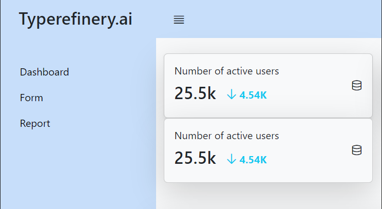

# Component

Button component

# Overview

Component for adding button to pages

## Information

- **group**:Typerefinery - Forms
- **sling:resourceType**: ws:Component
- **description**: Button component
- **title**: Button
- **sling:resourceSuperType**:
- **Vendor**: Typerefinery
- **Version**: 1.0
- **Compatibility**: CMS
- **Status**: Ready
- **Showcase**: [/typerefinery/components/forms/button](http://localhost:8113/apps/websight/index.html/content/typerefinery-showcase/pages/components/forms/button::editor)
- **Local Code**: [/apps/typerefinery/components/forms/button]
- **Source**: [github/typerefinery-websight](https://github.com/typerefinery-ai/typerefinery-websight/tree/feature/add-readme-file-for-button-component/application/backend/src/main/resources/apps/typerefinery/components/forms/fields/button)
- **Readme**: [/typerefinery/components/forms/button/readme](https://github.com/typerefinery-ai/typerefinery-websight/blob/feature/add-readme-file-for-button-component/application/backend/src/main/resources/apps/typerefinery/components/forms/fields/button/README.md)

# Authoring

Following section covers authoring features

## Dialog Tabs

These fields are available for input by the authors. These fields are used in templates

<table style="border-spacing: 1px;border-collapse: separate;width: 100.0%;text-align: left;background-color: black; text-indent: 4px;">
    <thead style="font-size: larger;">
        <tr>
            <th style="width: 8%;">Tab</th>
            <th style="width: 8%;">Field Name</th>
            <th style="width: 8%;">Default Value</th>
            <th>Description</th>
        </tr>
    </thead>
    <tbody style="background-color: gray;">
        <tr>
            <td rowspan="5"> General</td>
            <td>Label</td>
            <td>Start</td>
            <td>Consists the label of the button.</td>
        </tr>
        <tr>
            <td>Button Style</td>
            <td>Default</td>
            <td>Consists type of the Button style.</td>
        </tr>
        <tr>
            <td>Show Icon</td>
            <td>None</td>
            <td>Used to add icon for the Buttons.</td>
        </tr>
        <tr>
            <td>Hide label</td>
            <td>None</td>
            <td>Used to hide the label of Button.</td>
        </tr>
        <tr>
            <td>Icon Position</td>
            <td>None</td>
            <td>Used to set the position of icon inside the Button.</td>
        </tr>
        <tr>
            <td rowspan="4"> Style</td>
            <td>Class name</td>
            <td>None</td>
            <td>Add custom style classes.</td>
        </tr>
        <tr>
            <td>Button Type</td>
            <td>Submit</td>
            <td>Consists type of the Button.</td>
        </tr>
        <tr>
            <td>OutLined Button</td>
            <td>None</td>
            <td>Used to make the button outlined only.</td>
        </tr>
        <tr>
            <td>Show Text Elements</td>
            <td>None</td>
            <td>Display text or icon only, hide the border of Button.</td>
        </tr>
        <tr>
            <td rowspan="4"> Grid</td>
            <td>Width - S breakpoint</td>
            <td>12 Col</td>
            <td>S - Large Screen Break Points will be applicable to screens larger than 576px.</td>
        </tr>
        <tr>
            <td>Width - M breakpoint</td>
            <td>12 Col</td>
            <td>M - Large Screen Break Points will be applicable to screens larger than 768px.</td>
        </tr>
        <tr>
            <td>Width - L breakpoint</td>
            <td>12 Col</td>
            <td>L - Large Screen Break Points will be applicable to screens larger than 992px.</td>
        </tr>
        <tr>
            <td>Text Alignment</td>
            <td>Default</td>
            <td>Contains alignment of the text.</td>
        </tr>
    </tbody>
</table>

# Variants

This component has the following variants

<table style="border-spacing: 1px;border-collapse: separate;width: 100.0%;text-align: left;background-color: black; text-indent: 4px;">
    <thead style="font-size: larger;">
        <tr>
            <th style="width: 8%;">Name</th>
            <th style="width: 8%;">Type</th>
            <th>Description</th>
            <th>Example</th>
        </tr>
    </thead>
    <tbody style="background-color: Gray;">
        <tr>
            <td rowspan="6">Button Type</td>
            <td>Submit</td>
            <td>Used to submit the forms.</td>
            <th></th>
        </tr>
        <tr>
            <td>Navigate</td>
            <td>Navigate button to the different page.</td>
            <th></th>
        </tr>
        <tr>
            <td>Action</td>
            <td>Contains different actions of button like open modal and theme.</td>
            <th></th>
        </tr>
        <tr>
            <td>Theme</td>
            <td>Used to toggle the theme of page.</td>
            <th></th>
        </tr>
        <tr>
            <td>Hamburger</td>
            <td>Hamburger will be visible for certain screen Size.</td>
            <th></th>
        </tr>
        <tr>
            <td>toggle</td>
            <td>Only appear when Hamburger is selected</td>
            <th>Please provide the component Id that you want to toggle with prefix # e.g- #title_HJNJJH.</th>
        </tr>
         <tr>
            <td rowspan="3">Action Button</td>
            <td>Open Modal</td>
            <td>Open a modal when select action type Open Modal.</td>
            <th></th>
        </tr>
        <tr>
            <td>Open Dropdown</td>
            <td>Contains dropdown of Button.</td>
            <th></th>
        </tr>
        <tr>
            <td>Initial Theme</td>
            <td>Used to change the theme of pages.</td>
            <th></th>
        </tr>
    </tbody>
</table>
