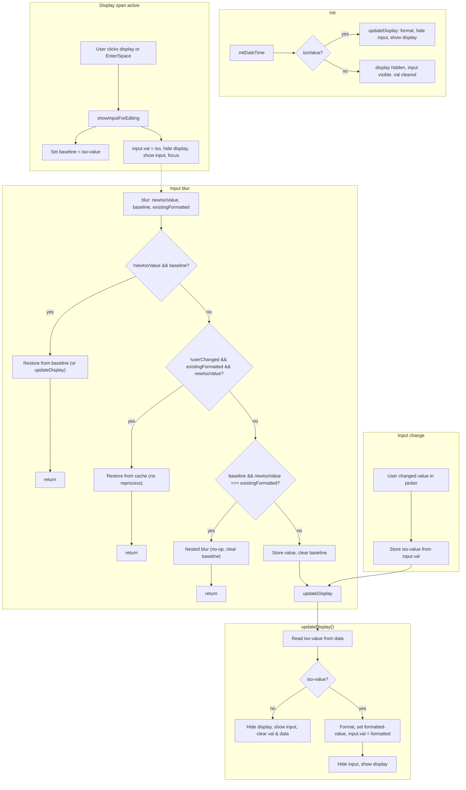

# Component

Input component

# Overview

Generic text-style input supporting various HTML input types (text, number, date, email, password, etc.) with validation and input masking support.

## Information

- **group**: Typerefinery - Forms
- **sling:resourceType**: ws:Component
- **description**: Basic form input field
- **title**: Input Field
- **sling:resourceSuperType**: typerefinery/components/forms/field
- **Vendor**: Typerefinery
- **Version**: 1.0
- **Compatibility**: CMS
- **Status**: Ready
- **Showcase**: [/typerefinery/components/forms/input](https://cms.typerefinery.localhost:8101/apps/websight/index.html/content/typerefinery-showcase/pages/components/forms/input::editor)
- **Local Code**: [/apps/typerefinery/components/forms/fields/input]
- **Source**: [github/typerefinery-websight](https://github.com/typerefinery-ai/typerefinery-websight/tree/main/application/backend/src/main/resources/apps/typerefinery/components/forms/fields/input)
- **Readme**: [/typerefinery/components/forms/input/readme](https://github.com/typerefinery-ai/typerefinery-websight/blob/main/application/backend/src/main/resources/apps/typerefinery/components/forms/fields/input/README.md)

# Authoring

Following section covers authoring features

## Dialog Tabs

These fields are available for input by the authors. These fields are used in templates

<table style="border-spacing: 1px;border-collapse: separate;width: 100.0%;text-align: left;background-color: black; text-indent: 4px;">
    <thead style="font-size: larger;">
        <tr>
            <th style="width: 8%;">Tab</th>
            <th style="width: 8%;">Field Name</th>
            <th style="width: 8%;">Default Value</th>
            <th>Description</th>
        </tr>
    </thead>
    <tbody style="background-color: gray;">
        <tr>
            <td rowspan="4">General</td>
            <td>Label</td>
            <td>Full Name</td>
            <td>The label text for the input field.</td>
        </tr>
        <tr>
            <td>Field Name</td>
            <td>-</td>
            <td>The name attribute for the input. Used for form submission.</td>
        </tr>
        <tr>
            <td>Placeholder</td>
            <td>Type here.</td>
            <td>Placeholder text displayed in the input field when empty.</td>
        </tr>
        <tr>
            <td>Type</td>
            <td>Text</td>
            <td>HTML5 input type. Options: Text, Password, Email, Mobile Number, Number, Date, Date and Time, Time, Range, Colour Picker, Rating, Hidden (visible in edit mode).</td>
        </tr>
        <tr>
            <td rowspan="3">General (Range only)</td>
            <td>Range Minimum</td>
            <td>0</td>
            <td>Minimum value for range input slider.</td>
        </tr>
        <tr>
            <td>Range Maximum</td>
            <td>100</td>
            <td>Maximum value for range input slider.</td>
        </tr>
        <tr>
            <td>Range Step</td>
            <td>1</td>
            <td>Step increment for range input slider.</td>
        </tr>
        <tr>
            <td rowspan="5">General (Rating only)</td>
            <td>Maximum Stars</td>
            <td>5</td>
            <td>Maximum number of stars for rating input (1-10).</td>
        </tr>
        <tr>
            <td>Allow Half Stars</td>
            <td>true</td>
            <td>Enable half-star selection for rating input.</td>
        </tr>
        <tr>
            <td>Filled Icon Class</td>
            <td>fas fa-star</td>
            <td>Font Awesome icon class for filled stars (e.g., "fas fa-star", "fas fa-heart").</td>
        </tr>
        <tr>
            <td>Empty Icon Class</td>
            <td>far fa-star</td>
            <td>Font Awesome icon class for empty stars (e.g., "far fa-star", "far fa-heart").</td>
        </tr>
        <tr>
            <td>Half Icon Class</td>
            <td>fas fa-star-half-alt</td>
            <td>Font Awesome icon class for half stars (e.g., "fas fa-star-half-alt", "fas fa-heart-half-alt").</td>
        </tr>
        <tr>
            <td>Icon Color</td>
            <td>#ffc107</td>
            <td>Color for rating icons in hex format (e.g., "#ffc107" for yellow, "#ff0000" for red, "#0066ff" for blue). Default is "#ffc107" (yellow).</td>
        </tr>
        <tr>
            <td rowspan="5">General (Date/Time/Datetime only)</td>
            <td>Output Format</td>
            <td>-</td>
            <td>How the date/time value is formatted when submitted. Options: ISO 8601, ISO Date, ISO Time, US Date (MM/DD/YYYY), European Date (DD/MM/YYYY), Long Date (January 15, 2024), Unix Timestamp, RFC 3339, Custom. Only shown when Type is Date, Time, or Date and Time.</td>
        </tr>
        <tr>
            <td>Custom Format Pattern</td>
            <td>-</td>
            <td>Custom format pattern (e.g., YYYY-MM-DD HH:mm:ss). Only used when Output Format is 'Custom'. Pattern supports: YYYY (year), MM (month), DD (day), HH (24-hour), hh (12-hour), mm (minutes), ss (seconds), A (AM/PM).</td>
        </tr>
        <tr>
            <td>Input Timezone</td>
            <td>Browser Local</td>
            <td>Timezone for the input value. Options: Browser Local, UTC, Custom. Only shown when Type is Date, Time, or Date and Time.</td>
        </tr>
        <tr>
            <td>Custom Timezone</td>
            <td>-</td>
            <td>IANA timezone identifier (e.g., America/New_York, Europe/London). Only shown when Input Timezone is 'Custom'. Options: America/New_York, America/Los_Angeles, Europe/London, Europe/Paris, Asia/Tokyo.</td>
        </tr>
        <tr>
            <td>Output Timezone</td>
            <td>Preserve Input</td>
            <td>Timezone for the output value when form is submitted. Options: Preserve Input, UTC, Custom. Only shown when Type is Date, Time, or Date and Time.</td>
        </tr>
        <tr>
            <td rowspan="2">Validation</td>
            <td>Required</td>
            <td>false</td>
            <td>Whether the input field is required for form submission.</td>
        </tr>
        <tr>
            <td>Input Mask</td>
            <td>-</td>
            <td>Input masking pattern for formatted input (e.g., phone numbers, dates). Uses Inputmask library format.</td>
        </tr>
        <tr>
            <td rowspan="4">Style</td>
            <td>Class name</td>
            <td>-</td>
            <td>Add custom CSS classes.</td>
        </tr>
        <tr>
            <td>Disabled</td>
            <td>false</td>
            <td>Disable the input field.</td>
        </tr>
        <tr>
            <td>Hide Label</td>
            <td>false</td>
            <td>Hide the input label while keeping accessibility.</td>
        </tr>
        <tr>
            <td>Persist Color When Theme Switches</td>
            <td>false</td>
            <td>Keep input styling when theme switches.</td>
        </tr>
        <tr>
            <td rowspan="4">Grid</td>
            <td>Width - S breakpoint</td>
            <td>12 Col</td>
            <td>S - Large Screen Break Points will be applicable to screens larger than 576px.</td>
        </tr>
        <tr>
            <td>Width - M breakpoint</td>
            <td>12 Col</td>
            <td>M - Large Screen Break Points will be applicable to screens larger than 768px.</td>
        </tr>
        <tr>
            <td>Width - L breakpoint</td>
            <td>12 Col</td>
            <td>L - Large Screen Break Points will be applicable to screens larger than 992px.</td>
        </tr>
        <tr>
            <td>Text Alignment</td>
            <td>Default</td>
            <td>Contains alignment of the text.</td>
        </tr>
        <tr>
            <td>Events</td>
            <td>Events</td>
            <td>-</td>
            <td>Configure events to listen to or emit (INPUT_CHANGE, etc.).</td>
        </tr>
        <tr>
            <td>Aria</td>
            <td>Aria attributes</td>
            <td>-</td>
            <td>Configure accessibility attributes (aria-label, aria-describedby, etc.).</td>
        </tr>
    </tbody>
</table>

# Variants

This component supports multiple HTML5 input types:

<table style="border-spacing: 1px;border-collapse: separate;width: 100.0%;text-align: left;background-color: black; text-indent: 4px;">
    <thead style="font-size: larger;">
        <tr>
            <th style="width: 8%;">Name</th>
            <th style="width: 8%;">Type</th>
            <th>Description</th>
        </tr>
    </thead>
    <tbody style="background-color: Gray;">
        <tr>
            <td>Text</td>
            <td>text</td>
            <td>Standard text input for any text content.</td>
        </tr>
        <tr>
            <td>Email</td>
            <td>email</td>
            <td>Email input with built-in email validation. Browsers validate email format automatically.</td>
        </tr>
        <tr>
            <td>Password</td>
            <td>password</td>
            <td>Password input that masks characters for security.</td>
        </tr>
        <tr>
            <td>Mobile Number</td>
            <td>tel</td>
            <td>Telephone number input. On mobile devices, shows numeric keypad.</td>
        </tr>
        <tr>
            <td>Number</td>
            <td>number</td>
            <td>Numeric input with spinner controls. Accepts only numeric values.</td>
        </tr>
        <tr>
            <td>Date</td>
            <td>date</td>
            <td>Date picker input. Shows native date picker on supported browsers.</td>
        </tr>
        <tr>
            <td>Date and Time</td>
            <td>datetime-local</td>
            <td>Date and time picker input. Shows native date/time picker on supported browsers. Supports custom output formats and timezone conversion. See "Date and Time Input Type" section for details.</td>
        </tr>
        <tr>
            <td>Time</td>
            <td>time</td>
            <td>Time picker input. Shows native time picker on supported browsers.</td>
        </tr>
        <tr>
            <td>Range</td>
            <td>range</td>
            <td>Range slider input for selecting numeric values within a range. Uses Bootstrap form-range class. Configure min, max, and step values in dialog.</td>
        </tr>
        <tr>
            <td>Colour Picker</td>
            <td>colourpicker</td>
            <td>Native HTML5 color picker input. Allows selecting colors from a color wheel/picker interface and typing hex values directly. Uses native browser color picker UI.</td>
        </tr>
        <tr>
            <td>Rating</td>
            <td>rating</td>
            <td>Star rating input with Font Awesome icons. Supports full and half-star selection. Configurable number of stars (1-10), half-star support, customizable icon classes, and icon color. Icons have fixed width (1.5rem) to prevent container growth when switching between empty and filled states. The input is hidden with CSS (`input[type="rating"]`), and a visual rating interface is created dynamically by JavaScript. Uses namespaced CSS classes (`.input-rating-items`, `.input-rating-item`) with uniform 2px spacing between items. Uses fixed width reference for accurate half-star detection.</td>
        </tr>
        <tr>
            <td>Hidden</td>
            <td>hidden</td>
            <td>Hidden input field. Invisible in published mode, but visible in edit mode for configuration.</td>
        </tr>
    </tbody>
</table>

## Input Masking

The input component supports input masking for formatted input:

**Common Mask Examples:**
- Phone: `(999) 999-9999` or `999-999-9999`
- Date: `99/99/9999`
- Credit Card: `9999-9999-9999-9999`
- Currency: `$999,999.99`

Uses Inputmask library format. See Inputmask documentation for complete mask syntax.

## Flow Integration

Input field values are automatically included in Flow payloads when the form has Flow enabled. The input value is submitted as a string (for text, email, tel, colourpicker) or number (for number, range, rating). Colour picker values are submitted as hex color strings (e.g., "#ff0000"). Rating values are submitted as numbers (e.g., 3.5 for three and a half stars).

## Technical Implementation Details

### Rating Input Type

The rating input type uses a sophisticated layered icon rendering approach to support half-star selection for any Font Awesome icon, including icons that don't have a native half-icon class (e.g., hearts).

**Architecture:**
- **Hidden Input**: The actual `<input type="rating">` element is hidden with CSS (`position: absolute`, `opacity: 0`, `width: 0`, `height: 0`)
- **Visual Interface**: JavaScript dynamically creates a `.input-rating-items` container with rating icons as siblings to the hidden input
- **Layered Rendering**: For icons without a valid half-icon class (e.g., hearts), a layered structure is used:
  - Empty icon (outline) - always visible, behind (z-index: 1)
  - Filled icon (solid) - on top, width controlled by CSS mask (z-index: 2)
- **Simple Rendering**: For icons with valid half-icon classes (e.g., stars with `fa-star-half-alt`), a single icon element switches classes

**Half-Star Detection:**
- Uses fixed item width (1.5rem) for accurate calculations
- Mouse position within icon determines left (half) vs right (full) selection
- Hover preview updates dynamically as mouse moves within icon
- Click commits the preview value to the hidden input

**CSS Mask Technique:**
- For layered icons, uses CSS `mask-image` with a linear gradient controlled by `--tr-rating-fill` CSS variable
- JavaScript sets `--tr-rating-fill` to `0%` (empty), `50%` (half), or `100%` (full)
- This approach reliably clips Font Awesome `::before` pseudo-elements

**Spacing:**
- Uses CSS Grid with `gap: 2px` for uniform spacing between icons
- Fixed width (`1.5rem`) and height prevent container growth when switching states

**Icon Color:**
- Configurable via `ratingIconColor` dialog field (default: `#ffc107`)
- Applied to both empty and filled icons via CSS `color` property

### Range Input Type

The range input type uses native HTML5 `<input type="range">` with Bootstrap's `form-range` class.

**Configuration:**
- **Min Value**: `rangeMin` (default: 0)
- **Max Value**: `rangeMax` (default: 100)
- **Step**: `rangeStep` (default: 1)

**Implementation:**
- Template converts `inputType="range"` to `type="range"` in HTML
- Bootstrap `form-range` class replaces `form-control` for range inputs
- Min, max, and step attributes are conditionally added when `inputType == 'range'`
- No JavaScript required - native HTML5 range input works automatically

**Form Submission:**
- Value is submitted as a number (not string)
- Works with form data collection via `isInput="true"` attribute

### Colour Picker Input Type

The colour picker input type uses native HTML5 `<input type="color">` for simplicity and browser compatibility.

**Implementation:**
- Template converts `inputType="colourpicker"` to `type="color"` in HTML
- Uses Bootstrap `form-control-color` class for styling
- Default value: `#000000` if no value is set
- No JavaScript required - native HTML5 color input works automatically

**Features:**
- Native browser color picker UI (varies by browser)
- Direct hex value input (browser-dependent)
- No external libraries required

**Form Submission:**
- Value is submitted as hex color string (e.g., "#ff0000")
- Works with form data collection via `isInput="true"` attribute

**Browser Support:**
- Modern browsers: Full support with native color picker
- Older browsers: Graceful degradation to text input
- Mobile: Native color picker on mobile devices

### Date and Time Input Type

The date and time input type (`datetime-local`) provides native date/time picker functionality with custom output formatting and timezone conversion capabilities.

**Architecture:**
- **Native Input**: Uses HTML5 `<input type="datetime-local">` for the picker UI
- **Hidden Input**: When formatting/timezone conversion is configured, a hidden input stores the formatted value
- **Display Element**: A formatted display element shows the formatted value to the user
- **Immediate Formatting**: Formatting and timezone conversion happen immediately when the user selects a value

**Output Formats:**
- **ISO 8601**: Standard ISO format (YYYY-MM-DDTHH:mm for datetime-local)
- **ISO Date**: Date only (YYYY-MM-DD)
- **ISO Time**: Time only (HH:mm:ss)
- **US Date**: MM/DD/YYYY format
- **European Date**: DD/MM/YYYY format
- **Long Date**: "January 15, 2024" format
- **Unix Timestamp**: Seconds since epoch
- **RFC 3339**: Full RFC 3339 format
- **Custom**: User-defined pattern (e.g., YYYY-MM-DD HH:mm:ss)

**Timezone Handling:**
- **Input Timezone**: Specifies the timezone for the input value (Browser Local, UTC, or Custom IANA timezone)
- **Output Timezone**: Specifies the timezone for the output value (Preserve Input, UTC, or Custom IANA timezone)
- **Conversion**: Uses `Intl.DateTimeFormat` API for reliable timezone conversion
- **IANA Timezones**: Supports standard IANA timezone identifiers (e.g., America/New_York, Europe/London)

**User Experience:**
- User selects date/time using native browser picker
- Formatted value is displayed immediately in the input field
- User can click the formatted display to edit (shows native picker again)
- `$component.val()` returns the formatted value directly
- Hidden input (if formatting is active) contains the formatted value for form submission

**Implementation:**
- JavaScript file: `type-datetime.js`
- Initialized in `functions.js` for `date`, `time`, and `datetime-local` input types
- Only activates when format or timezone conversion is configured
- If no formatting/timezone is configured, uses native HTML5 behavior

**Common Format Patterns:**
- `YYYY-MM-DD HH:mm:ss` - Standard datetime format
- `MM/DD/YYYY HH:mm A` - US format with 12-hour time
- `DD/MM/YYYY HH:mm` - European format with 24-hour time
- `YYYY-MM-DD` - Date only
- `HH:mm:ss` - Time only

**Form Submission:**
- If formatting is active: Hidden input value (formatted) is submitted
- If no formatting: Native input value (ISO format) is submitted
- Value is always a string (formatted according to configuration)

#### DateTime Processing Logic

When formatting or timezone conversion is configured, the datetime field switches between a **display span** (formatted value, read-only) and the **native input** (picker). The diagram and paths below describe how visibility, value, and baseline are updated.

**Flow diagram (Mermaid):**

**Path summary:**

| Trigger | Condition | Action |
|--------|-----------|--------|
| **Init** | Has `iso-value` | `updateDisplay()` → format, hide input, show display |
| **Init** | No value | Display hidden, input visible, val cleared |
| **Display click / keydown** | — | `showInputForEditing`: set baseline from `iso-value`, `input.val(iso)`, hide display, show input, focus |
| **Blur** | `val` empty and baseline set | Treat as no change: restore from baseline (or `existingFormatted`), show display, return |
| **Blur** | No user change and has cached formatted | Restore from cache (no timezone reprocess), show display, return |
| **Blur** | Nested blur: `val === existingFormatted` and baseline set | No-op (hiding input fired blur again), clear baseline, return |
| **Blur** | User changed or no cache | Store value, clear baseline, call `updateDisplay()` |
| **Change** | User picked new value | Store `iso-value` from `input.val()`, call `updateDisplay()` |
| **updateDisplay()** | No `iso-value` | Hide display, show input, clear val and data |
| **updateDisplay()** | Has `iso-value` | Format, set `formatted-value` and `input.val(formatted)`, hide input, show display |

**Data stored on the input element:**

- `iso-value`: canonical value (ISO string) used for formatting and comparison
- `formatted-value`: last formatted string (used for “restore from cache”)
- `baseline-iso-value`: value when edit started (set in `showInputForEditing`, cleared after blur)

**Logging:** All datetime actions are logged with the prefix `[datetime]` and the field id. Filter the browser console by `[datetime]` to trace display click, showInputForEditing, focus/blur, change, and updateDisplay paths.
