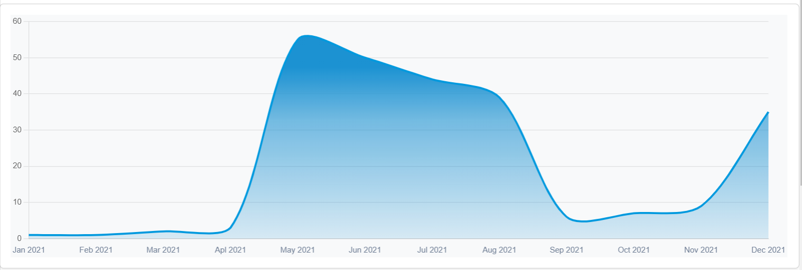
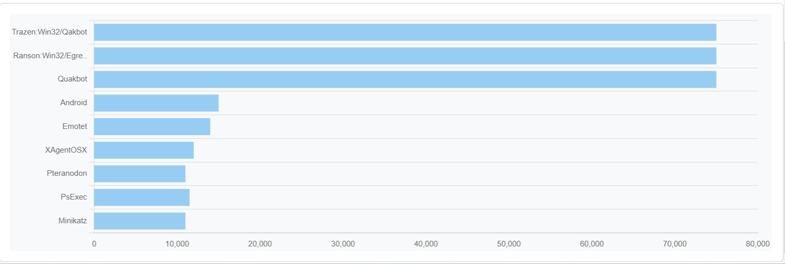
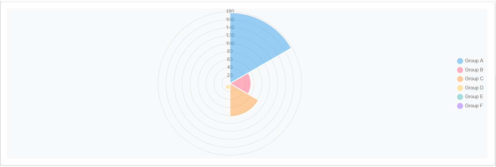

# Component

Chart component

# Overview

Component for adding chart to pages

## Information

- **group**:Typerefinery - Widgets
- **sling:resourceType**: ws:Component
- **description**: Chart component
- **title**: Chart
- **sling:resourceSuperType**:
- **Vendor**: Typerefinery
- **Version**: 1.0
- **Compatibility**: CMS
- **Status**: Ready
- **Showcase**: [/typerefinery/components/widgets/chart](https://cms.typerefinery.localhost:8100/apps/websight/index.html/content/typerefinery-showcase/pages/components/widgets/chart::editor)
- **Local Code**: [/apps/typerefinery/components/widgets/chart]

# Authoring

Following section covers authoring features

## Dialog Tabs

These fields are available for input by the authors. These fields are used in templates.

<table style="border-spacing: 1px;border-collapse: separate;width: 100.0%;text-align: left;background-color: black; text-indent: 4px;">
    <thead style="font-size: larger;">
        <tr>
            <th style="width: 8%;">Tab</th>
            <th style="width: 8%;">Field Name</th>
            <th style="width: 8%;">Default Value</th>
            <th>Description</th>
        </tr>
    </thead>
    <tbody style="background-color: gray;">
        <tr>
            <td rowspan="1"> General</td>
            <td>Variants</td>
            <td>Line Chart</td>
            <td>You can select differnt chart variants.</td>
        </tr>
        <tr>
            <td rowspan="6"> Style</td>
            <td>Class name</td>
            <td>None</td>
            <td>Add custom style classes.</td>
        </tr>
        <tr>
            <td>Id</td>
            <td>Unique Id</td>
            <td>Each component has it own unique Id.</td>
        </tr>
                <tr>
            <td>Show Border</td>
            <td>Disabled</td>
            <td>Enable to use border properties.</td>
        </tr>
                <tr>
            <td>Apply Margin</td>
            <td>Disabled</td>
            <td>Enable to use Margin properties.</td>
        </tr>
                <tr>
            <td>Persist Color When Theme Switches</td>
            <td>Disabled</td>
            <td>Enable to presist color while switching theme.</td>
        </tr>
                <tr>
            <td>Apply Padding</td>
            <td>Disabled</td>
            <td>Enable to use Padding properties.</td>
        </tr>
         <tr>
            <td rowspan="12">Flow</td>
            <td>Topics</td>
            <td><em>Dynamic topics</em></td>
            <td>The topic set for this flow is used for sending and receiving messages to and from the flow.</td>
        </tr>
         <tr>
            <td>Title</td>
            <td>Table flow</td>
            <td>The title to be used for this flow should be updated in this component to change the title of the flow in Flow Designer</td>
        </tr>
        <tr>
            <td>Group</td>
            <td>/content/typerefinery-showcase/pages/components/widgets/table</td>
            <td>This is the group that the flow belongs to, its used to group relevant flows.</td>
        </tr>
        <tr>
            <td>Template</td>
            <td>/apps/typerefinery/components/widgets/table/templates/table.json</td>
            <td>This is the template that the flow is based on, its used to create new flows from a template.</td>
        </tr>
        <tr>
            <td>Design Template</td>
            <td><em>Dynamic template</em></td>
            <td>This is the design template that the flow is based on, its used to update the design of the flow.</td>
        </tr>
        <tr>
            <td>Sample Data</td>
            <td>/apps/typerefinery/components/widgets/table/templates/flowsample.json</td>
            <td>This is the sample data that is added to the flow to help to get started.</td>
        </tr>
        <tr>
            <td>HTTP Route</td>
            <td>/content/typerefinery-showcase/pages/components/widgets/table/*</td>
            <td>This is the HTTP route for REST API for this flow, where applicable, not used in all flow enabled components.</td>
        </tr>
        <tr>
            <td>Is Container</td>
            <td>false</td>
            <td>This is a flag to indicate if the flow is a container flow, where applicable, not used in all flow enabled components.</td>
        </tr>
        <tr>
            <td>Flow ID</td>
            <td><em>Dynamic flow-id</em></td>
            <td>This is the flow stream ID for this flow, this is used to identify the flow in the flow stream.</td>
        </tr>
        <tr>
            <td>Created On</td>
            <td><em>Dynamic time/date</em></td>
            <td>This is the date and time that the flow was created.</td>
        </tr>
        <tr>
            <td>Updated On</td>
            <td><em>Dynamic time/date</em></td>
            <td>This is the date and time that the flow was last updated.</td>
        </tr>
         <tr>
            <td>Flow Designer</td>
            <td>Link</td>
            <td>This is the URL to edit the flow in Flow Designer.</td>
        </tr>
         <tr>
            <td rowspan="4"> Grid</td>
            <td>Width - S breakpoint</td>
            <td>12 Col</td>
            <td>S - Large Screen Break Points will be applicable to screens larger than 576px.</td>
        </tr>
        <tr>
            <td>Width - M breakpoint</td>
            <td>12 Col</td>
            <td>M - Large Screen Break Points will be applicable to screens larger than 768px.</td>
        </tr>
        <tr>
            <td>Width - L breakpoint</td>
            <td>12 Col</td>
            <td>L - Large Screen Break Points will be applicable to screens larger than 992px.</td>
        </tr>
        <tr>
            <td>Text Alignment</td>
            <td>Default</td>
            <td>Contains alignment of the text.</td>
        </tr>

</table>

# Variants

This component has the following variants

<table style="border-spacing: 1px;border-collapse: separate;width: 100.0%;text-align: left;background-color: black; text-indent: 4px;">
    <thead style="font-size: larger;">
      <tr>
            <th style="width: 8%;">Tab</th>
            <th style="width: 8%;">Field Name</th>
            <th style="width: 8%;">Default Value</th>
            <th>Description</th>
        </tr>
        </thead>
        <tbody style="background-color: Gray;">
          <tr>
          <td rowspan="3">Variant</td>
            <td>Line Chart</td>
            <td>Enabled</td>
            <td>Show data in Line Chart.</td>
        </tr>
          <tr>
            <td>Bar Chart</td>
            <td>Disabled</td>
            <td>Show data in Bar Chart.</td>
        </tr>
          <tr>
            <td>Pie Chart</td>
            <td>Disabled</td>
            <td>Show data in Pie Chart.</td>
        </tr>
      </tbody>
    </table>
