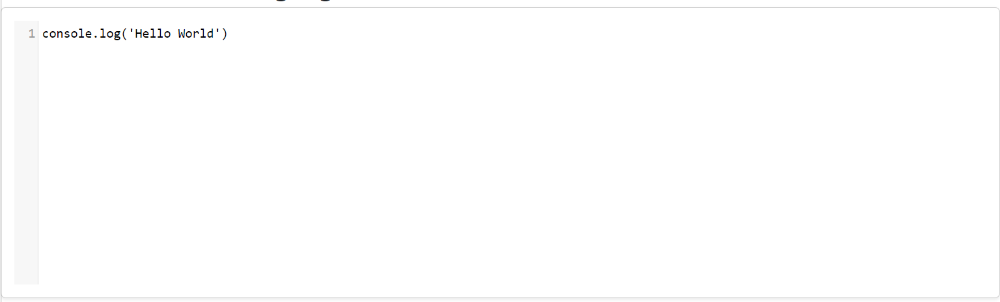
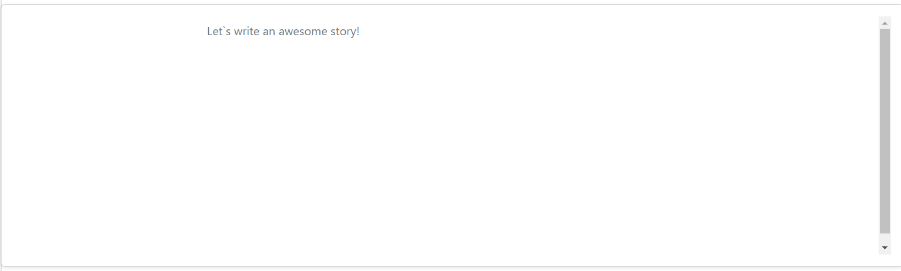

# Component

Editor component

# Overview

Component for adding editor to pages

## Information

- **group**:Typerefinery - Widgets
- **sling:resourceType**: ws:Component
- **description**: Editor component
- **title**: Editor
- **sling:resourceSuperType**:
- **Vendor**: Typerefinery
- **Version**: 1.0
- **Compatibility**: CMS
- **Status**: Ready
- **Showcase**: [/typerefinery/components/widgets/editor](https://cms.typerefinery.localhost:8100/apps/websight/index.html/content/typerefinery-showcase/pages/components/widgets/editor::editor)
- **Local Code**: [/apps/typerefinery/components/widgets/editor]

# Authoring

Following section covers authoring features.

## Dialog Tabs

These fields are available for input by the authors. These fields are used in templates.

<table style="border-spacing: 1px;border-collapse: separate;width: 100.0%;text-align: left;background-color: black; text-indent: 4px;">
    <thead style="font-size: larger;">
        <tr>
            <th style="width: 8%;">Tab</th>
            <th style="width: 8%;">Field Name</th>
            <th style="width: 8%;">Default Value</th>
            <th>Description</th>
        </tr>
    </thead>
     <tbody style="background-color: gray;">
        <tr>
            <td rowspan="3"> General</td>
            <td>Name</td>
            <td>Empty</td>
            <td>Please enter a name for the component, which can be used for loading data from the endpoint.</td>
        </tr>
         <tr>
            <td>Variants</td>
            <td>Code</td>
            <td>You can select differnt Editor variants.</td>
        </tr>
         <tr>
            <td>Editor Language</td>
            <td>Javascript</td>
            <td>Select the code editor language.</td>
        </tr>
        <tr>
            <td rowspan="4"> Alignment</td>
            <td>Container Width
</td>
            <td>default</td>
            <td>Add custom style classes.</td>
        </tr>
                <tr>
            <td>Arrange children in same line
</td>
            <td>disabled</td>
            <td>Components arranged in Horizontal Direction.</td>
        </tr>
                      <tr>
            <td>Horizontal alignment
</td>
            <td>None</td>
            <td>Components arranged in Horizontal Direction Ex- start,end,etc.</td>
        </tr>
                              <tr>
            <td>Column Spacing
</td>
            <td>None</td>
            <td>Enable Component spacing ex- 0,1,2.</td>
        </tr>
         <tr>
            <td rowspan="4"> Grid</td>
            <td>Width - S breakpoint</td>
            <td>12 Col</td>
            <td>S - Large Screen Break Points will be applicable to screens larger than 576px.</td>
        </tr>
        <tr>
            <td>Width - M breakpoint</td>
            <td>12 Col</td>
            <td>M - Large Screen Break Points will be applicable to screens larger than 768px.</td>
        </tr>
        <tr>
            <td>Width - L breakpoint</td>
            <td>12 Col</td>
            <td>L - Large Screen Break Points will be applicable to screens larger than 992px.</td>
        </tr>
        <tr>
            <td>Text Alignment</td>
            <td>Default</td>
            <td>Contains alignment of the text.</td>
        </tr>
        </tbody>
        </table>

# Variants

This component has the following variants

<table style="border-spacing: 1px;border-collapse: separate;width: 100.0%;text-align: left;background-color: black; text-indent: 4px;">
    <thead style="font-size: larger;">
      <tr>
            <th style="width: 8%;">Tab</th>
            <th style="width: 8%;">Field Name</th>
            <th style="width: 8%;">Default Value</th>
            <th>Description</th>
        </tr>
        </thead>
         <tbody style="background-color: Gray;">
          <tr>
          <td rowspan="3">Variant</td>
            <td>Code</td>
            <td>Enabled</td>
            <td>Enable Code as Variant.</td>
        </tr>
          <tr>
            <td>Text</td>
            <td>Disable</td>
            <td>Enable Text as Editor Variant.</td>
        </tr>
      </tbody>
      </table>
