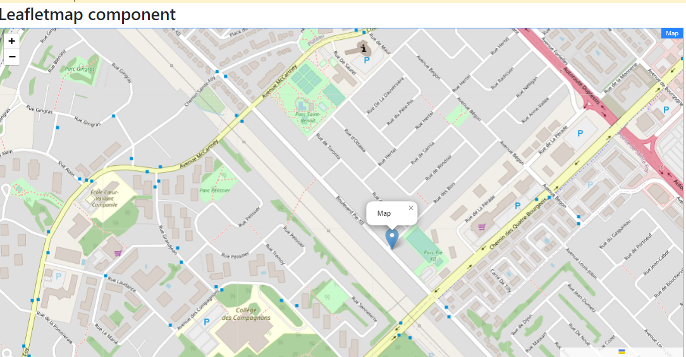

Component
============

Map component

# Overview

Component for adding map to pages

## Information
* **group**:Typerefinery - Widgets
* **sling:resourceType**: ws:Component
* **description**: Map component
* **title**: Map
* **sling:resourceSuperType**: 
* **Vendor**: Typerefinery
* **Version**: 1.0
* **Compatibility**: CMS
* **Status**: Ready
* **Showcase**: [/typerefinery/components/widgets/map](http://localhost:8080/apps/websight/index.html/content/typerefinery-showcase/pages/components/widgets/map::editor)
* **Local Code**: [/apps/typerefinery/components/widgets/map]
* **Source**: [github/typerefinery-websight](https://github.com/typerefinery-ai/typerefinery-websight/tree/feature/%23203-map-flow-enabled/application/backend/src/main/resources/apps/typerefinery/components/widgets/map)
* **Readme**: [/typerefinery/components/widgets/map/readme](https://github.com/typerefinery-ai/typerefinery-websight/tree/feature/%23203-map-flow-enabled/application/backend/src/main/resources/apps/typerefinery/components/widgets/map/README.md)

# Authoring

Following section covers authoring features

## Dialog Tabs

These fields are available for input by the authors. These fields are used in templates

<table style="border-spacing: 1px;border-collapse: separate;width: 100.0%;text-align: left;background-color: black; text-indent: 4px;">
    <thead style="font-size: larger;">
        <tr>
            <th style="width: 8%;">Tab</th>
            <th style="width: 8%;">Field Name</th>
            <th style="width: 8%;">Default Value</th>
            <th>Description</th>
        </tr>
    </thead>
    <tbody style="background-color: gray;">
        <tr>
            <td rowspan="6"> General</td>
            <td>latitude</td>
            <td>46.76336</td>
            <td>Consists of map centre view latitude. </td>
        </tr>
        <tr>
            <td>longitude</td>
            <td>-71.32453</td>
            <td>Consists of map centre view Longitude.</td>
        </tr>
        <tr>
            <td>Zoom</td>
            <td>16</td>
            <td>Defines the zoom level of the Map.</td>
        </tr>
        <tr>
            <td>Template Url</td>
            <td>https://{s}.tile.openstreetmap.org/{z}/{x}/{y}.png</td>
            <td>Instantiates a tile layer object given a URL template.</td>
        </tr>
         <tr>
            <td>Copyright Url</td>
            <td>https://www.openstreetmap.org/copyright</td>
            <td>Url for copyright.</td>
        </tr>
         <tr>
            <td>Layer zoom</td>
            <td>15</td>
            <td>Zoom level  to which this layer will be displayed.</td>
        </tr>
        <tr>
            <td rowspan="3">Marker</td>
            <td>Latitude</td>
            <td>46.76672</td>
            <td>Instantiates a Marker object given a latitude geographical point.</td>
        </tr>
        <tr>
            <td>Longitude</td>
            <td>-71.32919</td>
            <td>Instantiates a Marker object given a Longitude geographical point.</td>
        </tr>
        <tr>
            <td>Popup Text</td>
            <td>Map</td>
            <td>Used to open popups in certain places of the map.</td>
        </tr>
        <tr>
            <td>Data</td>
            <td>DataSource Url</td>
            <td>/apps/typerefinery/components/widgets/map/templates/flowsample.json</td>
            <td>Creates marker's data from datasource JSON.</td>
        </tr>
        <tr>
            <td rowspan="12">Flow</td>
            <td>Topics</td>
            <td><em>Dynamic topics</em></td>
            <td>The topic set for this flow, which is used to send and recive messages to and from the flow.</td>
        </tr>
         <tr>
            <td>Title</td>
            <td>Map flow</td>
            <td>The title to use for this flow. Update this component to change the title of the flow in Flow Designer.</td>
        </tr>
        <tr>
            <td>Group</td>
            <td>/content/typerefinery-showcase/pages/components/widgets/map</td>
            <td>This is the group that the flow belongs to, its used to group relevant flows.</td>
        </tr>
        <tr>
            <td>Template</td>
            <td>/apps/typerefinery/components/widgets/map/templates/map.json</td>
            <td>This is the template that the flow is based on, its used to create new flows from a template.</td>
        </tr>
        <tr>
            <td>Design Template</td>
            <td><em>Dynamic template</em></td>
            <td>This is the design template that the flow is based on, its used to update the design of the flow.</td>
        </tr>
        <tr>
            <td>Sample Data</td>
            <td>/apps/typerefinery/components/widgets/map/templates/flowsample.json</td>
            <td>This is the sample data that is added to the flow to help to get started.</td>
        </tr>
        <tr>
            <td>HTTP Route</td>
            <td>/content/typerefinery-showcase/pages/components/widgets/map/*</td>
            <td>This is the HTTP route for REST API for this flow, where applicable, not used in all flow enabled components.</td>
        </tr>
        <tr>
            <td>Is Container</td>
            <td>false</td>
            <td>This is a flag to indicate if the flow is a container flow, where applicable, not used in all flow enabled components.</td>
        </tr>
        <tr>
            <td>Flow ID</td>
            <td><em>Dynamic flow-id</em></td>
            <td>This is the flow stream ID for this flow, this is used to identify the flow in the flow stream.</td>
        </tr>
        <tr>
            <td>Created On</td>
            <td><em>Dynamic time/date</em></td>
            <td>This is the date and time that the flow was created.</td>
        </tr>
        <tr>
            <td>Updated On</td>
            <td><em>Dynamic time/date</em></td>
            <td>This is the date and time that the flow was last updated.</td>
        </tr>
         <tr>
            <td>Flow Designer</td>
            <td>Link</td>
            <td>This is the URL to edit the flow in Flow Designer.</td>
        </tr>
        <tr>
            <td>Grid</td>
            <td>Grid</td>
            <td></td>
            <td>Controls grids system.</td>
        </tr>
        <tr>
            <td>Style</td>
            <td>Id</td>
            <td></td>
            <td>Controls the css and styling.</td>
        </tr>
    </tbody>
</table>

# Variants

This component has the following variants

<table style="border-spacing: 1px;border-collapse: separate;width: 100.0%;text-align: left;background-color: black; text-indent: 4px;">
    <thead style="font-size: larger;">
        <tr>
            <th style="width: 8%;">Name</th>
            <th>Description</th>
            <th>Example</th>
        </tr>
    </thead>
    <tbody style="background-color: Gray;">
        <tr>
            <td>Leaflet</td>
            <td>Render map using leafletjs library</td>
            <th></th>
        </tr>
    </tbody>
</table>