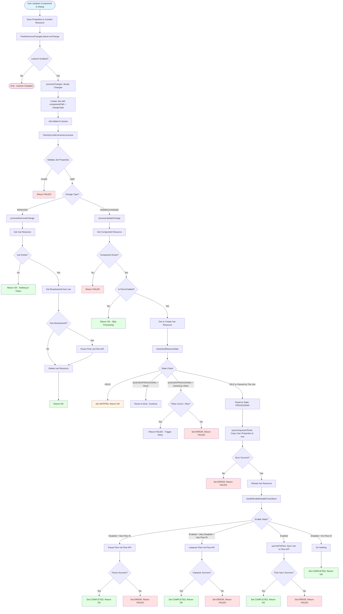

# Flow Execution Flow

This document describes the complete execution flow from change detection to Flow API synchronization.

## Architecture Overview

The Flow synchronization system uses a **listener → job → consumer** pattern:

1. **FlowResourceChangeListener** - Detects changes in `/content` and creates jobs
2. **FlowSyncJobConsumer** - Processes jobs and handles all business logic
3. **FlowSyncStorageService** - Manages `/var` storage and synchronization
4. **FlowService** - Interacts with Flow API

## Execution Flow Diagram



## Key Design Decisions

### 1. Flow-Enabled Check First

The flow-enabled check happens **before** state reservation to prevent unnecessary job queuing for non-flow-enabled resources. This ensures:
- No `/var` resources created for non-flow-enabled resources
- No state machine overhead for resources that don't need processing
- Faster job completion for skipped resources

### 2. Early State Reservation

State is reserved to `PROCESSING` **before** syncing component to var. This ensures:
- Other jobs wait if they try to process the same resource
- Race conditions are prevented
- Stuck state detection can recover from failed jobs

### 3. Separation of Concerns

- **Listener**: Only creates jobs (no business logic)
- **Consumer**: All business logic (flow-enabled check, state management, sync)
- **Storage Service**: Manages `/var` storage and synchronization
- **Flow Service**: Interacts with Flow API

### 4. Enable/Disable Transition Handling

The system explicitly handles enable/disable transitions:
- **Disable**: If flow ID exists, pause the flow
- **Enable (from disabled)**: If flow ID exists, unpause the flow
- **Enable**: Sync properties to Flow API
- **Disable (no flow ID)**: Nothing to do

### 5. Stuck State Recovery

The system detects and recovers from stuck states:
- **Timeout**: Resource in `PROCESSING` state longer than `processingTimeoutSeconds`
- **Missing Job**: Stored job ID no longer exists in queue
- **Recovery**: Reset state to `IDLE` and allow processing to continue

## State Machine Flow

```
IDLE → (Check Flow-Enabled) → Get/Create Var → Check State → Reserve PROCESSING
  → Sync Component to Var → Handle Transitions → Sync to Flow API → COMPLETED/ERROR
```

For REMOVED changes:
```
Get Var → (If exists) Pause Flow → Delete Var → OK
```

## Error Handling

- **Invalid Job Properties**: Return `FAILED` immediately
- **Component Not Found**: Set `ERROR` state, return `FAILED`
- **Not Flow-Enabled**: Return `OK` (not an error, just skip)
- **Sync Failures**: Set `ERROR` state, return `FAILED`
- **Flow API Failures**: Set `ERROR` state, return `FAILED`
- **Stuck Resources**: Reset to `IDLE`, allow retry

## Retry Mechanism

- **Max Retries**: Configurable (default: 10)
- **Retry Trigger**: Return `FAILED` when resource is owned by another job
- **Retry Limit**: After max retries, set `ERROR` state and stop retrying
- **Stuck Recovery**: Automatic recovery from stuck states (timeout or missing job)

## Configuration

- **`maxRetryCount`**: Maximum retries before giving up (default: 10)
- **`processingTimeoutSeconds`**: Timeout for stuck state detection (default: 300 seconds)

