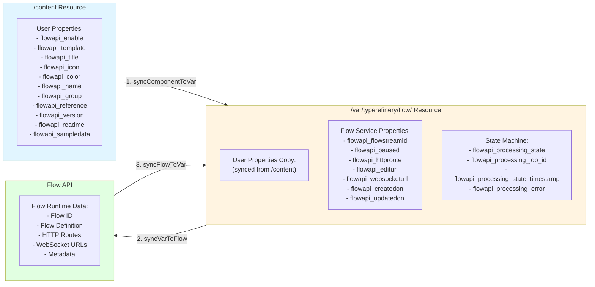

# Flow Synchronization Flow

This document describes the data synchronization flow between `/content`, `/var`, and the Flow API.

## Data Flow Overview

The Flow synchronization system maintains three data stores:

1. **`/content`** - User-editable metadata (component resources)
2. **`/var/typerefinery/flow/`** - Flow service data and state machine
3. **Flow API** - External Flow service (runtime)

## Synchronization Flow Diagram



## Detailed Synchronization Steps

### Step 1: Component to Var Sync (`syncComponentToVar`)

**Trigger**: When a component is added or changed in `/content`

**Process**:
1. Get or create `/var` resource for component path
2. Copy user-controlled properties from `/content` to `/var`:
   - `flowapi_enable`
   - `flowapi_template`
   - `flowapi_template_design`
   - `flowapi_title`
   - `flowapi_icon`
   - `flowapi_color`
   - `flowapi_name`
   - `flowapi_group`
   - `flowapi_reference`
   - `flowapi_version`
   - `flowapi_sampledata`
   - `flowapi_readme`
3. Commit changes to repository

**Purpose**: Keep `/var` in sync with user-editable metadata from `/content`

**Code**: `FlowSyncStorageService.syncComponentToVar()`

### Step 2: Var to Flow API Sync (`syncVarToFlow`)

**Trigger**: After component metadata is synced to `/var` and resource is enabled

**Process**:
1. Read Flow data from `/var` resource
2. Call `FlowService.doProcessFlowResource()` with `/var` resource
3. FlowService determines action:
   - **Create**: If no flow ID exists and template exists
   - **Update**: If flow ID exists and metadata changed
   - **Pause**: If disabled and flow ID exists
   - **Unpause**: If enabled (from disabled) and flow ID exists
4. FlowService calls Flow API endpoints:
   - `/flow/import` - Create new flow
   - `/flow/update` - Update existing flow
   - `/flow/pause/{id}?is=1` - Pause flow
   - `/flow/pause/{id}?is=0` - Unpause flow
   - `/flow/save/{id}` - Save metadata only

**Purpose**: Synchronize Flow data to external Flow API service

**Code**: `FlowSyncStorageService.syncVarToFlow()` → `FlowService.doProcessFlowResource()`

### Step 3: Flow API to Var Sync (`syncFlowToVar`)

**Trigger**: After successful Flow API calls

**Process**:
1. FlowService receives response from Flow API
2. Extract Flow service properties from response:
   - `flowapi_flowstreamid` - Flow ID
   - `flowapi_httproute` - Client-facing HTTP route URL
   - `flowapi_editurl` - Flow Designer URL
   - `flowapi_websocketurl` - WebSocket URL
   - `flowapi_createdon` - Creation timestamp
   - `flowapi_updatedon` - Update timestamp
   - `flowapi_paused` - Pause state
3. Write properties to `/var` resource
4. Commit changes to repository

**Purpose**: Store Flow API response data in `/var` for display in dialogs. `/var` is only the persistence location for the generated metadata. Saved route values such as `flowapi_httproute` and `flowapi_httproutenosfx` must remain actual client-facing Flow URLs.

**Code**: `FlowService` → `FlowSyncStorageService.syncFlowToVar()`

## Data Separation

### User-Controlled Properties (in `/content`)

These properties are edited by users in component dialogs:

- `flowapi_enable` - Enable/disable Flow
- `flowapi_template` - Flow template path
- `flowapi_template_design` - Design template path
- `flowapi_title` - Display title
- `flowapi_icon` - Icon identifier
- `flowapi_color` - Color identifier
- `flowapi_name` - Flow name
- `flowapi_group` - Flow group/category override. If blank, FlowService derives the default group/category from the normalized component path for the page.
- `flowapi_reference` - Reference identifier
- `flowapi_version` - Version string
- `flowapi_readme` - README content
- `flowapi_sampledata` - Sample data path

### Flow Service Properties (in `/var`)

These properties are managed by FlowService and Flow API:

- `flowapi_flowstreamid` - Flow ID from API
- `flowapi_paused` - Pause state
- `flowapi_httproute` - Client-facing HTTP route URL persisted in `/var`
- `flowapi_editurl` - Flow Designer URL
- `flowapi_websocketurl` - WebSocket URL
- `flowapi_createdon` - Creation timestamp
- `flowapi_updatedon` - Update timestamp

### State Machine Properties (in `/var`)

These properties track processing state:

- `flowapi_processing_state` - Current state (IDLE, QUEUED, PROCESSING, COMPLETED, ERROR, SKIPPED, HOLD)
- `flowapi_processing_job_id` - Job ID currently processing
- `flowapi_processing_state_timestamp` - State change timestamp
- `flowapi_processing_error` - Error message (if ERROR state)

## Synchronization Scenarios

### Scenario 1: New Component (ADDED)

```
1. User creates component in /content
2. User enables Flow in dialog
3. Listener creates job (ADDED)
4. Consumer: Check flow-enabled → Yes
5. Consumer: Get/Create /var resource
6. Consumer: Sync component to var (copy user properties)
7. Consumer: Sync var to Flow API (create flow)
8. Flow API: Returns flow ID and URLs
9. FlowService: Sync Flow API response to var
10. Consumer: Set state to COMPLETED
```

### Scenario 2: Update Component (CHANGED)

```
1. User updates component properties in /content
2. Listener creates job (CHANGED)
3. Consumer: Check flow-enabled → Yes
4. Consumer: Get /var resource
5. Consumer: Sync component to var (update user properties)
6. Consumer: Check enable state transition
   - If disabled → Pause flow
   - If enabled (was disabled) → Unpause flow
   - If enabled → Sync var to Flow API (update flow)
7. Flow API: Returns updated URLs
8. FlowService: Sync Flow API response to var
9. Consumer: Set state to COMPLETED
```

### Scenario 3: Delete Component (REMOVED)

```
1. User deletes component from /content
2. Listener creates job (REMOVED)
3. Consumer: Get /var resource
4. Consumer: If flow ID exists → Pause flow via Flow API
5. Consumer: Delete /var resource
6. Consumer: Return OK
```

### Scenario 4: Disable Flow

```
1. User disables Flow in dialog (flowapi_enable = false)
2. Listener creates job (CHANGED)
3. Consumer: Check flow-enabled → Yes (still flow-enabled component)
4. Consumer: Sync component to var (flowapi_enable = false)
5. Consumer: Check enable state → Disabled + Has Flow ID
6. Consumer: Pause flow via Flow API
7. Consumer: Set state to COMPLETED
```

### Scenario 5: Enable Flow (from disabled)

```
1. User enables Flow in dialog (flowapi_enable = true)
2. Listener creates job (CHANGED)
3. Consumer: Check flow-enabled → Yes
4. Consumer: Sync component to var (flowapi_enable = true)
5. Consumer: Check enable state → Enabled + Was Disabled + Has Flow ID
6. Consumer: Unpause flow via Flow API
7. Consumer: Set state to COMPLETED
```

## Path Mapping

Component paths in `/content` are mapped to `/var` paths:

```
/content/pages/home/jcr:content/rootcontainer/form
  → /var/typerefinery/flow/content/pages/home/jcr:content/rootcontainer/form
```

**Implementation**: `FlowSyncStorageService.getVarPath()`

## Benefits of This Architecture

1. **No Listener Loops**: Flow service updates to `/var` don't trigger `/content` listener
2. **Clean Separation**: User data in `/content`, Flow service data in `/var`
3. **State Machine**: Prevents duplicate processing with retry mechanism
4. **Stuck State Recovery**: Automatic detection and recovery from stuck jobs
5. **Simplified Listener**: Listener only creates jobs, all logic in consumer

## Dialog Display

The Flow dialog uses `typerefinery/components/dialog/flow/openurl` to display read-only Flow URLs from the `/var` resource:

- **Edit URL**: `flowapi_editurl` - Opens Flow Designer
- **HTTP Route**: `flowapi_httproute` - HTTP endpoint URL
- **WebSocket URL**: `flowapi_websocketurl` - WebSocket endpoint URL

These values are read from `/var` resource via `FlowOpenUrlModel`.

