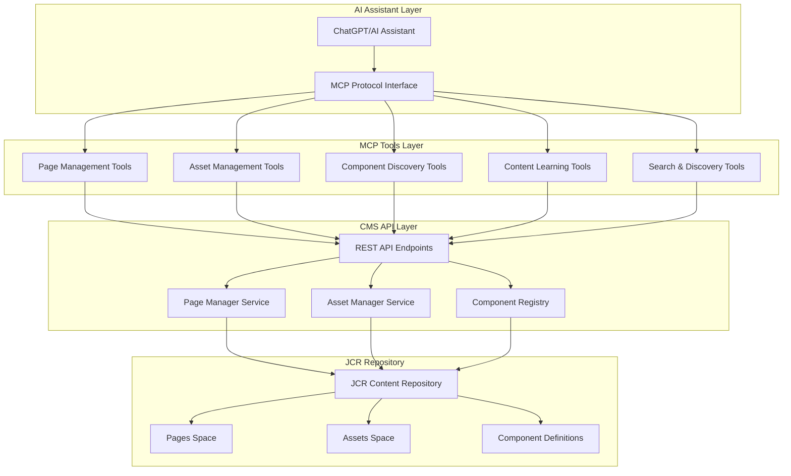
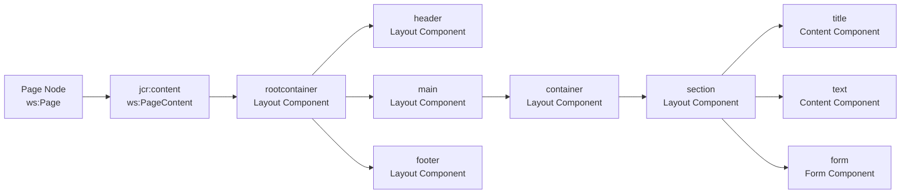
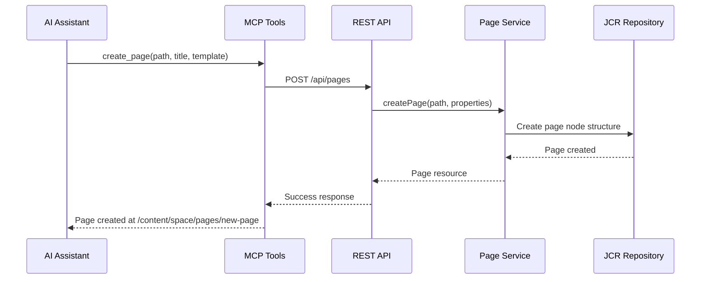
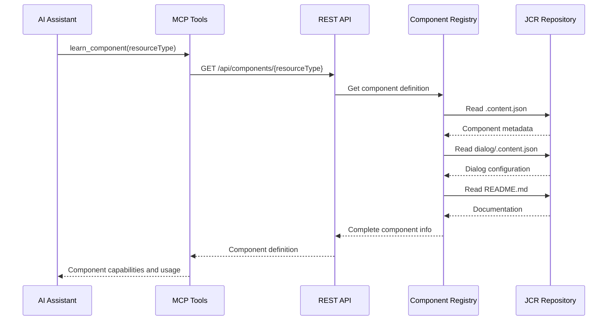
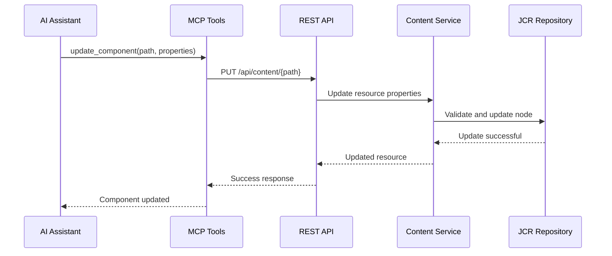
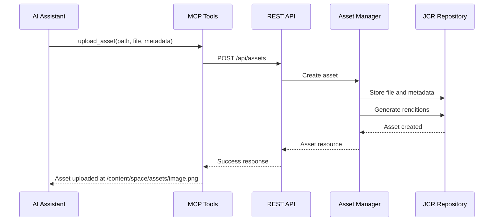
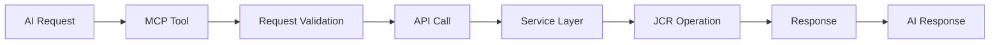
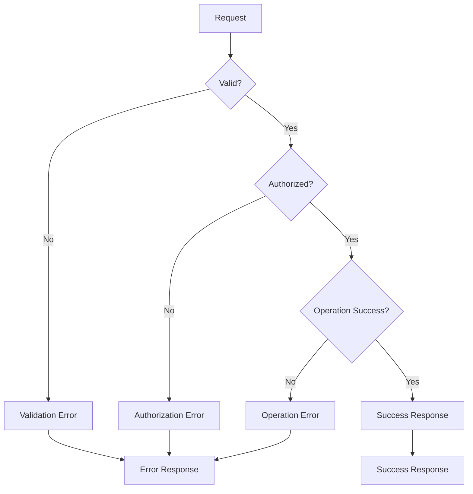
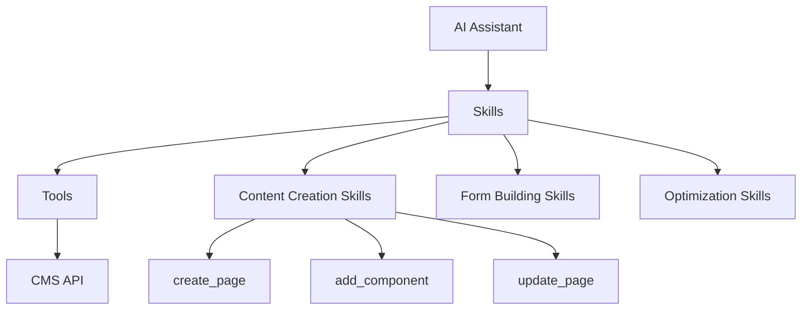

# MCP Tools for CMS Integration - Overview and Architecture

## Executive Summary

This document provides a comprehensive overview of the MCP (Model Context Protocol) tools integration for the Typerefinery CMS. The goal is to enable AI assistants (like ChatGPT) to interact with the CMS through a structured set of tools that allow content creation, management, and understanding.

## System Architecture

### High-Level Architecture



## Content Structure

### JCR Repository Organization

```mermaid
graph TD
    Root[/content]
    
    Root --> Spaces[Spaces ws:PagesSpace]
    Root --> Showcase[typerefinery-showcase]
    
    Spaces --> PagesSpace[pages ws:Pages]
    Spaces --> AssetsSpace[assets ws:Assets]
    
    PagesSpace --> Page1[Page ws:Page]
    Page1 --> PageContent[jcr:content ws:PageContent]
    PageContent --> RootContainer[rootcontainer]
    RootContainer --> Components[Component Hierarchy]
    
    Components --> Layout[Layout Components]
    Components --> Content[Content Components]
    Components --> Forms[Form Components]
    Components --> Widgets[Widget Components]
    
    AssetsSpace --> Asset1[Asset]
    Asset1 --> Renditions[Renditions]
```

### Page Structure



## Process Flows

### Page Creation Flow



### Component Learning Flow



### Content Update Flow



### Asset Management Flow



## MCP Tool Categories

### Tools vs Skills

**Tools** are low-level, atomic operations:
- Individual API operations
- Single responsibility
- Direct CMS interactions

**Skills** are high-level, reusable capabilities:
- Combine multiple tools
- Business logic and patterns
- Domain expertise
- Complex workflows

See [Skills Architecture](11-skills-architecture.md) for detailed information.

### 1. Page Management Tools
- `create_page` - Create new pages
- `create_site` - Create new page spaces
- `update_page` - Update page properties
- `find_pages` - Search and filter pages
- `get_page_structure` - Get page component hierarchy

### 2. Asset Management Tools
- `upload_asset` - Upload files to assets space
- `find_assets` - Search assets
- `get_asset_info` - Get asset metadata and renditions
- `delete_asset` - Remove assets

### 3. Component Discovery Tools
- `find_components` - Search available components
- `get_component_info` - Get component definition
- `learn_component` - Comprehensive component learning
- `get_component_dialog` - Get component dialog configuration

### 4. Content Learning Tools
- `analyze_page_structure` - Understand page composition
- `learn_content_patterns` - Identify content patterns
- `get_component_usage` - Find component usage examples
- `understand_layers` - Learn component layering rules

### 5. Search & Discovery Tools
- `search_content` - Full-text content search
- `find_by_path` - Locate resources by path
- `find_by_type` - Find resources by type
- `get_content_tree` - Get hierarchical content structure

## Integration Points

### REST API Endpoints

The MCP tools will interact with existing REST API endpoints:

- **Pages**: `/api/pages/*` - Page management operations
- **Assets**: `/api/assets/*` - Asset management operations
- **Components**: `/api/components/*` - Component discovery
- **Content**: `/api/content/*` - Content CRUD operations
- **Spaces**: `/api/spaces/*` - Space management

### Authentication & Authorization

- All MCP tool calls require authentication
- Authorization is enforced at the API layer
- Role-based access control (RBAC) for different operations
- Audit logging for all content modifications

## Data Flow

### Request Flow



### Error Handling



## Security Considerations

- All operations require authentication
- Role-based access control enforced
- Input validation and sanitization
- Audit logging for compliance
- Rate limiting to prevent abuse
- Content validation before persistence

## Performance Considerations

- Caching for frequently accessed components
- Lazy loading for large content trees
- Pagination for search results
- Async operations for long-running tasks
- Connection pooling for JCR access

## Skills Layer

Skills provide higher-level capabilities that combine multiple tools:



**Example Skills:**
- `create_landing_page_skill` - Complete landing page creation
- `build_contact_form_skill` - Form with validation
- `optimize_page_seo_skill` - SEO optimization workflow

See [Skills Architecture](11-skills-architecture.md) for details.

## Tool Discovery

MCP tools are self-describing and discoverable:

- **Tool Registration**: Tools register themselves with the MCP server
- **Schema Definition**: Each tool provides JSON Schema describing capabilities
- **Tool Listing**: AI can list and discover available tools
- **Tool Introspection**: AI can query tool schemas and examples

See [Tool Discovery and Learning](13-tool-discovery-learning.md) for details.

## CMS Discovery and Learning

MCP tools learn about the CMS through:

- **Structure Discovery**: Analyzing JCR repository structure
- **Component Learning**: Reading component definitions, dialogs, and documentation
- **Pattern Analysis**: Analyzing reference content for patterns
- **Template Learning**: Understanding page templates and structures
- **Operation Learning**: Learning how to perform CMS operations

See [CMS Discovery and Learning](14-cms-discovery-learning.md) for complete details.

## ChatGPT Integration

To connect your local CMS instance to ChatGPT:

1. **MCP Server**: Run MCP server locally (standalone or embedded)
2. **CMS Connection**: MCP server connects to localhost:8080
3. **ChatGPT Configuration**: Configure ChatGPT to use MCP server
4. **Authentication**: Set up token-based authentication

**Architecture:**
```
ChatGPT → MCP Server (localhost:3000) → CMS (localhost:8080)
```

See [ChatGPT Integration Setup](15-chatgpt-integration-setup.md) for complete setup instructions.

## Next Steps

1. Review MCP tool specifications (see `02-mcp-tool-specifications.md`)
2. Understand tool discovery (see `13-tool-discovery-learning.md`)
3. Understand skills architecture (see `11-skills-architecture.md`)
4. Analyze content structure (see `03-content-structure-analysis.md`)
5. Review security considerations (see `04-security-evaluation.md`)
6. Understand architecture patterns (see `05-architecture-evaluation.md`)


