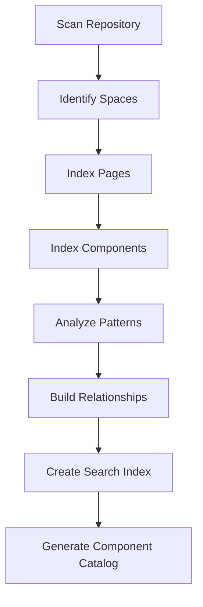

# Content Structure Analysis

## Overview

This document analyzes the JCR content structure based on reference content in `tests/content/src/main/content/jcr_root/content`. This analysis informs how MCP tools should index, navigate, and update content in the CMS.

## Repository Structure

### Root Organization

```
/content
├── typerefinery/              # Main site space
│   ├── pages/                # Pages space (ws:Pages)
│   └── assets/               # Assets space (ws:Assets)
├── typerefinery-showcase/    # Showcase site space
│   ├── pages/                # Pages space
│   │   ├── components/       # Component showcase pages
│   │   ├── forms/            # Form examples
│   │   ├── os-triage/        # Application pages
│   │   └── ...
│   └── assets/               # Assets space
│       ├── images/           # Image assets
│       └── config/           # Configuration assets
└── os-triage/                # Application-specific space
    ├── pages/
    └── assets/
```

### Page Space Structure

Each page space (`ws:Pages`) contains:
- **Pages** (`ws:Page` nodes): Individual pages
- **Hierarchical organization**: Pages can be nested
- **Template reference**: Each page references a template

### Page Node Structure

```xml
<jcr:root jcr:primaryType="ws:Page">
    <jcr:content                    # Page content node
        jcr:primaryType="ws:PageContent"
        sling:resourceType="typerefinery/components/structure/page"
        jcr:title="Page Title"
        ws:template="/apps/typerefinery/templates/page">
        <rootcontainer             # Root container component
            jcr:primaryType="nt:unstructured"
            sling:resourceType="typerefinery/components/layout/fixedrootcontainer">
            <!-- Component hierarchy -->
        </rootcontainer>
    </jcr:content>
    <!-- Additional child pages -->
</jcr:root>
```

### Component Hierarchy Patterns

#### Standard Page Layout

```
jcr:content
└── rootcontainer (fixedrootcontainer)
    ├── header (header)
    ├── main (main)
    │   └── container (container)
    │       └── section (section)
    │           ├── title (title)
    │           ├── text (text)
    │           └── form (form)
    └── footer (footer)
```

#### Form Page Pattern

```
jcr:content
└── rootcontainer (fixedrootcontainer)
    └── main (main)
        └── form (form)
            ├── input (input)
            │   ├── label (label)
            │   └── field (input field)
            └── input_1 (input)
                ├── label (label)
                └── field (input field)
```

## Component Types

### Layout Components

**Purpose**: Structure and organize page layout

**Common Layout Components:**
- `fixedrootcontainer` - Fixed root container
- `rootcontainer` - Flexible root container
- `header` - Page header
- `main` - Main content area
- `footer` - Page footer
- `container` - Content container
- `section` - Content section
- `sidebar` - Sidebar navigation
- `accordion` - Accordion layout
- `breadcrumbs` - Breadcrumb navigation

**Properties:**
- `id` - Unique component identifier (auto-generated)
- `sling:resourceType` - Component type
- `jcr:primaryType` - JCR node type (usually `nt:unstructured`)

### Content Components

**Purpose**: Display content to users

**Common Content Components:**
- `title` - Heading/title
- `text` - Text content
- `image` - Image display
- `card` - Card component
- `table` - Data table
- `tag` - Tag/label
- `embed` - Embedded content
- `upload-file` - File upload display

**Properties:**
- Component-specific properties (e.g., `title` for title component)
- `id` - Unique identifier

### Form Components

**Purpose**: Collect user input

**Common Form Components:**
- `form` - Form container
- `input` - Text input field
- `textarea` - Multi-line text input
- `select` - Dropdown selection
- `checkbox` - Checkbox input
- `radio` - Radio button group
- `fileupload` - File upload field
- `composite` - Composite field group
- `button` - Form button

**Form Component Structure:**
```
form
├── input
│   ├── label
│   └── field (input field component)
└── input_1
    ├── label
    └── field
```

### Widget Components

**Purpose**: Interactive UI widgets

**Common Widget Components:**
- `modal` - Modal dialog
- `tabs` - Tabbed interface
- `chart` - Data visualization
- `table` - Data table widget
- `map` - Map display
- `treeview` - Tree navigation
- `ticker` - News ticker
- `security` - Security-related widgets

## Component Properties Analysis

### Common Properties

**All Components:**
- `jcr:primaryType` - JCR node type
- `sling:resourceType` - Component resource type
- `id` - Unique component identifier (format: `{type}_{RANDOM}`)

**Page Content:**
- `jcr:title` - Page title
- `jcr:description` - Page description
- `ws:template` - Template path
- `ws:lastModified` - Last modification date
- `ws:lastModifiedBy` - Last modifier
- `hideInNav` - Hide from navigation
- `ogTitle`, `ogDescription`, `ogUrl` - Open Graph metadata

**Form Components:**
- `flowapi_*` - Flow API properties (e.g., `flowapi_name`, `flowapi_color`, `flowapi_icon`)
- `name` - Field name
- `label` - Field label
- `required` - Required field flag

## Component Relationships

### Container Rules

Components define `allowedComponents` in their `.content.json`:

```json
{
  "isContainer": true,
  "allowedComponents": [
    "Typerefinery - Content",
    "Typerefinery - Forms",
    "Typerefinery - Layout"
  ]
}
```

### Component Groups

Components are organized into groups:
- `Typerefinery - Content`
- `Typerefinery - Forms`
- `Typerefinery - Layout`
- `Typerefinery - Widgets`
- `Typerefinery - Flow`
- `Typerefinery - Graphs`

## Asset Structure

### Asset Organization

```
/assets
├── images/
│   ├── forms/              # Form-related images
│   │   └── *.svg
│   └── *.png, *.svg
└── config/
    └── favicon.ico/
        └── _jcr_content/
            └── renditions/
                └── original.ico
```

### Asset Properties

- Assets stored with `_jcr_content` sub-node
- Renditions stored under `renditions/`
- Original file in `renditions/original.*`

## Template Structure

### Page Templates

Templates define initial page structure:

**Location**: `/apps/typerefinery/templates/{template-name}/initial/.content.json`

**Common Templates:**
- `page` - Standard page template
- `blank` - Blank page template
- `base` - Base template
- `dashboard` - Dashboard template

**Template Structure:**
```json
{
  "jcr:primaryType": "ws:Page",
  "jcr:content": {
    "jcr:primaryType": "ws:PageContent",
    "sling:resourceType": "typerefinery/components/structure/page",
    "rootcontainer": {
      "sling:resourceType": "typerefinery/components/layout/fixedrootcontainer"
    }
  }
}
```

## Content Patterns

### Pattern 1: Simple Content Page

```
Page
└── jcr:content
    └── rootcontainer
        └── main
            └── container
                └── section
                    ├── title
                    └── text
```

### Pattern 2: Form Page

```
Page
└── jcr:content
    └── rootcontainer
        └── main
            └── form
                ├── input (field 1)
                ├── input_1 (field 2)
                └── input_2 (field 3)
```

### Pattern 3: Dashboard Page

```
Page
└── jcr:content
    └── rootcontainer
        ├── header
        ├── main
        │   └── container
        │       ├── section (widget 1)
        │       ├── section (widget 2)
        │       └── section (widget 3)
        └── footer
```

## MCP Tool Implications

### Indexing Requirements

MCP tools need to:
1. **Index Pages**: Build searchable index of all pages
2. **Index Components**: Catalog all available components
3. **Index Patterns**: Identify common content patterns
4. **Index Relationships**: Map component relationships and dependencies

### Navigation Requirements

MCP tools must support:
1. **Path-based navigation**: Navigate by JCR path
2. **Type-based navigation**: Find resources by type
3. **Relationship navigation**: Follow component relationships
4. **Hierarchical navigation**: Traverse page and component trees

### Update Requirements

MCP tools must handle:
1. **Node creation**: Create new nodes with proper types
2. **Property updates**: Update node properties
3. **Structure changes**: Add/remove/move components
4. **Validation**: Ensure updates maintain structure integrity

## Reference Content Examples

### Example 1: Form Flow Metadata Page

**Path**: `/content/typerefinery-showcase/pages/os-triage/forms/form-flow-metadata`

**Structure**:
- Page with form component
- Form contains multiple input fields
- Each input has label and field sub-components
- Form has flow API properties

### Example 2: Component Showcase Page

**Path**: `/content/typerefinery-showcase/pages/components/content`

**Structure**:
- Page demonstrating content components
- Multiple component examples
- Shows component usage patterns

## Content Analysis Workflow



## Next Steps

1. Review MCP tool specifications (see `02-mcp-tool-specifications.md`)
2. Understand security requirements (see `04-security-evaluation.md`)
3. Review architecture patterns (see `05-architecture-evaluation.md`)


