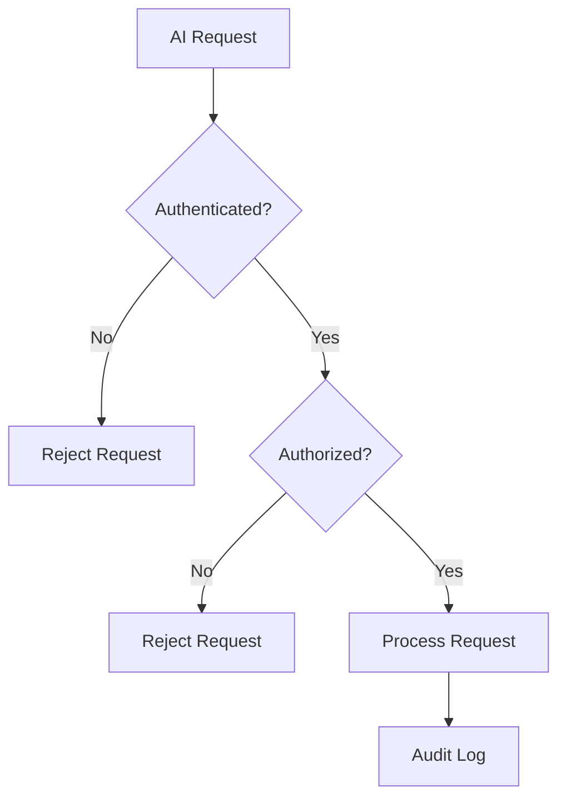
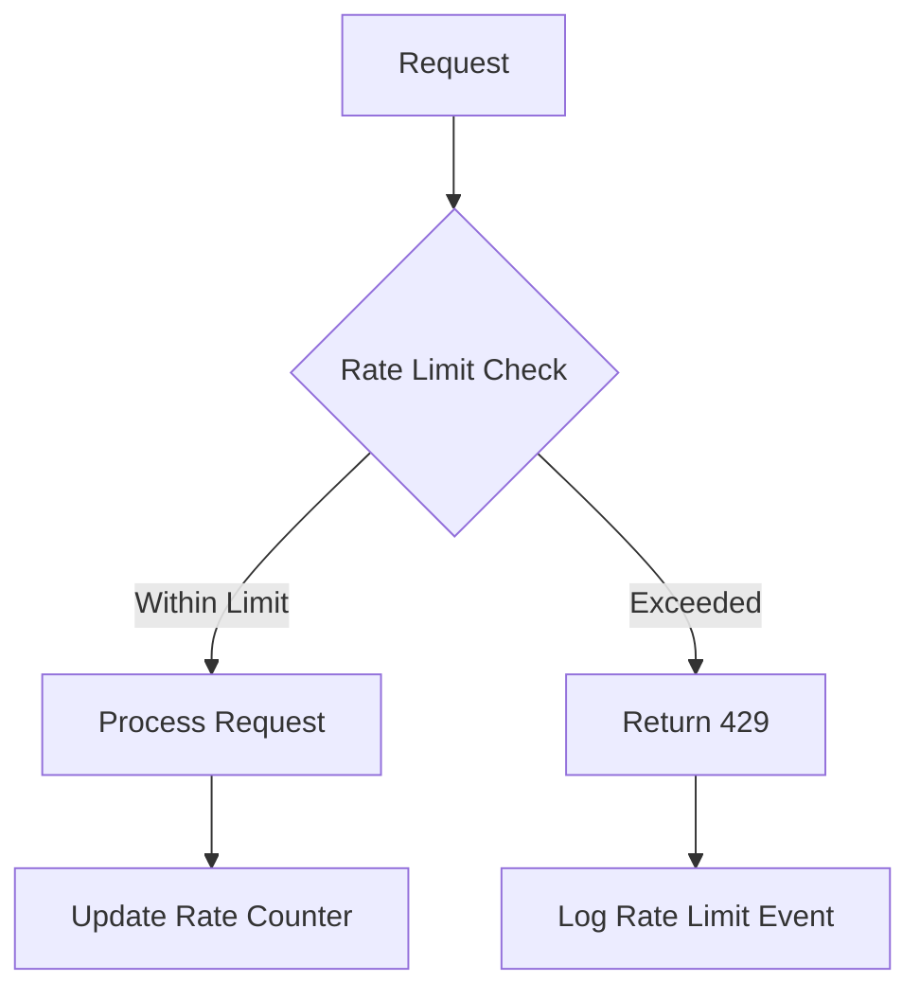

# Security Evaluation

## Overview

This document evaluates security considerations for MCP tools that enable AI assistants to interact with the Typerefinery CMS. Security is critical as these tools provide programmatic access to content management operations.

## Threat Model

### Potential Threats

1. **Unauthorized Access**: AI assistant accessing content without proper authorization
2. **Data Leakage**: Sensitive content exposed through tool responses
3. **Malicious Content**: AI creating or modifying content maliciously
4. **Privilege Escalation**: AI gaining access beyond intended permissions
5. **Denial of Service**: Excessive requests overwhelming the system
6. **Injection Attacks**: Malicious input in content or paths
7. **Audit Bypass**: Operations not properly logged

## Authentication & Authorization

### Authentication Requirements



**Implementation:**
- All MCP tool calls require valid authentication token
- Token validation at API gateway level
- Token expiration and refresh mechanisms
- Support for service accounts and user impersonation

### Authorization Model

**Role-Based Access Control (RBAC):**

1. **Viewer Role**
   - Read-only access to published content
   - Can search and discover content
   - Cannot modify content

2. **Author Role**
   - Create and edit content
   - Upload assets
   - Cannot publish or delete

3. **Editor Role**
   - All Author permissions
   - Publish content
   - Manage pages and components

4. **Administrator Role**
   - Full system access
   - Manage sites and spaces
   - System configuration

**Path-Based Authorization:**
- Access control enforced at JCR path level
- Inherited permissions from parent paths
- Explicit deny rules override allow rules

### Permission Matrix

| Operation | Viewer | Author | Editor | Admin |
|-----------|--------|--------|--------|-------|
| Read pages | ✓ | ✓ | ✓ | ✓ |
| Search content | ✓ | ✓ | ✓ | ✓ |
| Create pages | ✗ | ✓ | ✓ | ✓ |
| Update pages | ✗ | ✓ | ✓ | ✓ |
| Delete pages | ✗ | ✗ | ✓ | ✓ |
| Publish pages | ✗ | ✗ | ✓ | ✓ |
| Upload assets | ✗ | ✓ | ✓ | ✓ |
| Delete assets | ✗ | ✗ | ✓ | ✓ |
| Create sites | ✗ | ✗ | ✗ | ✓ |
| System config | ✗ | ✗ | ✗ | ✓ |

## Input Validation & Sanitization

### Path Validation

**Requirements:**
- Validate JCR path format
- Prevent path traversal attacks (`../`, `..\\`)
- Restrict to allowed content spaces
- Validate path length limits

**Example Validation:**
```javascript
function validatePath(path) {
  // Reject path traversal
  if (path.includes('..') || path.includes('//')) {
    throw new Error('Invalid path');
  }
  
  // Restrict to content spaces
  if (!path.startsWith('/content/')) {
    throw new Error('Path must be under /content');
  }
  
  // Validate length
  if (path.length > 1000) {
    throw new Error('Path too long');
  }
  
  return path;
}
```

### Content Validation

**Requirements:**
- Validate component properties against schemas
- Sanitize HTML content to prevent XSS
- Validate file uploads (type, size, content)
- Validate JSON structures

**XSS Prevention:**
- Sanitize all user-generated content
- Use Content Security Policy (CSP)
- Escape output in templates
- Validate and sanitize component properties

### Property Validation

**Requirements:**
- Validate property types match expected types
- Enforce property constraints (min/max length, patterns)
- Validate required properties
- Reject unknown properties for strict components

## Data Protection

### Sensitive Data Handling

**PII (Personally Identifiable Information):**
- Identify and flag PII in content
- Apply additional access controls
- Log access to sensitive content
- Support data anonymization

**Credentials:**
- Never expose credentials in responses
- Mask sensitive fields in logs
- Secure storage of API keys
- Support credential rotation

### Data Encryption

**In Transit:**
- All API communication over HTTPS/TLS
- Enforce TLS 1.2 minimum
- Certificate pinning for critical endpoints

**At Rest:**
- Encrypt sensitive content in JCR
- Secure storage of authentication tokens
- Encrypted audit logs

## Rate Limiting & Throttling

### Rate Limit Strategy



**Limits:**
- **Read Operations**: 100 requests/minute per token
- **Write Operations**: 20 requests/minute per token
- **Search Operations**: 50 requests/minute per token
- **Bulk Operations**: 10 requests/minute per token

**Implementation:**
- Token-based rate limiting
- Sliding window algorithm
- Per-endpoint limits
- Graceful degradation

## Audit Logging

### Logging Requirements

**All operations must log:**
- Timestamp
- User/Service account identifier
- Operation type
- Resource path
- Request parameters (sanitized)
- Response status
- Error details (if applicable)

**Sensitive Operations:**
- Content creation
- Content modification
- Content deletion
- Permission changes
- Asset uploads

### Log Format

```json
{
  "timestamp": "2024-01-15T10:30:00Z",
  "user": "ai-service-account",
  "operation": "create_page",
  "path": "/content/typerefinery/pages/new-page",
  "parameters": {
    "title": "New Page",
    "template": "/apps/typerefinery/templates/page"
  },
  "status": "success",
  "ip": "192.168.1.100"
}
```

### Log Retention

- **Audit Logs**: 7 years retention
- **Access Logs**: 1 year retention
- **Error Logs**: 90 days retention
- **Performance Logs**: 30 days retention

## Error Handling Security

### Information Disclosure

**Do Not Expose:**
- Internal system paths
- Database connection strings
- Stack traces in production
- Internal error codes
- User enumeration information

**Safe Error Messages:**
```json
{
  "success": false,
  "error": "OPERATION_FAILED",
  "message": "The requested operation could not be completed.",
  "requestId": "req-12345"
}
```

### Error Logging

- Log detailed errors server-side
- Include stack traces in server logs only
- Use request IDs for correlation
- Never log sensitive data

## Content Security Policy

### CSP Headers

- Restrict inline scripts
- Whitelist allowed sources
- Prevent data exfiltration
- Enforce HTTPS

### Component Security

**Sandboxing:**
- Isolate component execution
- Limit component capabilities
- Validate component code
- Monitor component behavior

## API Security

### API Gateway Security

**Requirements:**
- Request validation
- Authentication verification
- Rate limiting enforcement
- Request/response logging
- DDoS protection

### Endpoint Security

**Per-Endpoint Controls:**
- Different rate limits per endpoint
- Role-based endpoint access
- Input validation per endpoint
- Response filtering per endpoint

## Security Best Practices

### For Developers

1. **Never trust input**: Always validate and sanitize
2. **Principle of least privilege**: Grant minimum required permissions
3. **Defense in depth**: Multiple security layers
4. **Secure defaults**: Safe defaults for all configurations
5. **Regular updates**: Keep dependencies updated
6. **Security testing**: Regular security audits

### For AI Integration

1. **Service Account**: Use dedicated service account for AI
2. **Limited Scope**: Restrict to specific content spaces
3. **Monitoring**: Monitor all AI-generated content
4. **Review Process**: Human review for sensitive operations
5. **Audit Trail**: Complete audit trail for AI operations

## Security Testing

### Testing Requirements

1. **Penetration Testing**: Annual security audits
2. **Vulnerability Scanning**: Regular automated scans
3. **Code Review**: Security-focused code reviews
4. **Dependency Scanning**: Check for vulnerable dependencies
5. **Access Control Testing**: Verify authorization rules

### Test Scenarios

- Unauthorized access attempts
- Path traversal attacks
- Injection attacks (XSS, SQL, etc.)
- Rate limit bypass attempts
- Privilege escalation attempts
- Data exfiltration attempts

## Incident Response

### Security Incident Procedure

1. **Detection**: Identify security incident
2. **Containment**: Isolate affected systems
3. **Investigation**: Determine scope and impact
4. **Remediation**: Fix vulnerabilities
5. **Recovery**: Restore normal operations
6. **Post-Mortem**: Document and learn

### Monitoring & Alerting

- Real-time security monitoring
- Automated alerting for suspicious activity
- Security dashboard for visibility
- Integration with SIEM systems

## Compliance Considerations

### GDPR

- Right to access
- Right to deletion
- Data portability
- Privacy by design

### SOC 2

- Access controls
- Audit logging
- Change management
- Incident response

## Security Checklist

- [ ] Authentication implemented
- [ ] Authorization enforced
- [ ] Input validation in place
- [ ] Output sanitization implemented
- [ ] Rate limiting configured
- [ ] Audit logging enabled
- [ ] Error handling secure
- [ ] Encryption in transit and at rest
- [ ] Security testing completed
- [ ] Monitoring and alerting configured
- [ ] Incident response plan documented
- [ ] Compliance requirements met

## Next Steps

1. Review architecture evaluation (see `05-architecture-evaluation.md`)
2. Understand developer guide (see `06-developer-guide.md`)
3. Review user guides (see `07-author-designer-guide.md`, `08-user-guide.md`)


