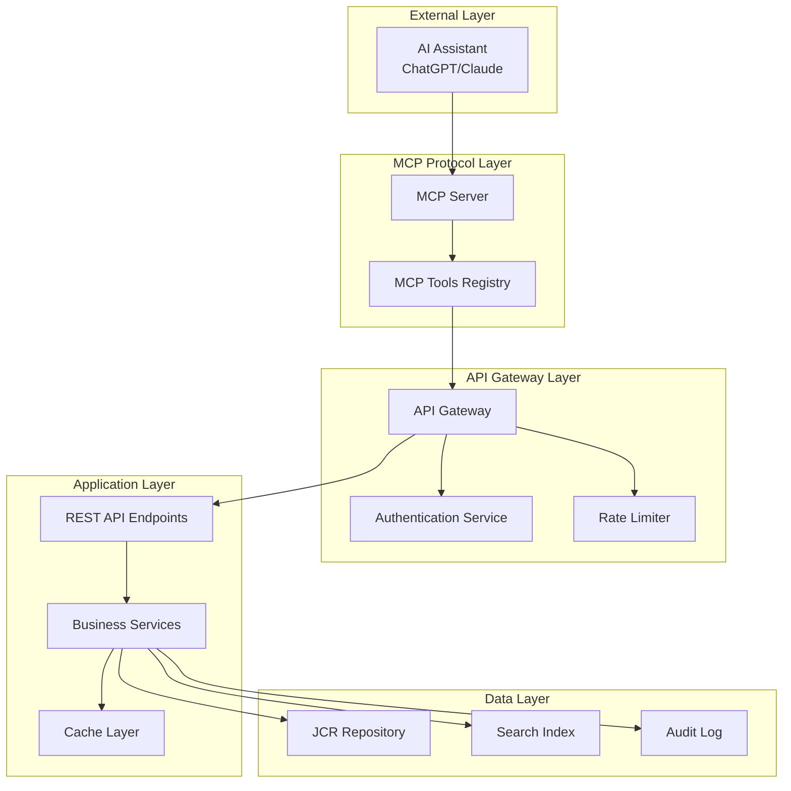
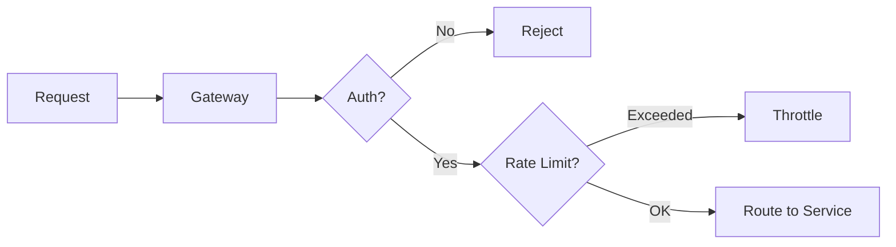
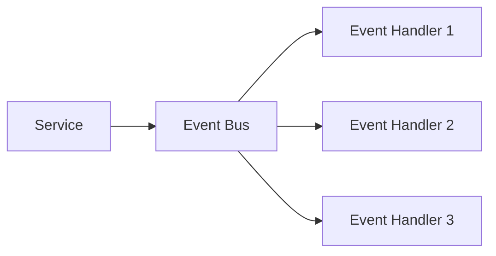
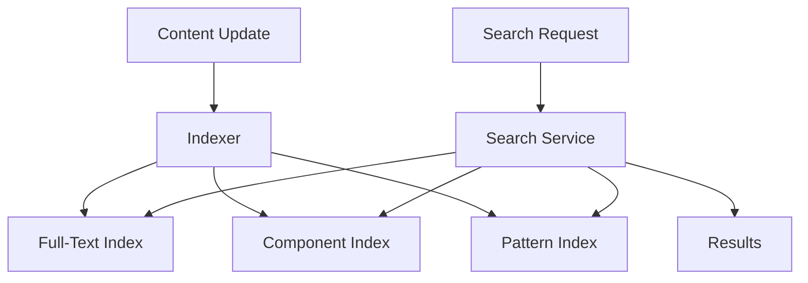
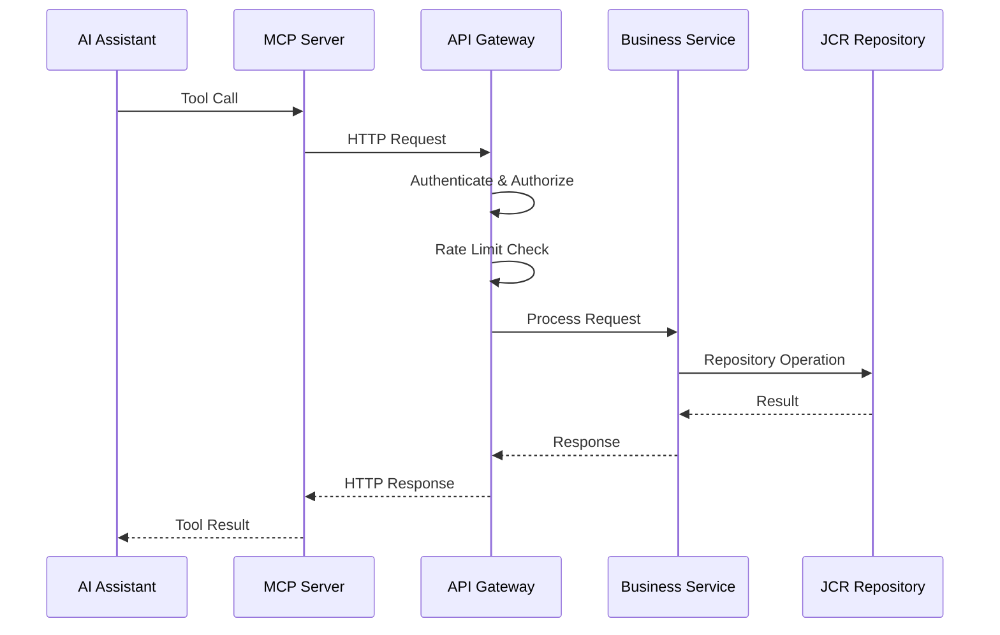
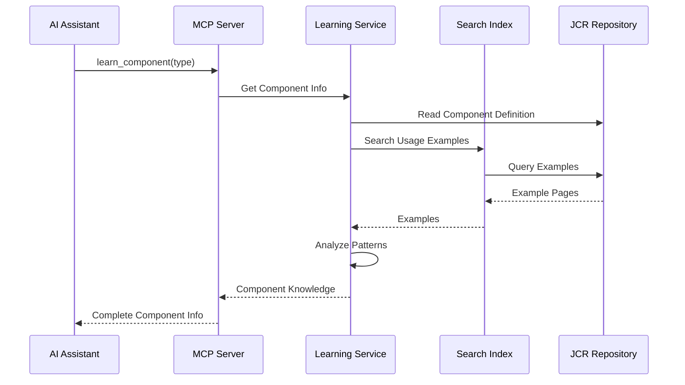
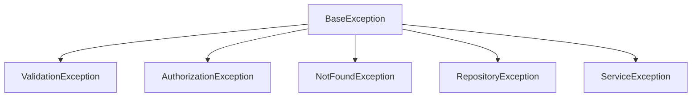
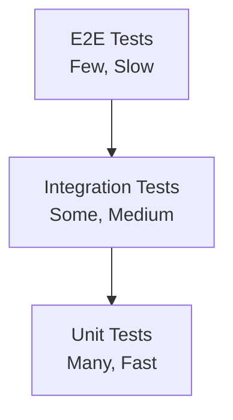

# Architecture Evaluation

## Overview

This document evaluates the architecture design for MCP tools integration with the Typerefinery CMS, considering scalability, maintainability, performance, and integration patterns.

## System Architecture

### High-Level Architecture



## Architecture Patterns

### 1. Layered Architecture

**Benefits:**
- Clear separation of concerns
- Easy to test and maintain
- Scalable and flexible

**Layers:**
1. **Presentation Layer**: MCP protocol interface
2. **Application Layer**: Business logic and orchestration
3. **Domain Layer**: Domain models and rules
4. **Infrastructure Layer**: JCR, database, external services

### 2. API Gateway Pattern

**Purpose:**
- Single entry point for all requests
- Centralized authentication and authorization
- Request routing and load balancing
- Rate limiting and throttling

**Implementation:**


### 3. Service Layer Pattern

**Purpose:**
- Encapsulate business logic
- Provide reusable operations
- Abstract data access

**Services:**
- `PageService` - Page management operations
- `AssetService` - Asset management operations
- `ComponentService` - Component discovery and learning
- `SearchService` - Content search and indexing
- `LearningService` - Content pattern analysis

### 4. Repository Pattern

**Purpose:**
- Abstract data access
- Provide consistent interface
- Enable testing with mocks

**Implementation:**
```java
interface ContentRepository {
    Page createPage(PageRequest request);
    Page updatePage(String path, Map<String, Object> properties);
    Page findPage(String path);
    List<Page> searchPages(SearchCriteria criteria);
}
```

## Integration Patterns

### 1. RESTful API Integration

**Design Principles:**
- Resource-based URLs
- HTTP methods for operations
- JSON request/response format
- Stateless communication

**Endpoint Structure:**
```
/api/pages          - Page operations
/api/assets         - Asset operations
/api/components     - Component operations
/api/search         - Search operations
/api/learning       - Learning operations
```

### 2. Event-Driven Architecture

**Purpose:**
- Decouple components
- Enable async processing
- Support event sourcing

**Events:**
- `PageCreated` - Page creation event
- `PageUpdated` - Page update event
- `ComponentAdded` - Component addition event
- `AssetUploaded` - Asset upload event



### 3. Caching Strategy

**Cache Layers:**
1. **Component Metadata Cache**: Cache component definitions
2. **Page Structure Cache**: Cache page hierarchies
3. **Search Index Cache**: Cache search results
4. **Learning Cache**: Cache pattern analysis results

**Cache Invalidation:**
- Time-based expiration
- Event-based invalidation
- Manual invalidation API

### 4. Search and Indexing

**Indexing Strategy:**
- Full-text search index
- Component catalog index
- Pattern index
- Relationship index

**Search Implementation:**


## Scalability Considerations

### Horizontal Scaling

**Components:**
- Stateless API services
- Load-balanced MCP server instances
- Distributed cache (Redis)
- Shared search index

### Vertical Scaling

**Optimization:**
- Connection pooling for JCR
- Efficient query patterns
- Caching frequently accessed data
- Async processing for heavy operations

### Performance Optimization

**Strategies:**
1. **Lazy Loading**: Load data on demand
2. **Pagination**: Limit result sets
3. **Batch Operations**: Group related operations
4. **Async Processing**: Background processing for heavy tasks

## Data Flow Architecture

### Request Flow



### Learning Flow



## Component Design

### MCP Tool Interface

**Design:**
- Consistent interface for all tools
- Standardized error handling
- Type-safe parameters
- Comprehensive documentation

**Example:**
```typescript
interface MCPTool {
  name: string;
  description: string;
  parameters: ParameterSchema;
  execute(context: ToolContext): Promise<ToolResult>;
}
```

### Service Interface

**Design:**
- Clean service interfaces
- Dependency injection
- Interface segregation
- Single responsibility

**Example:**
```java
public interface PageService {
    Page createPage(CreatePageRequest request);
    Page updatePage(String path, UpdatePageRequest request);
    Page findPage(String path);
    List<Page> searchPages(SearchCriteria criteria);
}
```

## Error Handling Architecture

### Error Hierarchy



### Error Propagation

**Strategy:**
- Catch at service boundaries
- Transform to user-friendly messages
- Log detailed errors server-side
- Return structured error responses

## Monitoring and Observability

### Metrics

**Key Metrics:**
- Request rate and latency
- Error rates by type
- Cache hit rates
- JCR operation performance
- Tool usage statistics

### Logging

**Log Levels:**
- **DEBUG**: Detailed diagnostic information
- **INFO**: General informational messages
- **WARN**: Warning messages
- **ERROR**: Error conditions
- **AUDIT**: Security and compliance events

### Tracing

**Distributed Tracing:**
- Request correlation IDs
- Span tracking across services
- Performance bottleneck identification

## Deployment Architecture

### Containerization

**Components:**
- MCP server container
- API gateway container
- Service containers
- Database container
- Cache container

### Orchestration

**Kubernetes:**
- Pod definitions
- Service discovery
- Load balancing
- Auto-scaling
- Health checks

## Testing Architecture

### Test Pyramid



### Test Strategy

1. **Unit Tests**: Test individual components
2. **Integration Tests**: Test service interactions
3. **E2E Tests**: Test complete workflows
4. **Performance Tests**: Test under load
5. **Security Tests**: Test security controls

## Technology Stack

### Backend

- **Language**: Java
- **Framework**: Apache Sling
- **Repository**: JCR (Jackrabbit)
- **API**: REST (JAX-RS)
- **Cache**: Redis
- **Search**: Apache Lucene

### MCP Layer

- **Language**: TypeScript/Node.js or Python
- **Protocol**: MCP (Model Context Protocol)
- **Framework**: MCP SDK
- **HTTP Client**: Axios/Fetch

## Architecture Decisions

### Decision 1: REST API vs GraphQL

**Decision**: REST API

**Rationale:**
- Simpler to implement
- Better caching support
- Easier to secure
- Standard HTTP methods

### Decision 2: Synchronous vs Asynchronous

**Decision**: Hybrid approach

**Rationale:**
- Synchronous for read operations
- Asynchronous for write operations
- Event-driven for notifications

### Decision 3: Monolith vs Microservices

**Decision**: Modular monolith

**Rationale:**
- Easier to develop and test
- Lower operational complexity
- Can evolve to microservices if needed
- Shared data model

## Architecture Risks

### Risk 1: Performance at Scale

**Mitigation:**
- Caching strategy
- Database optimization
- Load testing
- Performance monitoring

### Risk 2: Security Vulnerabilities

**Mitigation:**
- Security reviews
- Penetration testing
- Regular updates
- Security monitoring

### Risk 3: Complexity

**Mitigation:**
- Clear documentation
- Code reviews
- Design patterns
- Refactoring

## Architecture Evolution

### Phase 1: MVP

- Basic MCP tools
- Simple authentication
- Direct JCR access
- Basic error handling

### Phase 2: Enhanced

- Advanced learning tools
- Caching layer
- Search indexing
- Performance optimization

### Phase 3: Production

- Full security implementation
- Comprehensive monitoring
- High availability
- Scalability features

## Best Practices

### Code Organization

- Clear package structure
- Consistent naming conventions
- Separation of concerns
- DRY principle

### Documentation

- API documentation
- Architecture diagrams
- Code comments
- README files

### Versioning

- Semantic versioning
- API versioning
- Backward compatibility
- Migration guides

## Next Steps

1. Review developer guide (see `06-developer-guide.md`)
2. Understand user guides (see `07-author-designer-guide.md`, `08-user-guide.md`)
3. Review component learning (see `09-component-learning.md`)
4. Understand page composition (see `10-page-composition.md`)


