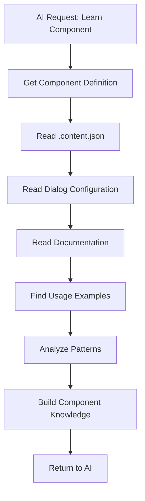
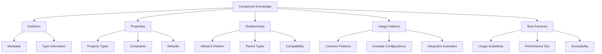
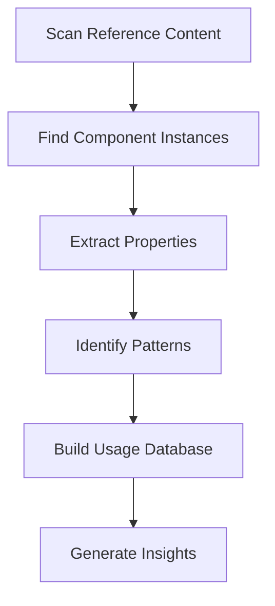

# Component Learning and Understanding

## Overview

This document explains how MCP tools enable AI assistants to learn and understand component capabilities, usage patterns, and best practices in the Typerefinery CMS.

## Component Learning Process

### Learning Flow



### Learning Sources

1. **Component Definition** (`.content.json`)
   - Component metadata
   - Component properties
   - Allowed children
   - Component groups

2. **Dialog Configuration** (`dialog/.content.json`)
   - Available properties
   - Property types and constraints
   - Field configurations
   - Validation rules

3. **Documentation** (`README.md`)
   - Component purpose
   - Usage instructions
   - Examples
   - Best practices

4. **Reference Content** (Example pages)
   - Real-world usage
   - Common patterns
   - Property combinations
   - Integration examples

## Component Information Structure

### Component Definition

**Location**: `/apps/typerefinery/components/{component-path}/.content.json`

**Structure:**
```json
{
  "sling:resourceType": "ws:Component",
  "title": "Component Title",
  "description": "Component description",
  "group": "Component Group",
  "isContainer": true,
  "isLayout": false,
  "allowedComponents": [
    "Typerefinery - Content",
    "Typerefinery - Forms"
  ]
}
```

### Dialog Configuration

**Location**: `/apps/typerefinery/components/{component-path}/dialog/.content.json`

**Structure:**
```json
{
  "sling:resourceType": "wcm/dialogs/dialog",
  "tabs": {
    "contentTab": {
      "sling:resourceType": "wcm/dialogs/components/tab",
      "fields": {
        "title": {
          "sling:resourceType": "wcm/dialogs/components/textfield",
          "name": "title",
          "label": "Title"
        }
      }
    }
  }
}
```

### Documentation

**Location**: `/apps/typerefinery/components/{component-path}/README.md`

**Content:**
- Component purpose
- Usage examples
- Property descriptions
- Best practices
- Integration patterns

## MCP Learning Tools

### `learn_component`

Comprehensive component learning tool that gathers all available information.

**Process:**

1. **Read Component Definition**
   ```json
   {
     "resourceType": "typerefinery/components/forms/form",
     "title": "Form",
     "description": "Container for form fields",
     "isContainer": true,
     "allowedComponents": ["Typerefinery - Forms"]
   }
   ```

2. **Read Dialog Configuration**
   - Extract all dialog fields
   - Identify property types
   - Understand constraints
   - Map to component properties

3. **Read Documentation**
   - Parse README.md
   - Extract examples
   - Identify best practices
   - Understand usage patterns

4. **Find Usage Examples**
   - Search reference content
   - Find component instances
   - Extract property values
   - Analyze usage patterns

5. **Build Knowledge Base**
   - Combine all information
   - Create usage patterns
   - Identify common configurations
   - Document best practices

**Example Response:**
```json
{
  "resourceType": "typerefinery/components/forms/form",
  "metadata": {
    "title": "Form",
    "description": "Container for form fields",
    "group": "Typerefinery - Forms",
    "isContainer": true,
    "isLayout": true
  },
  "properties": {
    "flowapi_name": {
      "type": "string",
      "description": "Form name for flow API",
      "required": false
    },
    "flowapi_color": {
      "type": "string",
      "description": "Card color in flow designer",
      "format": "hex-color"
    }
  },
  "allowedChildren": [
    "typerefinery/components/forms/input",
    "typerefinery/components/forms/textarea",
    "typerefinery/components/forms/select"
  ],
  "usage": {
    "examples": [
      {
        "path": "/content/typerefinery-showcase/pages/forms/contact",
        "properties": {
          "flowapi_name": "contact-form",
          "flowapi_color": "#62C9CA"
        }
      }
    ],
    "patterns": [
      {
        "name": "Simple Contact Form",
        "structure": "form > input (name) > input (email) > textarea (message)"
      }
    ]
  },
  "bestPractices": [
    "Always include form validation",
    "Use appropriate field types",
    "Configure form submission endpoint"
  ]
}
```

### `get_component_info`

Quick component information retrieval.

**Returns:**
- Basic metadata
- Component type
- Allowed children
- Common properties

### `get_component_dialog`

Retrieves dialog configuration for property understanding.

**Returns:**
- Dialog structure
- Available fields
- Field types and constraints
- Validation rules

### `get_component_usage`

Finds real-world usage examples.

**Returns:**
- Example pages using component
- Property configurations
- Usage contexts
- Integration patterns

## Component Knowledge Base

### Knowledge Structure



### Knowledge Categories

1. **Structural Knowledge**
   - Component hierarchy
   - Container relationships
   - Layout rules
   - Nesting constraints

2. **Property Knowledge**
   - Available properties
   - Property types
   - Required vs optional
   - Default values
   - Validation rules

3. **Usage Knowledge**
   - Common use cases
   - Typical configurations
   - Integration patterns
   - Best practices

4. **Relationship Knowledge**
   - Parent-child relationships
   - Sibling compatibility
   - Dependency requirements
   - Conflict resolution

## Learning from Reference Content

### Analysis Process



### Pattern Identification

**Common Patterns:**

1. **Property Combinations**
   - Which properties are used together
   - Typical value ranges
   - Required property sets

2. **Component Combinations**
   - Common parent-child pairs
   - Typical component sequences
   - Layout patterns

3. **Usage Contexts**
   - Where component is typically used
   - Common page types
   - Integration scenarios

### Example Analysis

**Component**: `typerefinery/components/forms/form`

**Found Patterns:**
- Usually contains `input` components
- Often has `flowapi_*` properties
- Typically nested in `main` or `container`
- Common in form pages and modal dialogs

**Property Analysis:**
- `flowapi_name`: Always present in flow forms
- `flowapi_color`: Optional, hex color format
- `flowapi_icon`: Optional, icon class format

## Component Understanding Levels

### Level 1: Basic Understanding

**What AI Knows:**
- Component name and type
- Basic description
- Component group

**Use Case:**
- Component discovery
- Basic categorization
- Simple queries

### Level 2: Property Understanding

**What AI Knows:**
- All available properties
- Property types and constraints
- Required vs optional
- Default values

**Use Case:**
- Property configuration
- Validation
- Default value application

### Level 3: Usage Understanding

**What AI Knows:**
- Common usage patterns
- Example configurations
- Integration patterns
- Best practices

**Use Case:**
- Component recommendation
- Pattern matching
- Best practice application

### Level 4: Deep Understanding

**What AI Knows:**
- Complete component knowledge
- All usage examples
- Relationship patterns
- Performance implications
- Accessibility considerations

**Use Case:**
- Complex component composition
- Optimization recommendations
- Advanced pattern matching

## Learning Optimization

### Caching Strategy

**Cache Levels:**
1. **Component Definition Cache**: Cache component metadata
2. **Dialog Cache**: Cache dialog configurations
3. **Usage Example Cache**: Cache usage examples
4. **Pattern Cache**: Cache identified patterns

**Cache Invalidation:**
- Time-based expiration
- Event-based invalidation (on component update)
- Manual invalidation

### Incremental Learning

**Strategy:**
- Learn components on demand
- Cache learned information
- Update cache on changes
- Share knowledge across requests

## Component Discovery

### Finding Components

**Methods:**
1. **By Group**: Find all components in a group
2. **By Type**: Find components by type (container, layout, etc.)
3. **By Resource Type**: Search by resource type pattern
4. **By Capability**: Find components with specific capabilities

### Component Catalog

**Structure:**
- Organized by groups
- Indexed by capabilities
- Cross-referenced by relationships
- Tagged by use cases

## Best Practices for AI

### Learning Strategy

1. **Learn on Demand**: Learn components when needed
2. **Cache Knowledge**: Store learned information
3. **Update Regularly**: Refresh knowledge periodically
4. **Share Knowledge**: Reuse learned information

### Usage Strategy

1. **Verify Understanding**: Confirm component capabilities
2. **Check Compatibility**: Verify component relationships
3. **Follow Patterns**: Use established patterns
4. **Apply Best Practices**: Follow recommended practices

## Example Learning Scenarios

### Scenario 1: Learning Form Component

**AI Request:**
```
Learn about the form component
```

**Process:**
1. Read component definition
2. Read dialog configuration
3. Read documentation
4. Find usage examples
5. Analyze patterns

**Result:**
- Complete understanding of form component
- Knowledge of all properties
- Usage examples
- Best practices

### Scenario 2: Finding Suitable Component

**AI Request:**
```
What component should I use to display a list of items?
```

**Process:**
1. Search component catalog
2. Analyze component capabilities
3. Find usage examples
4. Compare options
5. Recommend best fit

**Result:**
- Component recommendation
- Explanation of why
- Usage examples
- Implementation guidance

### Scenario 3: Understanding Component Relationships

**AI Request:**
```
What components can I put inside a form?
```

**Process:**
1. Learn form component
2. Extract allowed children
3. Learn child components
4. Explain relationships
5. Provide examples

**Result:**
- List of allowed components
- Component descriptions
- Usage examples
- Relationship explanation

## Next Steps

1. Understand page composition (see `10-page-composition.md`)
2. Review architecture (see `05-architecture-evaluation.md`)
3. Check developer guide (see `06-developer-guide.md`)


