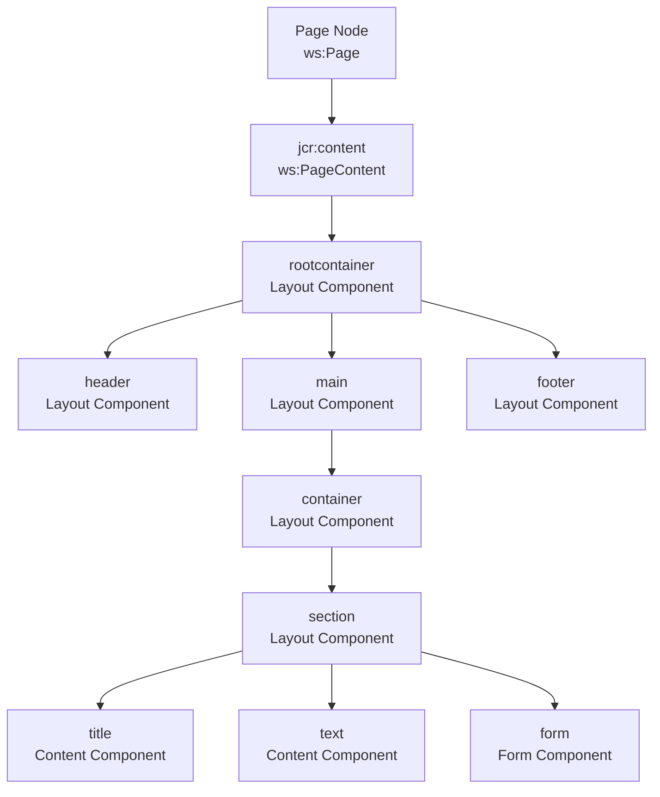
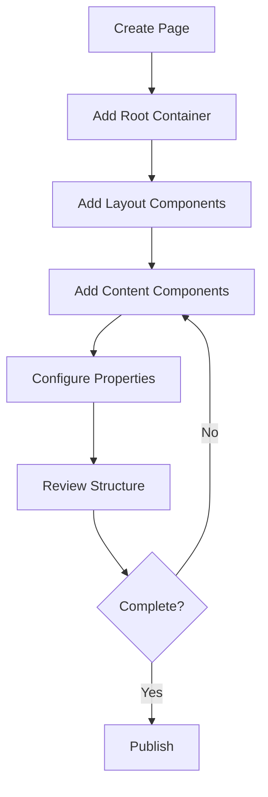

# Page Composition and Layers

## Overview

This document explains how pages are composed using component layers in the Typerefinery CMS, and how MCP tools enable AI assistants to understand and work with these layers.

## Page Structure

### Hierarchical Organization



### Component Layers

Pages are built using a layered approach:

1. **Structure Layer**: Page and content nodes
2. **Layout Layer**: Container and layout components
3. **Content Layer**: Content display components
4. **Functional Layer**: Forms and interactive components

## Layer Types

### Layer 1: Structure Layer

**Purpose**: Define page structure and metadata

**Components:**
- Page node (`ws:Page`)
- Content node (`jcr:content`, `ws:PageContent`)

**Properties:**
- Page title
- Page description
- Template reference
- SEO metadata
- Navigation settings

**Example:**
```xml
<jcr:root jcr:primaryType="ws:Page">
    <jcr:content
        jcr:primaryType="ws:PageContent"
        jcr:title="Home Page"
        sling:resourceType="typerefinery/components/structure/page"
        ws:template="/apps/typerefinery/templates/page">
        <!-- Component hierarchy -->
    </jcr:content>
</jcr:root>
```

### Layer 2: Root Container Layer

**Purpose**: Define page layout structure

**Components:**
- `fixedrootcontainer` - Fixed width root container
- `rootcontainer` - Flexible root container

**Properties:**
- Container type
- Width constraints
- Decoration tag (main, article, etc.)

**Structure:**
```
rootcontainer
├── header (optional)
├── main (required)
└── footer (optional)
```

### Layer 3: Layout Components Layer

**Purpose**: Organize content into sections

**Components:**
- `header` - Page header
- `main` - Main content area
- `footer` - Page footer
- `container` - Content container
- `section` - Content section
- `sidebar` - Sidebar navigation
- `accordion` - Accordion layout

**Layout Patterns:**

**Standard Layout:**
```
header
main
  └── container
      └── section
footer
```

**Multi-Column Layout:**
```
main
  └── container
      ├── section (left column)
      └── section (right column)
```

**Accordion Layout:**
```
main
  └── accordion
      ├── accordionitem
      └── accordionitem
```

### Layer 4: Content Components Layer

**Purpose**: Display content to users

**Components:**
- `title` - Heading/title
- `text` - Text content
- `image` - Image display
- `card` - Card component
- `table` - Data table
- `tag` - Tag/label
- `embed` - Embedded content

**Content Patterns:**

**Article Pattern:**
```
section
├── title
├── text
├── image
└── text
```

**Card Pattern:**
```
section
└── card
    ├── title
    ├── text
    └── image
```

### Layer 5: Functional Components Layer

**Purpose**: Interactive functionality

**Components:**
- `form` - Form container
- `input` - Input fields
- `button` - Buttons
- `modal` - Modal dialogs
- `tabs` - Tabbed interface
- `chart` - Data visualization

**Form Pattern:**
```
section
└── form
    ├── input
    │   ├── label
    │   └── field
    └── button
```

## Layer Rules and Constraints

### Container Rules

**Rule 1: Allowed Children**
- Each container defines `allowedComponents`
- Only allowed components can be added
- Enforced at API level

**Example:**
```json
{
  "isContainer": true,
  "allowedComponents": [
    "Typerefinery - Content",
    "Typerefinery - Forms"
  ]
}
```

**Rule 2: Nesting Depth**
- Maximum nesting depth enforced
- Prevents infinite nesting
- Performance optimization

**Rule 3: Component Types**
- Layout components contain other components
- Content components are leaf nodes
- Forms can contain form fields

### Layout Rules

**Rule 1: Root Container Required**
- Every page must have rootcontainer
- Defines page structure
- Template provides default

**Rule 2: Main Section Required**
- Main section typically required
- Contains primary content
- Can be empty

**Rule 3: Header/Footer Optional**
- Header and footer are optional
- Can be added as needed
- Typically at rootcontainer level

### Content Rules

**Rule 1: Content in Sections**
- Content components typically in sections
- Sections provide structure
- Can be nested

**Rule 2: Component Ordering**
- Components have natural order
- Order affects rendering
- Can be reordered

## Page Composition Patterns

### Pattern 1: Simple Content Page

**Structure:**
```
Page
└── jcr:content
    └── rootcontainer
        └── main
            └── container
                └── section
                    ├── title
                    └── text
```

**Use Case:**
- Blog posts
- Article pages
- Simple content pages

### Pattern 2: Landing Page

**Structure:**
```
Page
└── jcr:content
    └── rootcontainer
        ├── header
        ├── main
        │   └── container
        │       ├── section (hero)
        │       │   ├── title
        │       │   └── image
        │       ├── section (features)
        │       │   ├── title
        │       │   └── card (multiple)
        │       └── section (cta)
        │           └── button
        └── footer
```

**Use Case:**
- Marketing pages
- Product pages
- Campaign pages

### Pattern 3: Form Page

**Structure:**
```
Page
└── jcr:content
    └── rootcontainer
        └── main
            └── container
                └── section
                    └── form
                        ├── input (name)
                        ├── input (email)
                        ├── textarea (message)
                        └── button (submit)
```

**Use Case:**
- Contact forms
- Registration forms
- Data collection forms

### Pattern 4: Dashboard Page

**Structure:**
```
Page
└── jcr:content
    └── rootcontainer
        ├── header
        ├── main
        │   └── container
        │       ├── section (widget 1)
        │       │   └── chart
        │       ├── section (widget 2)
        │       │   └── table
        │       └── section (widget 3)
        │           └── card
        └── footer
```

**Use Case:**
- Admin dashboards
- Analytics pages
- Data visualization pages

## MCP Tools for Page Composition

### `analyze_page_structure`

Analyzes page to understand composition.

**Returns:**
- Component hierarchy
- Layer identification
- Pattern detection
- Component relationships

**Example:**
```json
{
  "path": "/content/typerefinery/pages/home",
  "structure": {
    "layers": [
      {
        "layer": "structure",
        "components": ["ws:Page", "ws:PageContent"]
      },
      {
        "layer": "rootcontainer",
        "components": ["fixedrootcontainer"]
      },
      {
        "layer": "layout",
        "components": ["header", "main", "footer"]
      },
      {
        "layer": "content",
        "components": ["title", "text", "image"]
      }
    ],
    "pattern": "landing-page"
  }
}
```

### `understand_layers`

Learns layer rules and relationships.

**Returns:**
- Layer definitions
- Layer rules
- Allowed combinations
- Best practices

### `get_page_structure`

Retrieves complete page component hierarchy.

**Returns:**
- Full component tree
- Component paths
- Component properties
- Relationships

## Composition Workflow

### Workflow: Creating a New Page



### Step-by-Step Process

**Step 1: Create Page Structure**
- Create page node
- Create content node
- Set page properties

**Step 2: Add Root Container**
- Add rootcontainer component
- Configure container type
- Set container properties

**Step 3: Add Layout Components**
- Add header (optional)
- Add main (required)
- Add footer (optional)

**Step 4: Add Content Sections**
- Add container to main
- Add sections to container
- Configure section properties

**Step 5: Add Content Components**
- Add title components
- Add text components
- Add image components
- Configure component properties

**Step 6: Add Functional Components**
- Add forms if needed
- Add interactive components
- Configure functionality

## Layer Best Practices

### Structure Layer

1. **Use Appropriate Templates**: Choose template that matches page type
2. **Set Metadata**: Configure SEO and navigation properties
3. **Naming**: Use descriptive page names

### Layout Layer

1. **Consistent Structure**: Use consistent layout patterns
2. **Semantic HTML**: Use appropriate container types
3. **Responsive Design**: Consider mobile layouts

### Content Layer

1. **Logical Ordering**: Order content logically
2. **Appropriate Components**: Use right component for content type
3. **Accessibility**: Ensure accessible content structure

### Functional Layer

1. **User Experience**: Design for good UX
2. **Validation**: Include proper validation
3. **Error Handling**: Handle errors gracefully

## Common Composition Mistakes

### Mistake 1: Incorrect Nesting

**Problem:**
```
container
  └── title (should be in section)
```

**Solution:**
```
container
  └── section
      └── title
```

### Mistake 2: Missing Required Layers

**Problem:**
```
Page
  └── jcr:content
      └── title (missing rootcontainer)
```

**Solution:**
```
Page
  └── jcr:content
      └── rootcontainer
          └── main
              └── container
                  └── section
                      └── title
```

### Mistake 3: Invalid Component Placement

**Problem:**
```
form
  └── title (not allowed in form)
```

**Solution:**
```
section
  ├── title
  └── form
```

## AI Composition Guidance

### Understanding Requests

**User Request:**
```
Create a landing page with hero section, features, and CTA
```

**AI Understanding:**
1. Identify pattern: landing page
2. Determine layers needed
3. Plan component structure
4. Execute composition

### Pattern Matching

**AI Process:**
1. Analyze user request
2. Match to known patterns
3. Select appropriate pattern
4. Adapt pattern to requirements
5. Compose page structure

### Validation

**AI Validation:**
1. Check layer rules
2. Verify component compatibility
3. Validate structure
4. Confirm completeness

## Advanced Composition

### Dynamic Composition

**Scenario**: Build page based on data

**Process:**
1. Analyze data structure
2. Determine required components
3. Generate component structure
4. Populate with data
5. Validate composition

### Template-Based Composition

**Scenario**: Use existing page as template

**Process:**
1. Analyze template page
2. Extract structure
3. Adapt to new requirements
4. Create new page
5. Populate with content

## Next Steps

1. Review component learning (see `09-component-learning.md`)
2. Understand architecture (see `05-architecture-evaluation.md`)
3. Check developer guide (see `06-developer-guide.md`)


