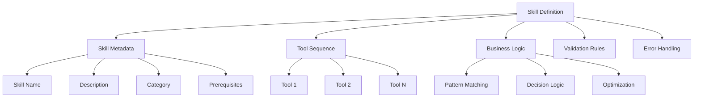
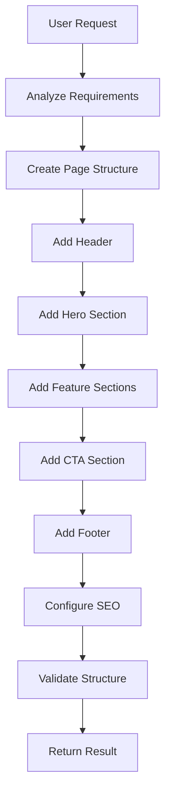
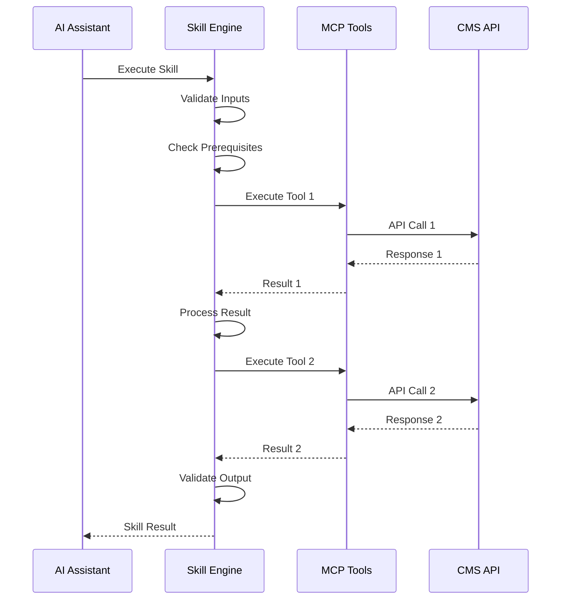
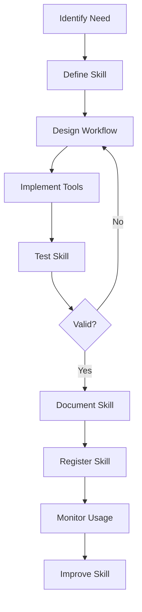
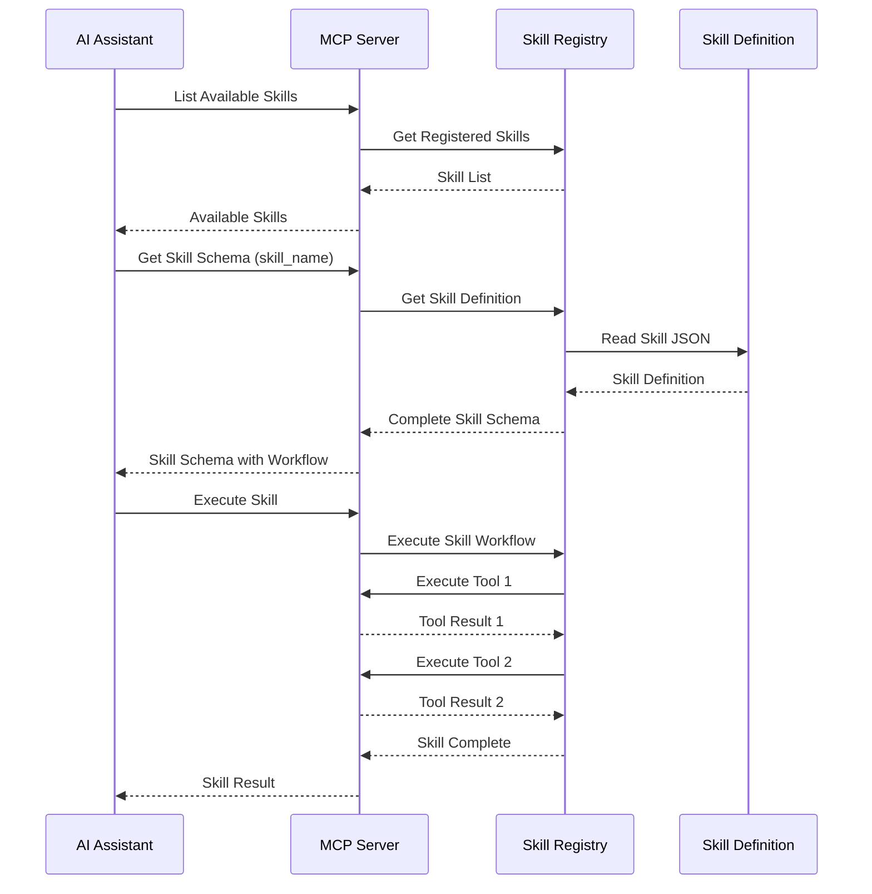
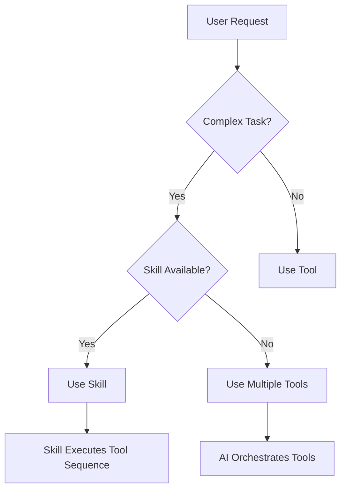
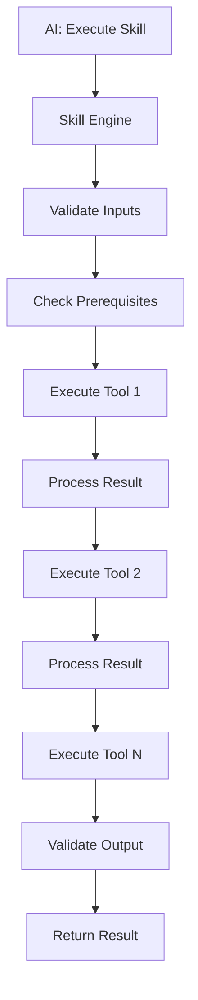
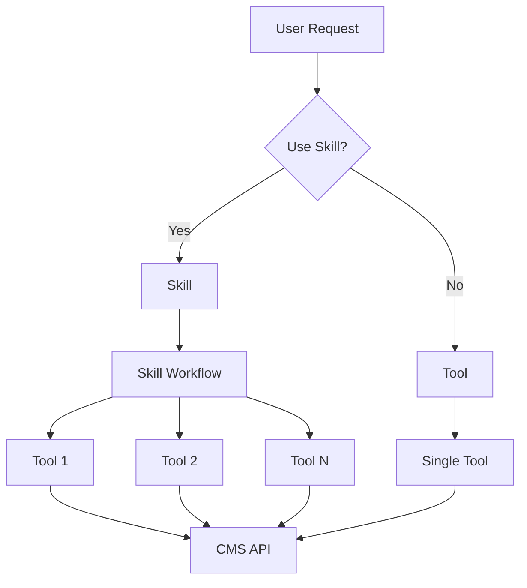
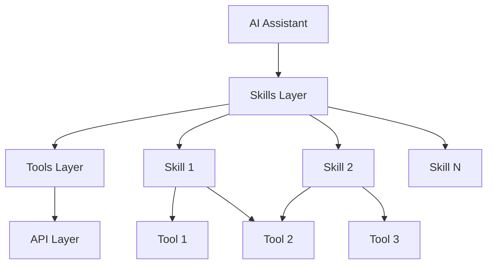

# Skills Architecture - Higher-Level AI Capabilities

## Overview

While **MCP Tools** provide individual operations (create page, add component, etc.), **Skills** represent higher-level, reusable capabilities that combine multiple tools to accomplish complex tasks. Skills enable AI assistants to develop domain expertise and execute sophisticated workflows.

## Skills vs Tools

### Tools (Low-Level Operations)

**Purpose**: Individual atomic operations

**Examples:**
- `create_page` - Creates a page node
- `add_component` - Adds a component to a page
- `update_property` - Updates a single property

**Characteristics:**
- Single responsibility
- Atomic operations
- Direct API calls
- No business logic

### Skills (High-Level Capabilities)

**Purpose**: Complex workflows combining multiple tools

**Examples:**
- `create_landing_page_skill` - Creates complete landing page with structure
- `build_contact_form_skill` - Creates form with validation and submission
- `optimize_page_seo_skill` - Analyzes and optimizes page for SEO

**Characteristics:**
- Multiple tool orchestration
- Business logic and patterns
- Reusable workflows
- Domain expertise

## Skills Architecture

### Skill Structure



### Skill Components

1. **Skill Metadata**
   - Name and description
   - Category and tags
   - Prerequisites and requirements
   - Success criteria

2. **Tool Orchestration**
   - Sequence of tool calls
   - Conditional logic
   - Parallel operations
   - Error recovery

3. **Business Logic**
   - Pattern recognition
   - Decision making
   - Optimization rules
   - Best practices

4. **Validation & Quality**
   - Input validation
   - Output verification
   - Quality checks
   - Compliance rules

## Skill Categories

### 1. Content Creation Skills

**Purpose**: Create complete content structures

**Skills:**
- `create_landing_page_skill`
- `create_blog_post_skill`
- `create_product_page_skill`
- `create_dashboard_skill`
- `create_form_page_skill`

**Example: `create_landing_page_skill`**



**Tool Sequence:**
1. `create_page` - Create page node
2. `add_component` - Add rootcontainer
3. `add_component` - Add header
4. `add_component` - Add main
5. `add_component` - Add hero section (title + image)
6. `add_component` - Add feature sections
7. `add_component` - Add CTA section
8. `add_component` - Add footer
9. `update_page` - Set SEO metadata
10. `validate_page_structure` - Verify structure

### 2. Form Building Skills

**Purpose**: Create complete forms with validation

**Skills:**
- `build_contact_form_skill`
- `build_registration_form_skill`
- `build_survey_form_skill`
- `build_multi_step_form_skill`

**Example: `build_contact_form_skill`**

**Tool Sequence:**
1. `create_page` - Create form page
2. `add_component` - Add form container
3. `learn_component` - Learn form component capabilities
4. `add_component` - Add name input field
5. `add_component` - Add email input field
6. `add_component` - Add message textarea
7. `configure_validation` - Set required fields
8. `add_component` - Add submit button
9. `configure_form_submission` - Set submission endpoint
10. `validate_form` - Verify form structure

### 3. Content Optimization Skills

**Purpose**: Analyze and optimize existing content

**Skills:**
- `optimize_page_seo_skill`
- `improve_accessibility_skill`
- `optimize_performance_skill`
- `enhance_content_quality_skill`

**Example: `optimize_page_seo_skill`**

**Tool Sequence:**
1. `get_page_structure` - Get page structure
2. `analyze_page_content` - Analyze content
3. `check_seo_metadata` - Check existing SEO
4. `identify_improvements` - Find optimization opportunities
5. `update_page` - Add missing metadata
6. `update_component` - Optimize title components
7. `update_component` - Add alt text to images
8. `validate_seo` - Verify SEO improvements

### 4. Content Migration Skills

**Purpose**: Migrate or transform content

**Skills:**
- `migrate_content_structure_skill`
- `update_content_pattern_skill`
- `bulk_update_pages_skill`
- `transform_component_types_skill`

**Example: `bulk_update_pages_skill`**

**Tool Sequence:**
1. `find_pages` - Find pages matching criteria
2. `analyze_page_structure` - Analyze each page
3. `identify_updates` - Determine required updates
4. `update_page` - Apply updates to each page
5. `validate_updates` - Verify updates
6. `generate_report` - Create update report

### 5. Component Composition Skills

**Purpose**: Compose complex component structures

**Skills:**
- `compose_dashboard_skill`
- `compose_article_layout_skill`
- `compose_multi_column_skill`
- `compose_accordion_layout_skill`

**Example: `compose_dashboard_skill`**

**Tool Sequence:**
1. `create_page` - Create dashboard page
2. `add_component` - Add rootcontainer
3. `add_component` - Add header
4. `add_component` - Add main container
5. `add_component` - Add widget sections
6. `add_component` - Add chart components
7. `add_component` - Add table components
8. `configure_data_sources` - Configure data connections
9. `validate_layout` - Verify layout structure

### 6. Learning and Discovery Skills

**Purpose**: Learn about system capabilities

**Skills:**
- `learn_component_ecosystem_skill`
- `discover_content_patterns_skill`
- `analyze_usage_patterns_skill`
- `build_component_knowledge_base_skill`

**Example: `learn_component_ecosystem_skill`**

**Tool Sequence:**
1. `find_components` - Find all components
2. `learn_component` - Learn each component
3. `analyze_relationships` - Analyze component relationships
4. `identify_patterns` - Identify usage patterns
5. `build_knowledge_base` - Build comprehensive knowledge
6. `generate_documentation` - Generate documentation

## Skill Definition Format

### Skill Schema

```json
{
  "name": "create_landing_page_skill",
  "description": "Creates a complete landing page with header, hero, features, CTA, and footer",
  "category": "content_creation",
  "version": "1.0",
  "prerequisites": [
    "create_page",
    "add_component",
    "update_page"
  ],
  "inputs": {
    "path": {
      "type": "string",
      "required": true,
      "description": "Page path"
    },
    "title": {
      "type": "string",
      "required": true,
      "description": "Page title"
    },
    "hero": {
      "type": "object",
      "required": false,
      "description": "Hero section configuration"
    },
    "features": {
      "type": "array",
      "required": false,
      "description": "Feature sections"
    }
  },
  "workflow": [
    {
      "step": 1,
      "tool": "create_page",
      "parameters": {
        "path": "{{inputs.path}}",
        "title": "{{inputs.title}}",
        "template": "/apps/typerefinery/templates/page"
      }
    },
    {
      "step": 2,
      "tool": "add_component",
      "parameters": {
        "pagePath": "{{inputs.path}}",
        "componentType": "typerefinery/components/layout/fixedrootcontainer",
        "parentPath": "{{inputs.path}}/jcr:content"
      }
    }
  ],
  "validation": {
    "structure": "landing_page_pattern",
    "required_components": ["header", "main", "footer"],
    "quality_checks": ["seo_metadata", "accessibility"]
  },
  "error_handling": {
    "retry": true,
    "rollback": true,
    "notify": true
  }
}
```

## Skill Execution Flow

### Execution Process



### Skill Engine

**Responsibilities:**
1. **Skill Registry**: Manage available skills
2. **Workflow Execution**: Execute skill workflows
3. **Tool Orchestration**: Coordinate tool calls
4. **Error Handling**: Handle and recover from errors
5. **Validation**: Validate inputs and outputs
6. **Learning**: Learn from skill executions

## Skill Learning and Development

### Skill Development Process



### Skill Evolution

**Level 1: Basic Skill**
- Simple tool sequence
- No conditional logic
- Basic validation

**Level 2: Intermediate Skill**
- Conditional logic
- Error handling
- Quality checks

**Level 3: Advanced Skill**
- Pattern recognition
- Optimization
- Learning capabilities
- Adaptive behavior

## Skill Examples

### Example 1: Create Landing Page Skill

**User Request:**
```
Create a landing page for "Product Launch 2024" with hero section, 
three feature sections, and a call-to-action
```

**Skill Execution:**
1. Validates inputs
2. Creates page structure
3. Adds header with logo
4. Adds hero section with title and image
5. Adds three feature sections with cards
6. Adds CTA section with button
7. Adds footer
8. Configures SEO metadata
9. Validates structure
10. Returns complete page

### Example 2: Build Contact Form Skill

**User Request:**
```
Create a contact form with name, email, message fields, all required, 
and submit to contact@example.com
```

**Skill Execution:**
1. Creates form page
2. Adds form container
3. Adds name input (required)
4. Adds email input (required, email validation)
5. Adds message textarea (required)
6. Adds submit button
7. Configures form submission
8. Sets validation rules
9. Validates form structure
10. Returns form page

### Example 3: Optimize Page SEO Skill

**User Request:**
```
Optimize the SEO for /content/typerefinery/pages/home
```

**Skill Execution:**
1. Analyzes page structure
2. Checks existing SEO metadata
3. Identifies missing metadata
4. Generates SEO recommendations
5. Updates page title
6. Adds meta description
7. Adds Open Graph tags
8. Optimizes heading structure
9. Adds alt text to images
10. Validates SEO improvements
11. Returns optimization report

## Skill Registry

### Skill Storage

**Location**: `/apps/typerefinery/mcp/skills/`

**Structure:**
```
skills/
├── content_creation/
│   ├── create_landing_page.json
│   ├── create_blog_post.json
│   └── create_product_page.json
├── forms/
│   ├── build_contact_form.json
│   └── build_registration_form.json
└── optimization/
    ├── optimize_seo.json
    └── improve_accessibility.json
```

### Skill Discovery

**MCP Tools:**
- `list_skills` - List all available skills
- `get_skill_info` - Get skill information
- `find_skills` - Search skills by category/tags
- `learn_skill` - Learn skill capabilities

## How Skills Come Into Play

### Skill Discovery Process

Skills are discovered and learned similarly to tools, but at a higher level:



### Skill Registration

**1. Skill Definition File**

Skills are defined as JSON files:

```json
{
  "name": "create_landing_page_skill",
  "description": "Creates a complete landing page",
  "category": "content_creation",
  "version": "1.0",
  "prerequisites": ["create_page", "add_component"],
  "workflow": [ /* tool sequence */ ]
}
```

**2. Skill Registry**

Skills are registered in the Skill Registry:

```java
@Component(service = MCPSkillRegistry.class)
public class MCPSkillRegistryImpl implements MCPSkillRegistry {
    
    private Map<String, SkillDefinition> skills = new ConcurrentHashMap<>();
    
    @Activate
    protected void activate() {
        // Load skills from /apps/typerefinery/mcp/skills/
        loadSkillsFromRepository();
    }
    
    public List<SkillDefinition> getAllSkills() {
        return new ArrayList<>(skills.values());
    }
    
    public SkillDefinition getSkill(String name) {
        return skills.get(name);
    }
}
```

**3. MCP Server Exposure**

Skills are exposed as MCP tools (higher-level tools):

```java
// Skills appear as tools to AI, but execute workflows
@Component(service = MCPTool.class)
public class SkillAsTool implements MCPTool {
    
    private SkillDefinition skill;
    
    @Override
    public String getName() {
        return skill.getName();
    }
    
    @Override
    public ToolResult execute(ToolContext context) {
        // Execute skill workflow
        return skillEngine.execute(skill, context);
    }
}
```

### AI Learning About Skills

**1. Skill Discovery**

AI discovers skills through MCP protocol:

```javascript
// AI requests available skills
const skills = await mcp.listSkills();

// AI learns each skill
for (const skill of skills) {
    const schema = await mcp.getSkillSchema(skill.name);
    learnSkill(skill.name, schema);
}
```

**2. Skill Schema Learning**

AI learns skill capabilities from schema:

- **Inputs**: What parameters the skill accepts
- **Workflow**: What tools the skill uses
- **Outputs**: What the skill produces
- **Prerequisites**: What tools must be available
- **Examples**: Usage examples

**3. Skill vs Tool Decision**

AI decides when to use skills vs tools:



### Skill Execution Flow

**How Skills Use Tools:**



**Example: `create_landing_page_skill`**

1. **AI Request**: "Create landing page for Product Launch"
2. **Skill Execution**:
   - Tool 1: `create_page` → Creates page structure
   - Tool 2: `add_component` → Adds rootcontainer
   - Tool 3: `add_component` → Adds header
   - Tool 4: `add_component` → Adds hero section
   - Tool 5: `add_component` → Adds feature sections
   - Tool 6: `add_component` → Adds CTA
   - Tool 7: `add_component` → Adds footer
   - Tool 8: `update_page` → Sets SEO metadata
   - Tool 9: `validate_page_structure` → Validates result
3. **Result**: Complete landing page

### Skill Advantages

**Why Use Skills:**

1. **Higher-Level Abstraction**: User says "create landing page" not "create page, add component, add component..."
2. **Reusable Workflows**: Common patterns become reusable
3. **Best Practices**: Skills encode best practices
4. **Error Handling**: Skills include rollback and recovery
5. **Validation**: Skills validate complete workflows
6. **Learning**: Skills improve over time

### Skill-Tool Relationship



**Key Points:**

- **Skills are tools**: Skills appear as tools to AI (higher-level tools)
- **Skills use tools**: Skills orchestrate multiple tools
- **Skills are discoverable**: AI discovers skills like tools
- **Skills have schemas**: Skills provide schemas like tools
- **Skills are executable**: AI executes skills like tools

## Skill vs Tool Decision Matrix

### When to Use Tools

- Simple, atomic operations
- Direct API calls
- Single-step operations
- Low-level operations

### When to Use Skills

- Complex workflows
- Multi-step operations
- Pattern-based tasks
- Domain-specific operations
- Reusable workflows

## Best Practices

### Skill Design

1. **Single Responsibility**: Each skill should do one thing well
2. **Composability**: Skills should be composable
3. **Reusability**: Design for reuse across scenarios
4. **Documentation**: Document skill purpose and usage
5. **Testing**: Test skills thoroughly

### Skill Execution

1. **Validation**: Always validate inputs
2. **Error Handling**: Handle errors gracefully
3. **Rollback**: Support rollback on failure
4. **Logging**: Log skill executions
5. **Monitoring**: Monitor skill performance

## Integration with MCP Tools

### Skill-Tool Relationship



### Skill Registration

Skills are registered with the MCP server and exposed as higher-level tools:

```json
{
  "name": "create_landing_page",
  "description": "Creates a complete landing page",
  "type": "skill",
  "skill": "create_landing_page_skill"
}
```

## Next Steps

1. Review tool specifications (see `02-mcp-tool-specifications.md`)
2. Understand component learning (see `09-component-learning.md`)
3. Review page composition (see `10-page-composition.md`)


