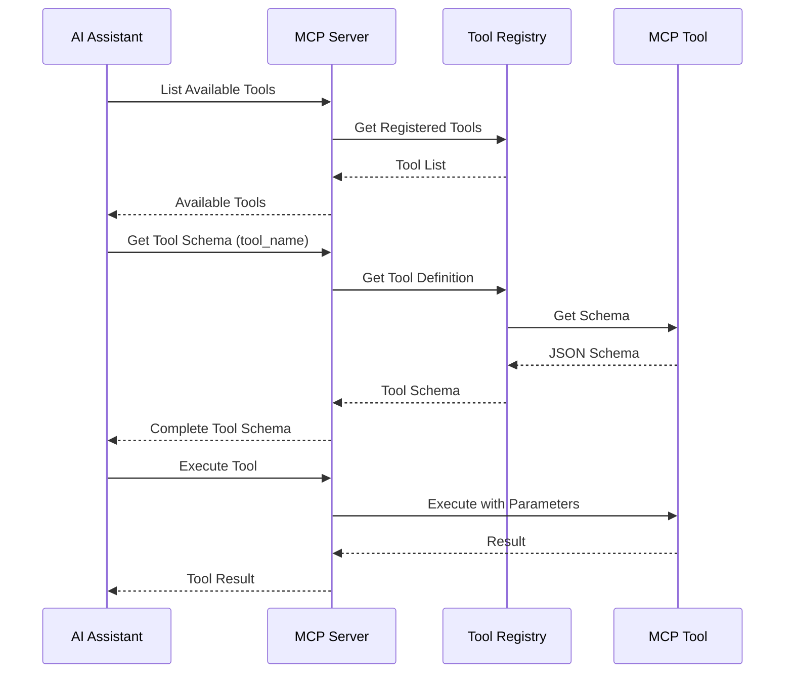
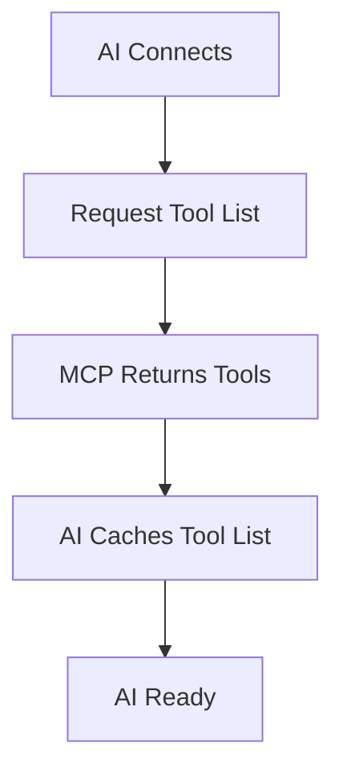
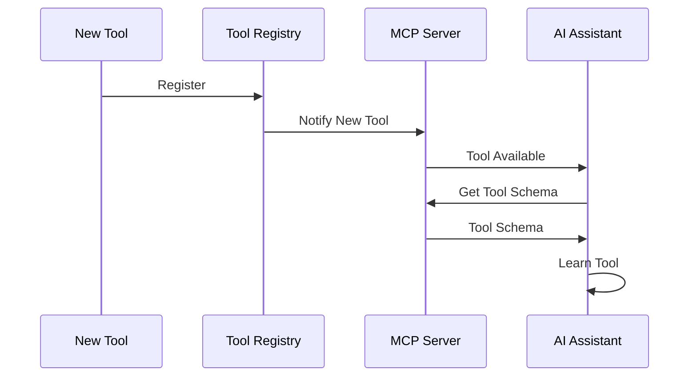
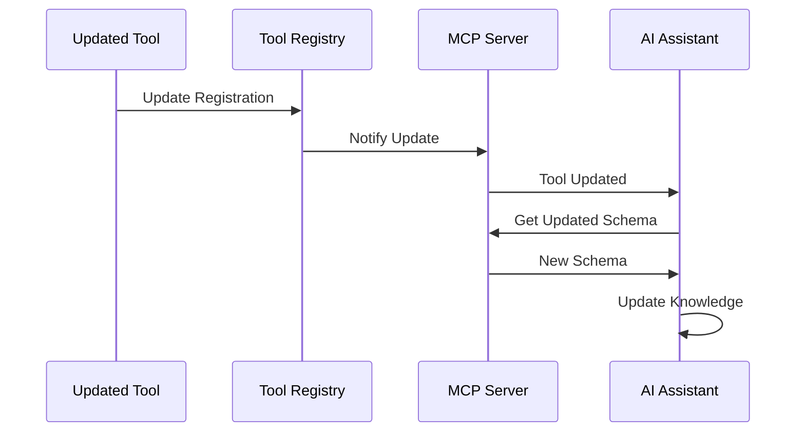
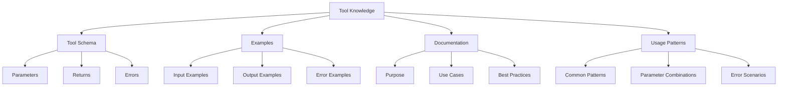

# Tool Discovery and Learning - How MCP Tools Learn Their Capabilities

## Overview

This document explains how MCP tools are discovered, registered, and how AI assistants learn about their capabilities. This is distinct from component learning - this is about the tools themselves.

## MCP Protocol Tool Discovery

### Built-in Discovery Mechanism

The MCP (Model Context Protocol) provides built-in mechanisms for tool discovery:

1. **Tool Registration**: Tools register themselves with the MCP server
2. **Schema Definition**: Each tool provides a JSON Schema describing its capabilities
3. **Tool Listing**: MCP server exposes available tools to AI assistants
4. **Tool Introspection**: AI can query tool schemas and capabilities

### Discovery Flow



## Tool Registration

### Registration Process

**1. Tool Implementation**

Tools implement the `MCPTool` interface:

```java
@Component(service = MCPTool.class)
public class CreatePageTool implements MCPTool {
    
    @Override
    public String getName() {
        return "create_page";
    }
    
    @Override
    public String getDescription() {
        return "Creates a new page in the specified location";
    }
    
    @Override
    public JSONSchema getParameterSchema() {
        return JSONSchema.builder()
            .addProperty("path", JSONSchema.string()
                .description("Full JCR path where page should be created")
                .required())
            .addProperty("title", JSONSchema.string()
                .description("Page title")
                .required())
            .build();
    }
    
    @Override
    public ToolResult execute(ToolContext context) {
        // Implementation
    }
}
```

**2. OSGi Service Registration**

Tools are automatically registered as OSGi services:

```java
@Component(
    service = MCPTool.class,
    immediate = true,
    property = {
        "mcp.tool.category=page_management",
        "mcp.tool.priority=100"
    }
)
public class CreatePageTool implements MCPTool {
    // Implementation
}
```

**3. Tool Registry**

The Tool Registry collects all registered tools:

```java
@Component(service = MCPToolRegistry.class)
public class MCPToolRegistryImpl implements MCPToolRegistry {
    
    @Reference(
        service = MCPTool.class,
        cardinality = ReferenceCardinality.MULTIPLE,
        policy = ReferencePolicy.DYNAMIC
    )
    private Map<String, MCPTool> tools = new ConcurrentHashMap<>();
    
    public List<MCPTool> getAllTools() {
        return new ArrayList<>(tools.values());
    }
    
    public MCPTool getTool(String name) {
        return tools.get(name);
    }
}
```

## Tool Schema Definition

### JSON Schema Structure

Each tool provides a complete JSON Schema describing:

1. **Tool Name**: Unique identifier
2. **Description**: Human-readable description
3. **Parameters**: Input parameter schema
4. **Returns**: Output schema
5. **Examples**: Usage examples
6. **Metadata**: Category, tags, version

**Example Schema:**

```json
{
  "name": "create_page",
  "description": "Creates a new page in the specified location",
  "category": "page_management",
  "version": "1.0",
  "parameters": {
    "type": "object",
    "properties": {
      "path": {
        "type": "string",
        "description": "Full JCR path where page should be created",
        "pattern": "^/content/.*",
        "examples": ["/content/typerefinery/pages/new-page"]
      },
      "title": {
        "type": "string",
        "description": "Page title",
        "minLength": 1,
        "maxLength": 255
      },
      "template": {
        "type": "string",
        "description": "Template path",
        "default": "/apps/typerefinery/templates/page",
        "enum": [
          "/apps/typerefinery/templates/page",
          "/apps/typerefinery/templates/blank",
          "/apps/typerefinery/templates/dashboard"
        ]
      },
      "properties": {
        "type": "object",
        "description": "Additional page properties",
        "properties": {
          "description": {
            "type": "string"
          },
          "hideInNav": {
            "type": "boolean",
            "default": false
          }
        }
      }
    },
    "required": ["path", "title"]
  },
  "returns": {
    "type": "object",
    "properties": {
      "success": {
        "type": "boolean"
      },
      "path": {
        "type": "string"
      },
      "resource": {
        "type": "object"
      }
    }
  },
  "examples": [
    {
      "description": "Create a simple page",
      "input": {
        "path": "/content/typerefinery/pages/my-page",
        "title": "My New Page"
      },
      "output": {
        "success": true,
        "path": "/content/typerefinery/pages/my-page"
      }
    }
  ],
  "errors": [
    {
      "code": "INVALID_PATH",
      "message": "Path must be under /content",
      "description": "The provided path is not valid"
    },
    {
      "code": "PAGE_EXISTS",
      "message": "Page already exists at path",
      "description": "A page already exists at the specified path"
    }
  ]
}
```

## Tool Discovery API

### MCP Server Endpoints

**1. List All Tools**

```
GET /mcp/tools
```

**Response:**
```json
{
  "tools": [
    {
      "name": "create_page",
      "description": "Creates a new page",
      "category": "page_management"
    },
    {
      "name": "add_component",
      "description": "Adds a component to a page",
      "category": "component_management"
    }
  ],
  "total": 30
}
```

**2. Get Tool Schema**

```
GET /mcp/tools/{toolName}/schema
```

**Response:**
```json
{
  "name": "create_page",
  "schema": {
    // Complete JSON Schema
  }
}
```

**3. Get Tool Categories**

```
GET /mcp/tools/categories
```

**Response:**
```json
{
  "categories": [
    {
      "name": "page_management",
      "description": "Page creation and management",
      "tools": ["create_page", "update_page", "find_pages"]
    },
    {
      "name": "component_management",
      "description": "Component operations",
      "tools": ["add_component", "update_component", "remove_component"]
    }
  ]
}
```

## AI Assistant Learning Process

### Initial Discovery

**Step 1: Connect to MCP Server**

When AI assistant connects to MCP server:



**Step 2: Learn Tool Capabilities**

AI can learn about tools in multiple ways:

1. **Bulk Learning**: Load all tool schemas at startup
2. **On-Demand Learning**: Load tool schema when needed
3. **Incremental Learning**: Learn tools as they're used

### Learning Strategies

**Strategy 1: Bulk Learning**

```javascript
// AI loads all tools at startup
const tools = await mcp.listTools();
for (const tool of tools) {
    const schema = await mcp.getToolSchema(tool.name);
    learnTool(tool.name, schema);
}
```

**Strategy 2: On-Demand Learning**

```javascript
// AI learns tool when user requests it
async function useTool(toolName, params) {
    if (!knownTools.has(toolName)) {
        const schema = await mcp.getToolSchema(toolName);
        learnTool(toolName, schema);
    }
    return await mcp.executeTool(toolName, params);
}
```

**Strategy 3: Incremental Learning**

```javascript
// AI learns tools as they're discovered
async function discoverTools() {
    const newTools = await mcp.listTools();
    for (const tool of newTools) {
        if (!knownTools.has(tool.name)) {
            const schema = await mcp.getToolSchema(tool.name);
            learnTool(tool.name, schema);
        }
    }
}
```

## Tool Introspection

### Self-Describing Tools

Tools can provide introspection capabilities:

**1. Tool Capabilities**

```java
public interface MCPTool {
    String getName();
    String getDescription();
    JSONSchema getParameterSchema();
    JSONSchema getReturnSchema();
    List<ToolExample> getExamples();
    List<ToolError> getErrorCodes();
    ToolMetadata getMetadata();
}
```

**2. Tool Metadata**

```java
public class ToolMetadata {
    private String category;
    private List<String> tags;
    private String version;
    private List<String> prerequisites;
    private Map<String, String> capabilities;
}
```

**3. Tool Examples**

```java
public class ToolExample {
    private String description;
    private Map<String, Object> input;
    private Map<String, Object> output;
    private String explanation;
}
```

## Tool Catalog

### Catalog Structure

Tools are organized in a catalog:

```
tools/
├── page_management/
│   ├── create_page.json
│   ├── update_page.json
│   └── find_pages.json
├── component_management/
│   ├── add_component.json
│   ├── update_component.json
│   └── remove_component.json
└── ...
```

### Catalog API

**Get Tool Catalog:**

```
GET /mcp/catalog
```

**Response:**
```json
{
  "categories": [
    {
      "name": "page_management",
      "tools": [
        {
          "name": "create_page",
          "description": "Creates a new page",
          "schema": "..."
        }
      ]
    }
  ]
}
```

## Dynamic Tool Discovery

### Runtime Discovery

Tools can be discovered at runtime:

**1. New Tool Registration**



**2. Tool Updates**

When a tool is updated:



## Tool Learning Mechanisms

### 1. Schema-Based Learning

**AI learns from JSON Schema:**

- Parameter types and constraints
- Required vs optional parameters
- Default values
- Validation rules
- Enum values

### 2. Example-Based Learning

**AI learns from examples:**

- Common usage patterns
- Typical parameter values
- Expected outputs
- Error scenarios

### 3. Documentation-Based Learning

**AI learns from documentation:**

- Tool purpose and use cases
- Best practices
- Limitations
- Integration patterns

### 4. Usage-Based Learning

**AI learns from usage:**

- Successful executions
- Common parameter combinations
- Error patterns
- Performance characteristics

## Tool Knowledge Base

### Knowledge Structure



### Knowledge Persistence

**AI can persist tool knowledge:**

1. **Cache Tool Schemas**: Store schemas for quick access
2. **Learn from Examples**: Build pattern database
3. **Track Usage**: Monitor tool usage patterns
4. **Update Knowledge**: Refresh when tools change

## Tool Discovery Tools

### Discovery Tools for AI

**1. `list_tools`**

Lists all available tools:

```json
{
  "category": "page_management",
  "tags": ["creation", "pages"]
}
```

**Returns:**
```json
{
  "tools": [
    {
      "name": "create_page",
      "description": "Creates a new page",
      "category": "page_management"
    }
  ]
}
```

**2. `get_tool_info`**

Gets complete tool information:

```json
{
  "name": "create_page"
}
```

**Returns:**
```json
{
  "name": "create_page",
  "description": "Creates a new page",
  "schema": { /* Complete schema */ },
  "examples": [ /* Examples */ ],
  "documentation": "/* Documentation */"
}
```

**3. `search_tools`**

Searches for tools:

```json
{
  "query": "create page",
  "category": "page_management"
}
```

**Returns:**
```json
{
  "tools": [
    {
      "name": "create_page",
      "relevance": 0.95
    }
  ]
}
```

## Tool Versioning

### Version Management

Tools can be versioned:

```java
@Component(service = MCPTool.class)
public class CreatePageTool implements MCPTool {
    
    @Override
    public String getVersion() {
        return "1.2.0";
    }
    
    @Override
    public List<String> getCompatibleVersions() {
        return Arrays.asList("1.0.0", "1.1.0", "1.2.0");
    }
}
```

### Version Discovery

AI can discover tool versions:

```
GET /mcp/tools/{toolName}/versions
```

**Response:**
```json
{
  "current": "1.2.0",
  "available": ["1.0.0", "1.1.0", "1.2.0"],
  "changelog": {
    "1.2.0": "Added template parameter",
    "1.1.0": "Added properties parameter",
    "1.0.0": "Initial version"
  }
}
```

## Best Practices

### For Tool Developers

1. **Complete Schemas**: Provide detailed JSON Schemas
2. **Clear Descriptions**: Write clear, descriptive tool descriptions
3. **Examples**: Include multiple usage examples
4. **Error Documentation**: Document all error codes
5. **Versioning**: Use semantic versioning

### For AI Assistants

1. **Learn on Connect**: Load tool schemas at startup
2. **Cache Knowledge**: Cache tool information
3. **Update Regularly**: Refresh tool knowledge periodically
4. **Learn from Usage**: Build usage patterns
5. **Handle Errors**: Learn from error scenarios

## Implementation Example

### Complete Tool Registration

```java
@Component(
    service = MCPTool.class,
    immediate = true,
    property = {
        "mcp.tool.category=page_management",
        "mcp.tool.priority=100",
        "mcp.tool.version=1.0.0"
    }
)
public class CreatePageTool implements MCPTool {
    
    @Override
    public String getName() {
        return "create_page";
    }
    
    @Override
    public String getDescription() {
        return "Creates a new page in the specified location with optional template and properties";
    }
    
    @Override
    public JSONSchema getParameterSchema() {
        // Complete schema definition
    }
    
    @Override
    public List<ToolExample> getExamples() {
        return Arrays.asList(
            new ToolExample(
                "Create simple page",
                Map.of("path", "/content/pages/test", "title", "Test Page"),
                Map.of("success", true, "path", "/content/pages/test")
            )
        );
    }
    
    @Override
    public ToolResult execute(ToolContext context) {
        // Implementation
    }
}
```

## Skills vs Tools Discovery

### Similar Discovery Mechanisms

Skills are discovered similarly to tools:

- **Skill Registration**: Skills register in Skill Registry
- **Skill Schema**: Skills provide schemas describing workflows
- **Skill Listing**: MCP server exposes available skills
- **Skill Introspection**: AI can query skill schemas

**Key Difference:**
- **Tools**: Single atomic operations
- **Skills**: Workflows combining multiple tools

See [Skills Architecture](11-skills-architecture.md) for how skills use tools.

## Next Steps

1. Review tool specifications (see `02-mcp-tool-specifications.md`)
2. Understand skills architecture (see `11-skills-architecture.md`)
3. Understand component learning (see `09-component-learning.md`)


