# CMS Discovery and Learning - How MCP Tools Understand the CMS

## Overview

This document explains how MCP tools discover and learn about the Typerefinery CMS structure, components, pages, sites, assets, and operations. This is the foundational learning process that enables AI assistants to understand how to work with the CMS.

## CMS Learning Architecture

### Overall Learning Flow

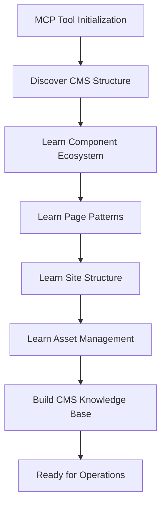

### Learning Sources

1. **Component Definitions** (`/apps/typerefinery/components/`)
2. **Templates** (`/apps/typerefinery/templates/`)
3. **Reference Content** (`tests/content/src/main/content/jcr_root/content/`)
4. **API Documentation** (REST API endpoints)
5. **Service Layer** (Java services and models)

## Discovery Process

### Phase 1: Initial CMS Discovery

**Step 1: Discover Repository Structure**

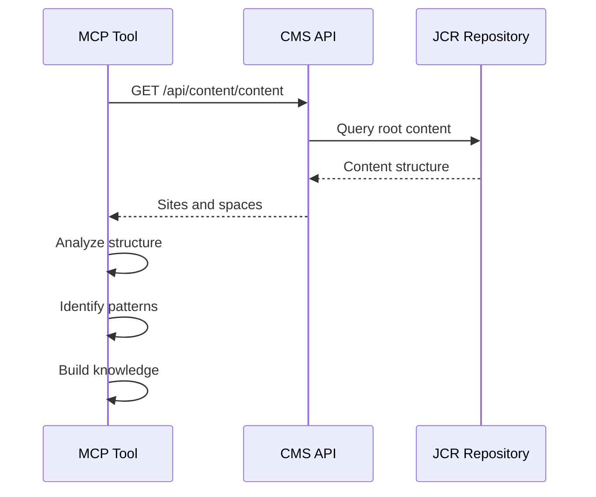

**What MCP Learns:**
- Content root structure (`/content`)
- Site spaces (`ws:PagesSpace`)
- Pages spaces (`ws:Pages`)
- Assets spaces (`ws:Assets`)
- Page node types (`ws:Page`, `ws:PageContent`)

**Step 2: Discover Component Registry**

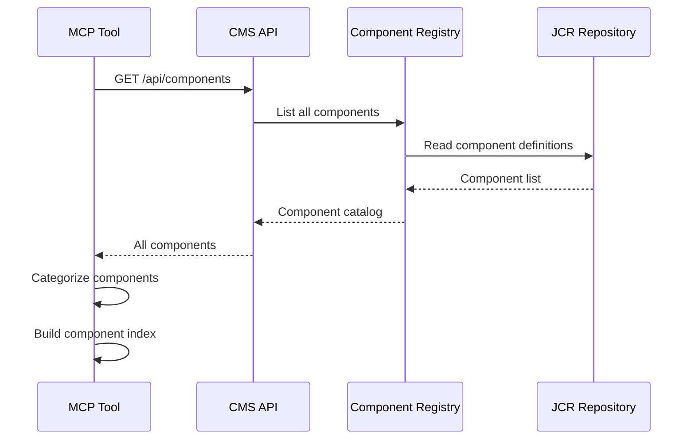

**What MCP Learns:**
- Available components
- Component groups
- Component types (container, layout, content, form)
- Component resource types

**Step 3: Discover Templates**

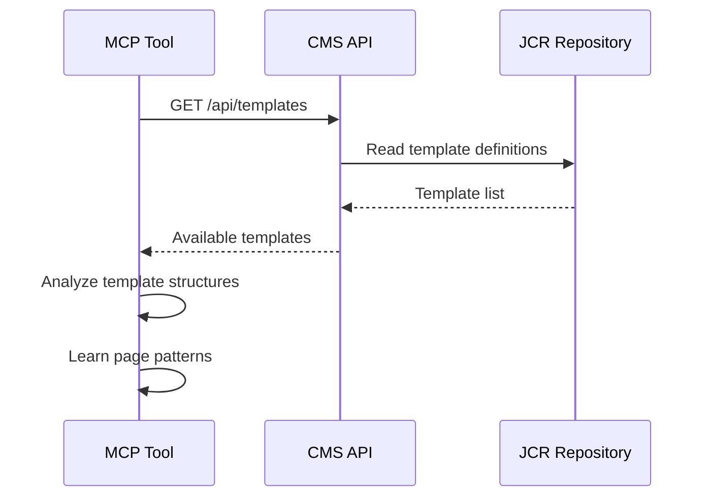

**What MCP Learns:**
- Available templates
- Template structures
- Initial page layouts
- Template usage patterns

### Phase 2: Component Learning

**Learning Individual Components**

For each component, MCP learns:

1. **Component Definition** (`.content.json`)
   ```json
   {
     "sling:resourceType": "ws:Component",
     "title": "Form",
     "description": "Container for form fields",
     "group": "Typerefinery - Forms",
     "isContainer": true,
     "isLayout": true,
     "allowedComponents": [
       "Typerefinery - Forms"
     ]
   }
   ```

2. **Dialog Configuration** (`dialog/.content.json`)
   - Available properties
   - Property types
   - Validation rules
   - Field configurations

3. **Documentation** (`README.md`)
   - Component purpose
   - Usage examples
   - Best practices

4. **Usage Examples** (from reference content)
   - Real-world usage
   - Property combinations
   - Integration patterns

**Component Learning Flow:**

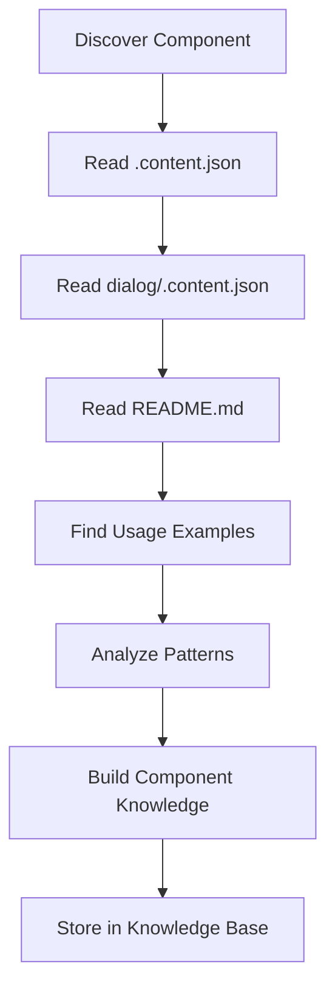

### Phase 3: Page Structure Learning

**Learning Page Patterns**

MCP analyzes reference pages to learn:

1. **Page Node Structure**
   - `ws:Page` node type
   - `jcr:content` structure
   - `ws:PageContent` properties
   - Template references

2. **Component Hierarchy**
   - Root container patterns
   - Layout component nesting
   - Content component placement
   - Form component structures

3. **Common Patterns**
   - Landing page pattern
   - Form page pattern
   - Dashboard pattern
   - Article/blog pattern

**Page Learning Process:**

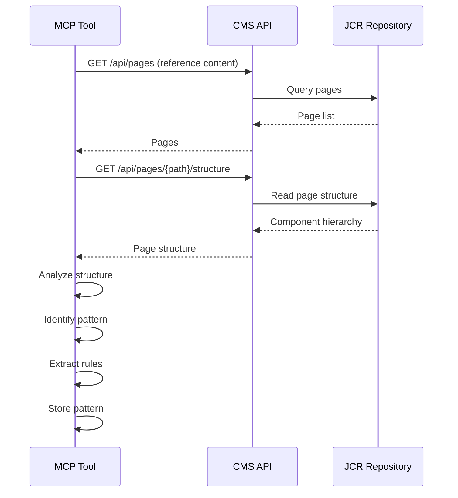

### Phase 4: Site Structure Learning

**Learning Site Organization**

MCP learns:

1. **Site Structure**
   - Site spaces (`ws:PagesSpace`)
   - Pages spaces (`ws:Pages`)
   - Assets spaces (`ws:Assets`)
   - Site properties

2. **Site Creation Patterns**
   - Required structure
   - Initial setup
   - Navigation configuration

**Site Learning:**

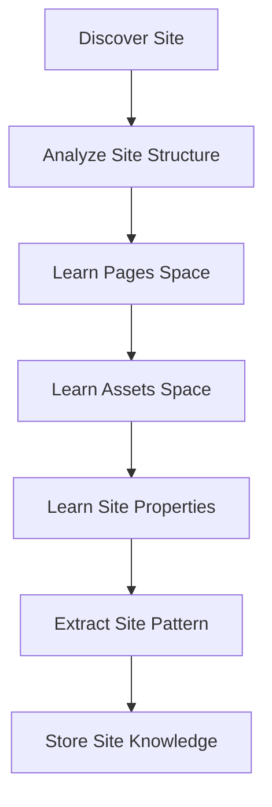

### Phase 5: Asset Management Learning

**Learning Asset Operations**

MCP learns:

1. **Asset Structure**
   - Asset node types
   - Rendition structure
   - Asset properties
   - Asset organization

2. **Asset Operations**
   - Upload process
   - Rendition generation
   - Asset retrieval
   - Asset organization

**Asset Learning:**

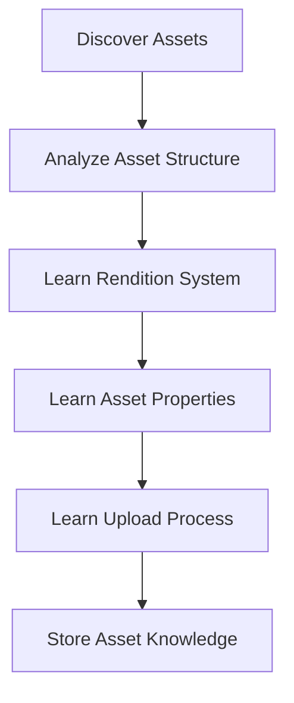

## CMS Knowledge Base

### Knowledge Structure

```mermaid
graph TD
    A[CMS Knowledge Base] --> B[Component Knowledge]
    A --> C[Page Knowledge]
    A --> D[Site Knowledge]
    A --> E[Asset Knowledge]
    A --> F[Pattern Knowledge]
    
    B --> B1[Component Definitions]
    B --> B2[Component Properties]
    B --> B3[Component Relationships]
    B --> B4[Component Usage]
    
    C --> C1[Page Structure]
    C --> C2[Page Patterns]
    C --> C3[Page Templates]
    C --> C4[Page Operations]
    
    D --> D1[Site Structure]
    D --> D2[Site Creation]
    D --> D3[Site Management]
    
    E --> E1[Asset Structure]
    E --> E2[Asset Operations]
    E --> E3[Asset Organization]
    
    F --> F1[Content Patterns]
    F --> F2[Layout Patterns]
    F --> F3[Form Patterns]
    F --> F4[Component Patterns]
```

### Knowledge Persistence

**Knowledge Storage:**

1. **Component Catalog**
   - Component definitions
   - Component capabilities
   - Component relationships
   - Usage examples

2. **Pattern Library**
   - Page patterns
   - Layout patterns
   - Form patterns
   - Component patterns

3. **Operation Knowledge**
   - How to create pages
   - How to create sites
   - How to add components
   - How to manage assets

## Learning Tools

### CMS Discovery Tools

**1. `discover_cms_structure`**

Discovers overall CMS structure:

```json
{
  "includeComponents": true,
  "includeTemplates": true,
  "includeReferenceContent": true
}
```

**Returns:**
- CMS structure overview
- Component catalog
- Template list
- Reference content patterns

**2. `learn_component_ecosystem`**

Learns entire component ecosystem:

```json
{
  "category": "Typerefinery - Forms",
  "includeExamples": true
}
```

**Returns:**
- All components in category
- Component relationships
- Usage patterns
- Best practices

**3. `analyze_reference_content`**

Analyzes reference content to learn patterns:

```json
{
  "space": "/content/typerefinery-showcase/pages",
  "patternType": "all"
}
```

**Returns:**
- Identified patterns
- Pattern frequency
- Pattern examples
- Pattern rules

**4. `learn_page_creation_patterns`**

Learns how pages are created:

```json
{
  "template": "/apps/typerefinery/templates/page"
}
```

**Returns:**
- Page creation process
- Required structure
- Component placement rules
- Validation rules

**5. `learn_site_creation_patterns`**

Learns how sites are created:

```json
{}
```

**Returns:**
- Site creation process
- Required structure
- Initial setup steps
- Site configuration

**6. `learn_asset_management`**

Learns asset operations:

```json
{
  "includeRenditions": true
}
```

**Returns:**
- Asset structure
- Upload process
- Rendition system
- Asset organization

## Learning Workflow

### Complete Learning Process

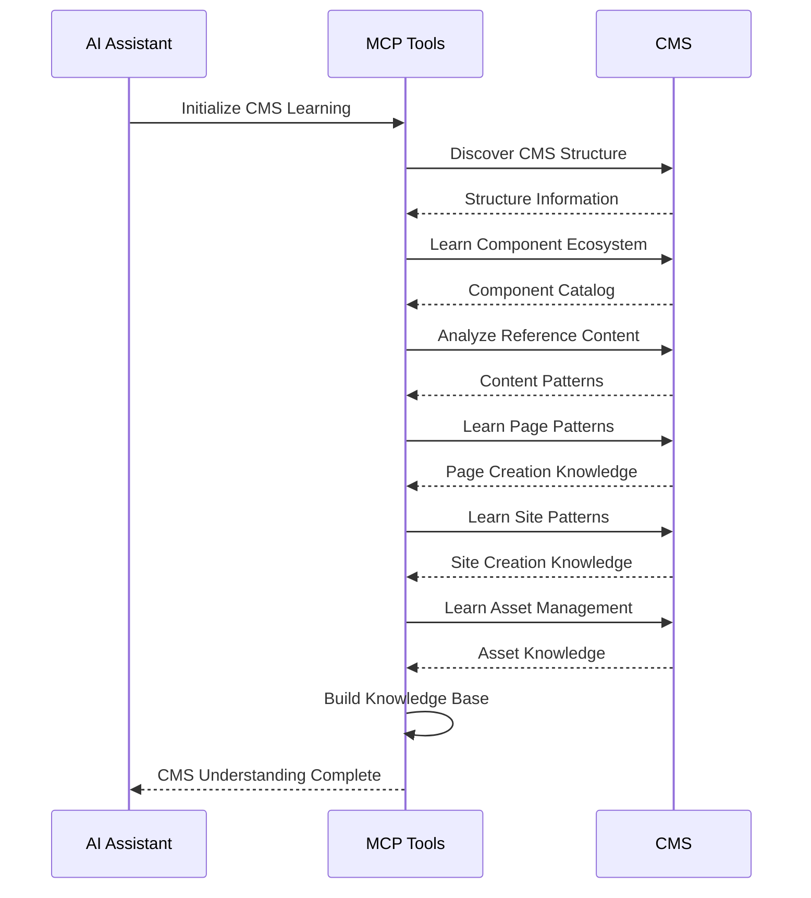

### Incremental Learning

**On-Demand Learning:**

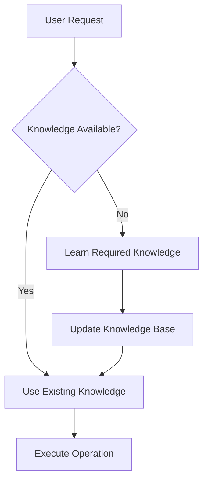

**Example:**
- User: "Create a form page"
- AI: Checks if form component knowledge exists
- If not: Learns form component, form page patterns
- Then: Uses knowledge to create form page

## Understanding Component Usage

### Component Discovery Process

**1. Find Component**

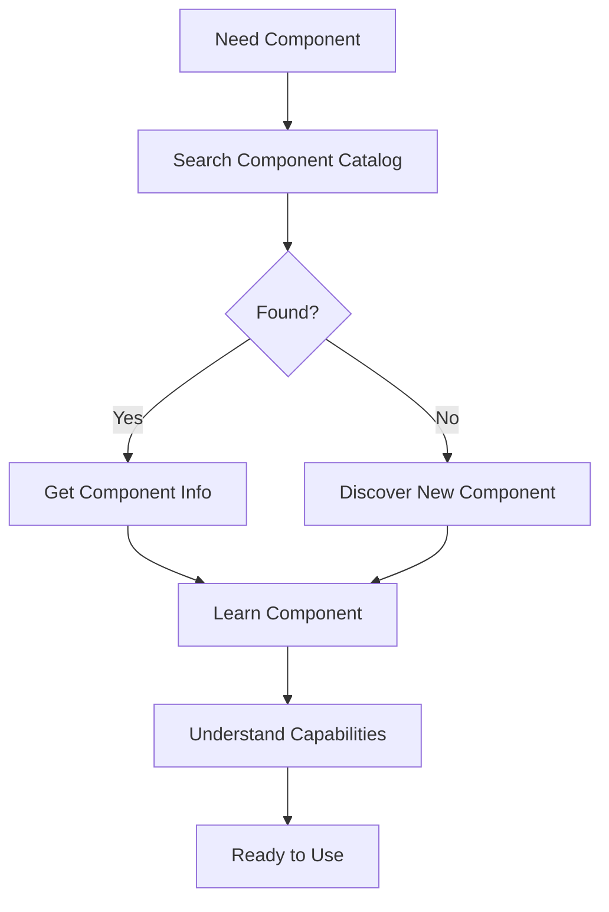

**2. Learn Component Capabilities**

For each component, MCP learns:

- **What it does**: Purpose and functionality
- **How to use it**: Properties and configuration
- **Where to use it**: Allowed parent components
- **What it contains**: Allowed child components
- **Examples**: Real-world usage

**3. Understand Component Relationships**

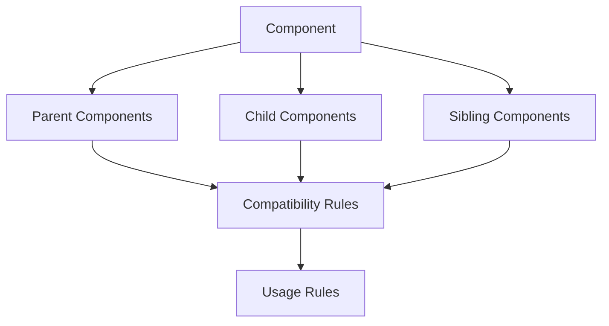

### Component Usage Learning

**From Reference Content:**

MCP analyzes reference pages to learn:

1. **Common Property Values**
   - Typical configurations
   - Default values
   - Required properties

2. **Component Combinations**
   - Which components are used together
   - Typical sequences
   - Layout patterns

3. **Integration Patterns**
   - How components integrate
   - Dependency relationships
   - Best practices

## Understanding Page Creation

### Page Creation Learning

**1. Learn Page Structure**

MCP learns from templates and reference pages:

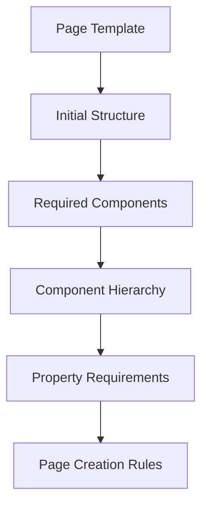

**2. Learn Page Patterns**

From reference content, MCP learns:

- **Landing Page Pattern**
  - Structure: header, hero, features, CTA, footer
  - Components: title, image, card, button
  - Properties: SEO metadata

- **Form Page Pattern**
  - Structure: form container, input fields, submit button
  - Components: form, input, label, field, button
  - Properties: validation, submission

- **Dashboard Pattern**
  - Structure: header, main with widgets, footer
  - Components: chart, table, card
  - Properties: data sources

**3. Learn Page Operations**

MCP learns how to:

- Create page nodes
- Set page properties
- Add components
- Configure page structure
- Validate page structure

## Understanding Site Creation

### Site Creation Learning

**1. Learn Site Structure**

MCP learns:

- Site space structure (`ws:PagesSpace`)
- Pages space (`ws:Pages`)
- Assets space (`ws:Assets`)
- Site properties

**2. Learn Site Creation Process**

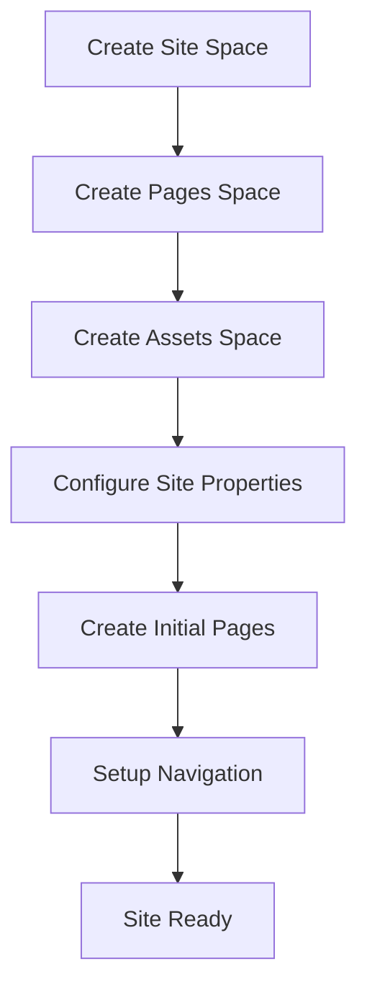

**3. Learn Site Management**

- Site configuration
- Navigation setup
- Site properties
- Site organization

## Understanding Asset Management

### Asset Learning

**1. Learn Asset Structure**

MCP learns:

- Asset node types
- Rendition structure (`_jcr_content/renditions/`)
- Asset properties
- Asset organization

**2. Learn Asset Operations**

- Upload process
- Rendition generation
- Asset retrieval
- Asset organization
- Asset properties

**3. Learn Asset Usage**

- How assets are referenced
- Image component usage
- Asset paths
- Rendition selection

## Reference Content Analysis

### Learning from Reference Content

**Location**: `tests/content/src/main/content/jcr_root/content/`

**What MCP Learns:**

1. **Page Examples**
   - Real page structures
   - Component usage
   - Property configurations
   - Integration patterns

2. **Component Examples**
   - Component instances
   - Property values
   - Component combinations
   - Usage contexts

3. **Pattern Examples**
   - Common patterns
   - Best practices
   - Anti-patterns to avoid
   - Edge cases

**Analysis Process:**

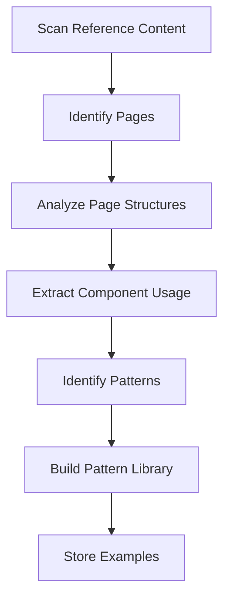

## Continuous Learning

### Learning During Operations

MCP learns from:

1. **Successful Operations**
   - What worked
   - Parameter combinations
   - Result patterns

2. **Failed Operations**
   - What didn't work
   - Error patterns
   - Correction strategies

3. **User Feedback**
   - User corrections
   - User preferences
   - Usage patterns

### Knowledge Updates

**When Knowledge Updates:**

1. **New Components Added**
   - Discover new component
   - Learn component capabilities
   - Update component catalog

2. **Content Structure Changes**
   - Detect changes
   - Re-analyze structure
   - Update knowledge

3. **Pattern Evolution**
   - Identify new patterns
   - Update pattern library
   - Refine best practices

## Implementation

### Learning Service

```java
@Service
public class CMSLearningService {
    
    public CMSKnowledge discoverCMS() {
        // Discover structure
        CMSStructure structure = discoverStructure();
        
        // Learn components
        ComponentCatalog catalog = learnComponents();
        
        // Analyze patterns
        PatternLibrary patterns = analyzePatterns();
        
        // Build knowledge
        return CMSKnowledge.builder()
            .structure(structure)
            .components(catalog)
            .patterns(patterns)
            .build();
    }
    
    public ComponentKnowledge learnComponent(String resourceType) {
        // Read component definition
        // Read dialog
        // Read documentation
        // Find examples
        // Build knowledge
    }
    
    public PagePattern learnPagePattern(String template) {
        // Analyze template
        // Analyze reference pages
        // Extract pattern
        // Build pattern knowledge
    }
}
```

### Knowledge Base

```java
@Component(service = CMSKnowledgeBase.class)
public class CMSKnowledgeBaseImpl implements CMSKnowledgeBase {
    
    private CMSKnowledge knowledge;
    private Map<String, ComponentKnowledge> components;
    private Map<String, PagePattern> patterns;
    
    @Activate
    protected void activate() {
        // Initialize knowledge base
        knowledge = learningService.discoverCMS();
        components = buildComponentCatalog();
        patterns = buildPatternLibrary();
    }
    
    public ComponentKnowledge getComponent(String resourceType) {
        return components.computeIfAbsent(resourceType, 
            rt -> learningService.learnComponent(rt));
    }
}
```

## Best Practices

### For CMS Learning

1. **Analyze Reference Content**: Use reference content as primary learning source
2. **Learn Incrementally**: Learn on demand, cache knowledge
3. **Update Regularly**: Refresh knowledge when CMS changes
4. **Validate Knowledge**: Verify learned knowledge with operations
5. **Learn from Operations**: Improve knowledge from usage

### For Operations

1. **Check Knowledge First**: Verify knowledge before operations
2. **Learn on Demand**: Learn missing knowledge when needed
3. **Validate Results**: Verify operation results match expectations
4. **Update Knowledge**: Update knowledge from successful operations
5. **Handle Errors**: Learn from errors and failures

## Next Steps

1. Review component learning (see `09-component-learning.md`)
2. Review content structure analysis (see `03-content-structure-analysis.md`)
3. Review tool discovery (see `13-tool-discovery-learning.md`)
4. Review skills architecture (see `11-skills-architecture.md`)


