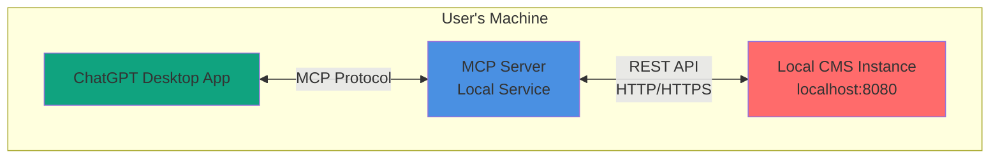
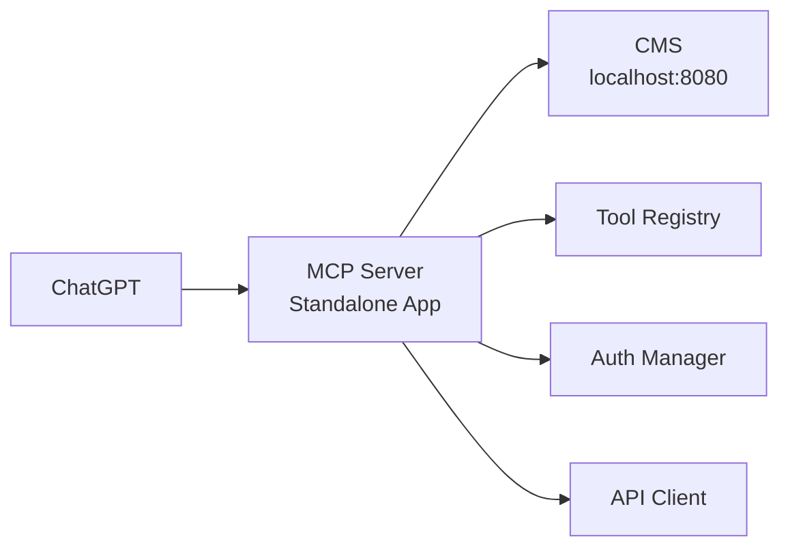
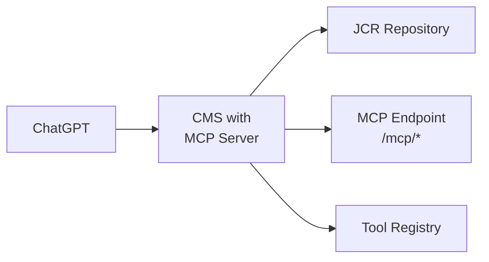
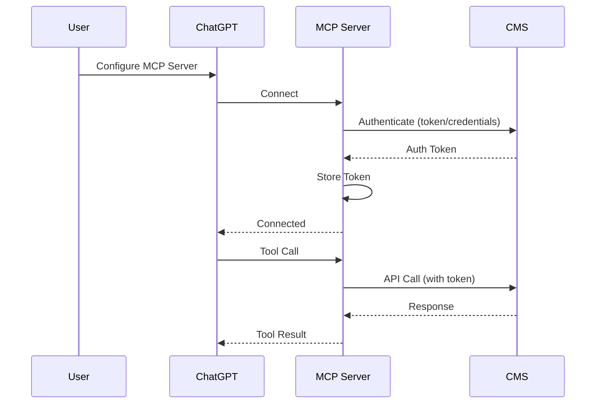

# ChatGPT Integration Setup - Connecting Local CMS to ChatGPT

## Overview

This document explains how to connect a local Typerefinery CMS instance to ChatGPT using MCP (Model Context Protocol). It covers the architecture, required services, setup steps, and configuration.

## Architecture

### Connection Architecture



### Component Overview

1. **ChatGPT Desktop App**: User's ChatGPT client with MCP support
2. **MCP Server**: Local service that bridges ChatGPT and CMS
3. **Local CMS**: Typerefinery CMS running on localhost

## Required Services

### 1. MCP Server

**Purpose**: Bridge between ChatGPT and CMS

**Responsibilities:**
- Expose MCP protocol interface to ChatGPT
- Translate MCP tool calls to CMS REST API calls
- Handle authentication with CMS
- Manage tool registry and execution
- Provide tool discovery and schema

**Deployment Options:**
- **Option A**: Standalone Java application (recommended)
- **Option B**: Node.js/TypeScript server
- **Option C**: Python server
- **Option D**: Embedded in CMS (future)

### 2. Local CMS Instance

**Requirements:**
- CMS running on `localhost:8080` (or configured port)
- REST API endpoints accessible
- Authentication enabled
- MCP tools bundle installed

### 3. Authentication Service

**Purpose**: Handle authentication between MCP server and CMS

**Mechanisms:**
- Token-based authentication (websight-token)
- Basic authentication (username/password)
- Service account authentication

## Setup Options

### Option 1: Standalone MCP Server (Recommended)

**Architecture:**



**Components:**
- MCP Server application (Java/Node.js/Python)
- Tool implementations
- CMS API client
- Authentication handler

**Advantages:**
- Independent of CMS deployment
- Easy to update
- Can support multiple CMS instances
- Better separation of concerns

### Option 2: Embedded MCP Server

**Architecture:**



**Components:**
- MCP server as OSGi bundle in CMS
- MCP REST endpoints in CMS
- Tools as OSGi services

**Advantages:**
- No separate service needed
- Direct CMS access
- Simpler deployment
- Better performance

## Network Configuration

### Local Connection

**For localhost CMS:**

```
ChatGPT → MCP Server (localhost:3000) → CMS (localhost:8080)
```

**Configuration:**
- MCP Server: `localhost:3000` (or configured port)
- CMS: `localhost:8080` (default)
- Protocol: HTTP/HTTPS

### Remote Connection

**For remote CMS:**

```
ChatGPT → MCP Server (localhost:3000) → CMS (https://cms.example.com)
```

**Configuration:**
- MCP Server: `localhost:3000`
- CMS: Remote URL with HTTPS
- Authentication: Token or API key

### Network Requirements

**Local Setup:**
- No firewall changes needed
- All services on localhost
- HTTP is acceptable (HTTPS recommended)

**Remote Setup:**
- HTTPS required
- Valid SSL certificates
- Network access to CMS
- Firewall rules if needed

## Authentication Setup

### Authentication Flow



### Authentication Methods

**Method 1: Token Authentication (Recommended)**

```json
{
  "mcpServer": {
    "name": "typerefinery-cms",
    "url": "http://localhost:3000",
    "auth": {
      "type": "token",
      "token": "your-cms-token"
    }
  }
}
```

**Method 2: Username/Password**

```json
{
  "mcpServer": {
    "name": "typerefinery-cms",
    "url": "http://localhost:3000",
    "auth": {
      "type": "basic",
      "username": "wsadmin",
      "password": "wsadmin"
    }
  }
}
```

**Method 3: API Key**

```json
{
  "mcpServer": {
    "name": "typerefinery-cms",
    "url": "http://localhost:3000",
    "auth": {
      "type": "apikey",
      "apiKey": "your-api-key",
      "header": "X-API-Key"
    }
  }
}
```

## MCP Server Implementation

### Standalone Java Server

**Structure:**

```
mcp-server/
├── src/
│   └── main/
│       ├── java/
│       │   └── ai/typerefinery/mcp/
│       │       ├── server/
│       │       │   ├── MCPServer.java
│       │       │   └── MCPHandler.java
│       │       ├── tools/
│       │       │   └── [Tool implementations]
│       │       ├── client/
│       │       │   └── CMSAPIClient.java
│       │       └── auth/
│       │           └── AuthenticationManager.java
│       └── resources/
│           └── application.properties
├── pom.xml
└── README.md
```

**Main Server Class:**

```java
public class MCPServer {
    private final int port;
    private final CMSAPIClient cmsClient;
    private final ToolRegistry toolRegistry;
    
    public MCPServer(int port, String cmsUrl, String authToken) {
        this.port = port;
        this.cmsClient = new CMSAPIClient(cmsUrl, authToken);
        this.toolRegistry = new ToolRegistry();
        registerTools();
    }
    
    public void start() {
        // Start HTTP server
        // Handle MCP protocol
        // Register tools
    }
    
    private void registerTools() {
        toolRegistry.register(new CreatePageTool(cmsClient));
        toolRegistry.register(new AddComponentTool(cmsClient));
        // ... register all tools
    }
}
```

### Node.js/TypeScript Server

**Structure:**

```
mcp-server/
├── src/
│   ├── server.ts
│   ├── tools/
│   │   └── [Tool implementations]
│   ├── client/
│   │   └── cms-client.ts
│   └── auth/
│       └── auth-manager.ts
├── package.json
└── tsconfig.json
```

**Main Server:**

```typescript
import { Server } from '@modelcontextprotocol/sdk/server/index.js';
import { CMSClient } from './client/cms-client.js';

const server = new Server({
  name: 'typerefinery-cms',
  version: '1.0.0'
}, {
  capabilities: {
    tools: {}
  }
});

const cmsClient = new CMSClient(
  process.env.CMS_URL || 'http://localhost:8080',
  process.env.CMS_TOKEN || ''
);

// Register tools
server.setRequestHandler(ListToolsRequestSchema, async () => {
  return {
    tools: await toolRegistry.listTools()
  };
});

server.setRequestHandler(CallToolRequestSchema, async (request) => {
  const tool = toolRegistry.getTool(request.params.name);
  return await tool.execute(request.params.arguments, cmsClient);
});
```

## ChatGPT Configuration

### Configuration File

**Location**: `~/.config/ChatGPT/mcp.json` (or ChatGPT settings)

**Configuration:**

```json
{
  "mcpServers": {
    "typerefinery-cms": {
      "command": "java",
      "args": [
        "-jar",
        "/path/to/mcp-server.jar",
        "--port", "3000",
        "--cms-url", "http://localhost:8080",
        "--cms-token", "${CMS_TOKEN}"
      ],
      "env": {
        "CMS_URL": "http://localhost:8080",
        "CMS_TOKEN": "your-token-here"
      }
    }
  }
}
```

### Alternative: HTTP Server Mode

**If MCP server runs as HTTP server:**

```json
{
  "mcpServers": {
    "typerefinery-cms": {
      "url": "http://localhost:3000",
      "auth": {
        "type": "bearer",
        "token": "mcp-server-token"
      }
    }
  }
}
```

## Step-by-Step Setup Guide

### Step 1: Install MCP Server

**Option A: Download Pre-built**

```bash
# Download MCP server
wget https://github.com/typerefinery-ai/mcp-server/releases/latest/mcp-server.jar

# Or using npm
npm install -g @typerefinery/mcp-server
```

**Option B: Build from Source**

```bash
# Clone repository
git clone https://github.com/typerefinery-ai/mcp-server.git
cd mcp-server

# Build
mvn clean install
# or
npm install && npm run build
```

### Step 2: Start Local CMS

**Using Docker:**

```bash
cd environment/local
docker compose up
```

**Using JVM:**

```bash
java -jar target/dependency/org.apache.sling.feature.launcher.jar \
  -f target/slingfeature-tmp/feature-websight-cms-luna.json
```

**Verify CMS is running:**
- Open: http://localhost:8080
- Login: `wsadmin` / `wsadmin`

### Step 3: Get CMS Authentication Token

**Method 1: From CMS UI**

1. Login to CMS: http://localhost:8080
2. Open browser developer tools
3. Check cookies for `websight-token`
4. Copy token value

**Method 2: Via API**

```bash
curl -X POST http://localhost:8080/system/sling/form/login \
  -d "j_username=wsadmin" \
  -d "j_password=wsadmin" \
  -c cookies.txt

# Extract token from response
```

**Method 3: Generate Service Account Token**

```bash
# Use CMS API to generate service account token
curl -X POST http://localhost:8080/api/auth/token \
  -H "Content-Type: application/json" \
  -d '{
    "username": "ai-service",
    "password": "service-password"
  }'
```

### Step 4: Configure MCP Server

**Create configuration file:**

```bash
# ~/.config/typerefinery/mcp-server.conf
CMS_URL=http://localhost:8080
CMS_TOKEN=your-token-here
MCP_PORT=3000
LOG_LEVEL=INFO
```

**Or use environment variables:**

```bash
export CMS_URL=http://localhost:8080
export CMS_TOKEN=your-token-here
export MCP_PORT=3000
```

### Step 5: Start MCP Server

**Java:**

```bash
java -jar mcp-server.jar \
  --cms-url http://localhost:8080 \
  --cms-token your-token-here \
  --port 3000
```

**Node.js:**

```bash
npx @typerefinery/mcp-server \
  --cms-url http://localhost:8080 \
  --cms-token your-token-here \
  --port 3000
```

**Verify MCP server:**

```bash
curl http://localhost:3000/health
# Should return: {"status": "ok"}
```

### Step 6: Configure ChatGPT

**Open ChatGPT Settings:**

1. Open ChatGPT Desktop App
2. Go to Settings → Features → Model Context Protocol
3. Click "Add MCP Server"

**Enter Configuration:**

```
Name: Typerefinery CMS
Command: java
Arguments:
  -jar
  /path/to/mcp-server.jar
  --cms-url
  http://localhost:8080
  --cms-token
  your-token-here
  --port
  3000
```

**Or use HTTP mode:**

```
Name: Typerefinery CMS
URL: http://localhost:3000
Auth Type: Bearer Token
Token: mcp-server-token
```

### Step 7: Test Connection

**In ChatGPT, test:**

```
@typerefinery-cms list available tools
```

**Expected response:**
- List of all available MCP tools
- Tool descriptions
- Tool schemas

**Test a tool:**

```
@typerefinery-cms create a page at /content/test/pages/my-page with title "Test Page"
```

## Security Considerations

### Local Setup Security

**For localhost only:**

1. **No External Access**: MCP server only listens on localhost
2. **Token Security**: Store tokens securely
3. **HTTPS Optional**: HTTP acceptable for localhost
4. **Firewall**: No firewall changes needed

**Configuration:**

```java
// MCP Server only binds to localhost
server.bind("localhost", 3000);
```

### Remote Setup Security

**For remote CMS:**

1. **HTTPS Required**: All communication over HTTPS
2. **Token Encryption**: Encrypt tokens in transit
3. **Certificate Validation**: Validate SSL certificates
4. **Network Security**: Use VPN or secure network

**Configuration:**

```java
// Use HTTPS
String cmsUrl = "https://cms.example.com";
// Validate certificates
SSLContext sslContext = createSSLContext();
```

### Token Management

**Best Practices:**

1. **Environment Variables**: Store tokens in environment variables
2. **Secure Storage**: Use secure credential storage
3. **Token Rotation**: Support token rotation
4. **Token Expiration**: Handle token expiration

**Example:**

```bash
# Use environment variables
export CMS_TOKEN=$(cat ~/.cms-token)

# Or use credential manager
export CMS_TOKEN=$(security find-generic-password -a cms -w)
```

## Troubleshooting

### Common Issues

**Issue 1: MCP Server Can't Connect to CMS**

**Symptoms:**
- Connection refused errors
- Timeout errors

**Solutions:**
- Verify CMS is running: `curl http://localhost:8080`
- Check CMS port (default: 8080)
- Verify firewall settings
- Check network connectivity

**Issue 2: Authentication Failures**

**Symptoms:**
- 401 Unauthorized errors
- Token invalid errors

**Solutions:**
- Verify token is valid
- Check token expiration
- Regenerate token if needed
- Verify username/password if using basic auth

**Issue 3: ChatGPT Can't Connect to MCP Server**

**Symptoms:**
- Connection timeout
- Server not found

**Solutions:**
- Verify MCP server is running: `curl http://localhost:3000/health`
- Check MCP server port
- Verify ChatGPT configuration
- Check firewall settings

**Issue 4: Tools Not Available**

**Symptoms:**
- Empty tool list
- Tool execution errors

**Solutions:**
- Verify MCP tools bundle is installed in CMS
- Check tool registration
- Review MCP server logs
- Verify CMS API endpoints are accessible

### Debug Mode

**Enable Debug Logging:**

```bash
# Java
java -jar mcp-server.jar --log-level DEBUG

# Node.js
DEBUG=* npx @typerefinery/mcp-server
```

**Check Logs:**

```bash
# MCP Server logs
tail -f ~/.mcp-server/logs/server.log

# CMS logs
tail -f /websight/logs/error.log
```

## Deployment Options

### Option 1: Local Development

**Setup:**
- CMS: localhost:8080
- MCP Server: localhost:3000
- ChatGPT: Desktop app

**Use Case:** Development and testing

### Option 2: Production with Remote CMS

**Setup:**
- CMS: https://cms.example.com
- MCP Server: localhost:3000 (or remote server)
- ChatGPT: Desktop app

**Use Case:** Production use with remote CMS

### Option 3: Cloud Deployment

**Setup:**
- CMS: Cloud-hosted
- MCP Server: Cloud service
- ChatGPT: Desktop app or web

**Use Case:** Enterprise deployment

## Additional Services Needed

### Required Services

1. **MCP Server** ⭐ REQUIRED
   - Standalone service or embedded
   - Handles MCP protocol
   - Manages tool execution

2. **Authentication Service** (Optional)
   - Token generation
   - Token validation
   - User management

3. **Proxy Service** (Optional, for remote)
   - Reverse proxy for CMS
   - SSL termination
   - Load balancing

### Optional Services

1. **Monitoring Service**
   - Health checks
   - Performance monitoring
   - Error tracking

2. **Logging Service**
   - Centralized logging
   - Log aggregation
   - Log analysis

3. **Configuration Service**
   - Centralized configuration
   - Environment management
   - Secret management

## Network Architecture

### Local Network

```
┌─────────────────┐
│  User's Machine  │
│                 │
│  ┌───────────┐  │
│  │ ChatGPT   │  │
│  └─────┬─────┘  │
│        │        │
│  ┌─────▼─────┐  │
│  │MCP Server │  │
│  │:3000      │  │
│  └─────┬─────┘  │
│        │        │
│  ┌─────▼─────┐  │
│  │CMS        │  │
│  │:8080      │  │
│  └───────────┘  │
└─────────────────┘
```

### Remote Network

```
┌─────────────────┐      ┌─────────────────┐
│  User's Machine  │      │  Remote Server   │
│                 │      │                 │
│  ┌───────────┐  │      │  ┌───────────┐  │
│  │ ChatGPT   │  │      │  │CMS        │  │
│  └─────┬─────┘  │      │  │:8080      │  │
│        │        │      │  └───────────┘  │
│  ┌─────▼─────┐  │      └─────────────────┘
│  │MCP Server │  │              ▲
│  │:3000      │  │              │
│  └─────┬─────┘  │              │
│        │        │              │
│        └────────┼──────────────┘
│                 │ HTTPS
└─────────────────┘
```

## Configuration Examples

### Example 1: Local Development

**MCP Server Config:**

```properties
# mcp-server.properties
cms.url=http://localhost:8080
cms.token=${CMS_TOKEN}
mcp.port=3000
mcp.host=localhost
log.level=DEBUG
```

**ChatGPT Config:**

```json
{
  "mcpServers": {
    "typerefinery-cms": {
      "command": "java",
      "args": [
        "-jar",
        "/Users/username/mcp-server.jar",
        "--config",
        "/Users/username/.config/typerefinery/mcp-server.properties"
      ]
    }
  }
}
```

### Example 2: Remote Production

**MCP Server Config:**

```properties
cms.url=https://cms.example.com
cms.token=${CMS_TOKEN}
mcp.port=3000
mcp.host=0.0.0.0
ssl.enabled=true
log.level=INFO
```

**ChatGPT Config:**

```json
{
  "mcpServers": {
    "typerefinery-cms": {
      "url": "https://mcp.example.com",
      "auth": {
        "type": "bearer",
        "token": "${MCP_SERVER_TOKEN}"
      }
    }
  }
}
```

## Next Steps

1. Review MCP tool specifications (see `02-mcp-tool-specifications.md`)
2. Understand CMS discovery (see `14-cms-discovery-learning.md`)
3. Review security considerations (see `04-security-evaluation.md`)
4. Check developer guide for implementation (see `06-developer-guide.md`)


